### Przygotowanie nowych obrazów
Zmiana app.js na wersje 2

```js
// ...
  res.end('hello world - version 2.0\n');
// ...
```

zbudowanie obrazu `docker build -t hello-node:2.0 .`

test działania wersji 2

`docker run -p 3000:3000 --rm --name hello hello-node:2.0`

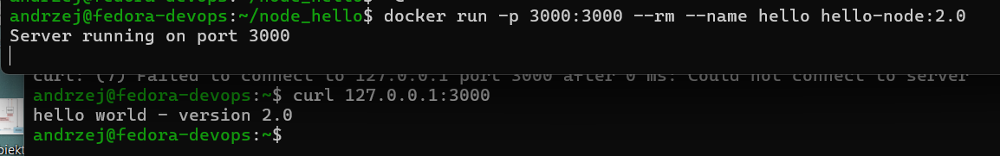

Test błędnego obrazu

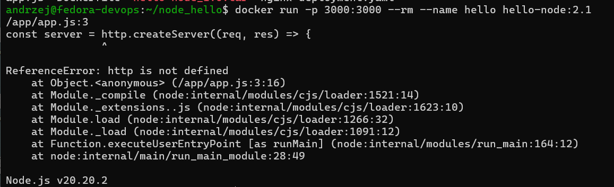

zapisanie obrazów `docker save -o hello_node2.1.tar hello-node:2.1`

### Zmiany w deploymencie

Zaadowanie obrazów do minikube
```
minikube image load hello-node:1.0
minikube image load hello-node:2.0
minikube image load hello-node:2.1
```

Uruchomieewdrożenia i przetestowanie
```
kubectl apply -f deployment.yaml

kubectl get pods
```

Ustawianie liczby replik i obserwacja podów

 Uruchomienie dla 1 i 8 replik
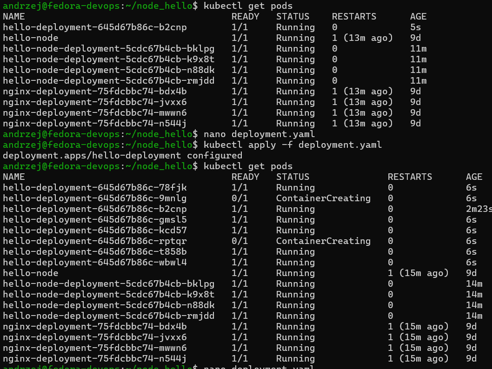


Widać usuwane pody dla zmiany z 8 na 4 repliki

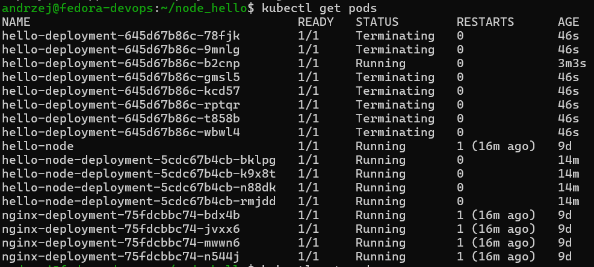


Zmiany wersji aplikacji

Historia zmian

```
kubectl rollout history deployment/hello-deployment

kubectl rollout history deployment/hello-deployment --revision=2
```

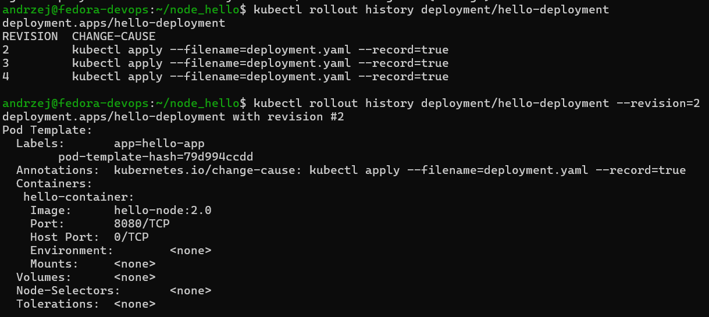

Cofnięie do poprzedniej wersji i sprawdzenie działania podów.

```
kubectl rollout undo deployment/hello-deployment
```
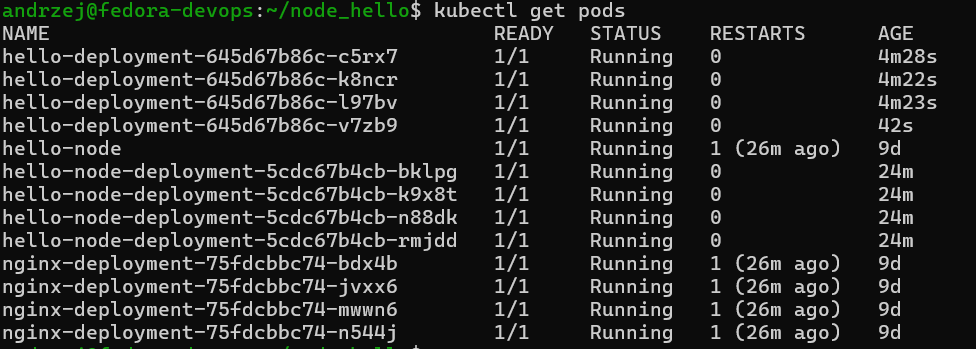

### Kontrola wdrożenia

utworznie skryptu weryfikującego czy wdrożenie zdązyło się wsdrozyć w 60 sekund

```bash
#!/bin/bash

DEPLOYMENT_NAME="hello-deployment"
TIMEOUT="60s"

echo "Sprawdzam status wdrożenia $DEPLOYMENT_NAME (limit: $TIMEOUT)..."

if kubectl rollout status deployment/$DEPLOYMENT_NAME --timeout=$TIMEOUT; then
    echo "Sukces: Aplikacja została pomyślnie wdrożona w wyznaczonym czasie!"
    exit 0
else
    echo "Błąd: Wdrożenie przekroczyło limit czasu 60 sekund lub zakończyło się niepowodzeniem!"
    exit 1
fi
```

nadanie uprawnień `chmod +x verify_deploy.sh`

Działanie skryptu dla obrazu 2.1 (tego z błedem)
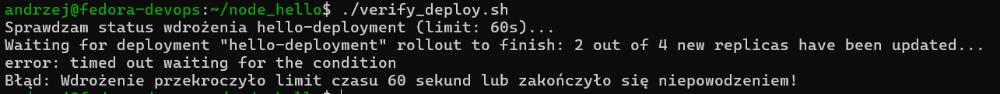

Działanie skryptu dla działającego obrazu (2.0)
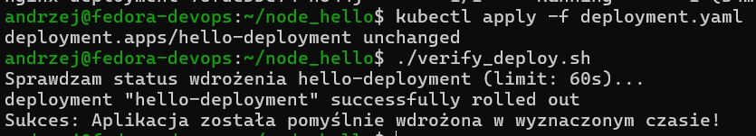

# Strategie wdrożenia

Utworzenie pliku `service.yaml`
```yaml
apiVersion: v1
kind: Service
metadata:
  name: hello-service
spec:
  type: ClusterIP
  ports:
  - port: 80
    targetPort: 8080
  selector:
    app: hello-app
```


Zmiana pliku deployment.yaml na strategię `Recreate`
```yaml
apiVersion: apps/v1
kind: Deployment
metadata:
  name: hello-deployment
  labels:
    app: hello-app
spec:
  replicas: 10
  strategy:
    type: Recreate
  selector:
    matchLabels:
      app: hello-app
  template:
    metadata:
      labels:
        app: hello-app
    spec:
      containers:
      - name: hello-container
        image: hello-node:2.0
        imagePullPolicy: Never
        ports:
        - containerPort: 8080
```

Uruchomienie i podgląd podó w czasie rzeczywistym
```
kubectl apply -f deployment.yaml & kubectl get pods -w
```

Strategia ta usuwa stare pody następnie tworzy nowe

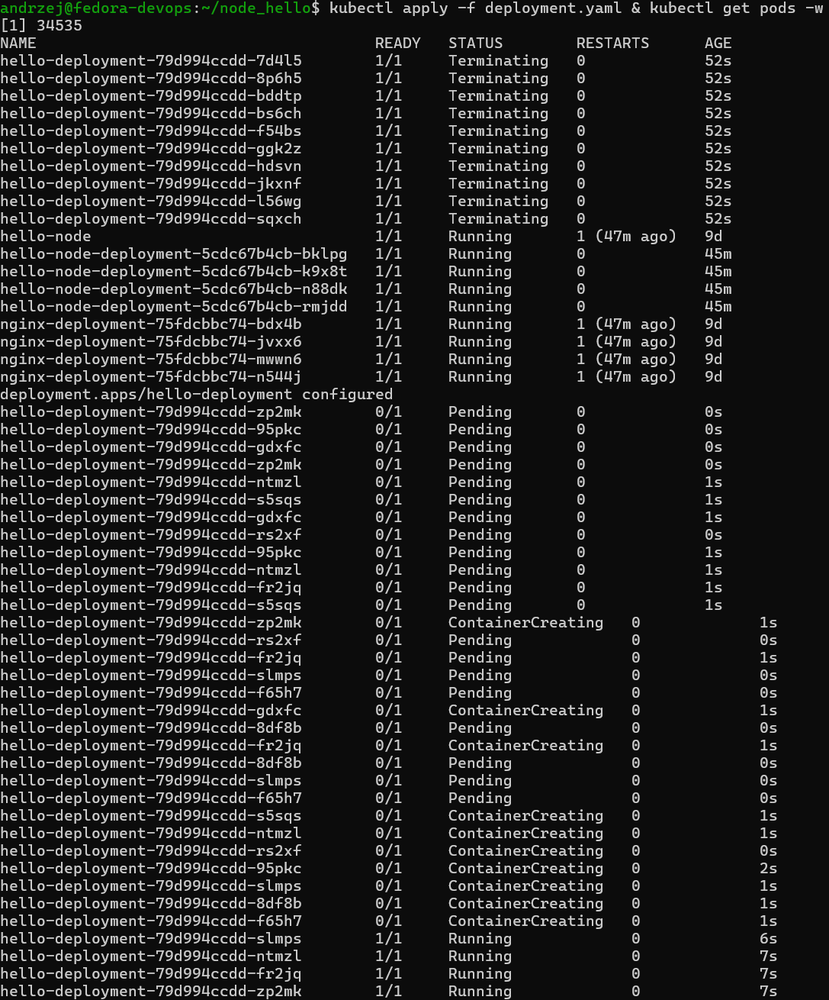

Zmiana na kolejną strategię
```yaml
  strategy:
    type: RollingUpdate
    rollingUpdate:
      maxUnavailable: 2
      maxSurge: 20%
```

Ta stratgia powodyuje że tworzone i usuwane są 2 pody i tak do osiągnięcia stanu docelowego

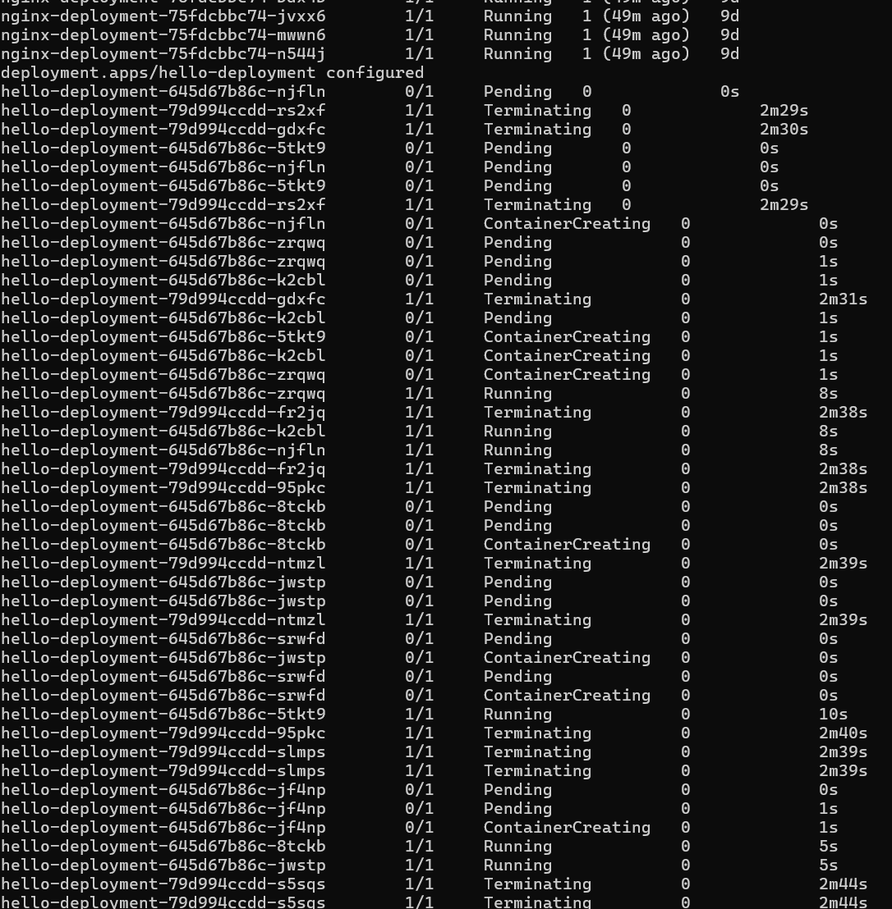


Utworzenie dwóch wdrożeń dla przetestowania kanarka:

Pseudo stara wersja 9 podów
```yaml
apiVersion: apps/v1
kind: Deployment
metadata:
  name: hello-production
spec:
  replicas: 9
  selector:
    matchLabels:
      app: hello-app
  template:
    metadata:
      labels:
        app: hello-app
        track: production
    spec:
      containers:
      - name: hello-container
        image: hello-node:1.0
        imagePullPolicy: Never
        ports:
        - containerPort: 8080
```

Pseudo nowa wersja 1 pod

```yaml
apiVersion: apps/v1
kind: Deployment
metadata:
  name: hello-canary
spec:
  replicas: 1
  selector:
    matchLabels:
      app: hello-app
  template:
    metadata:
      labels:
        app: hello-app
        track: canary   # <--- Dodatkowa etykieta różnicująca
    spec:
      containers:
      - name: hello-container
        image: hello-node:2.0
        imagePullPolicy: Never
        ports:
        - containerPort: 8080
```

Jak widać na poniższym zdjęciu uruchomione jest 9 podów starej wersji i 1 pod nowy. Czyli około 10% ruchu powinno być przekierowywane do nowej wersji.

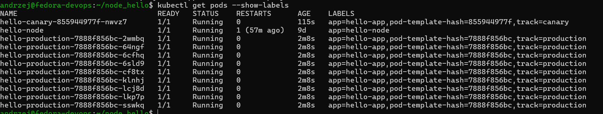