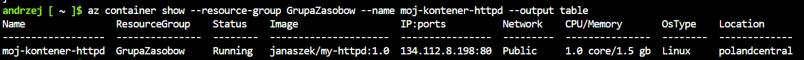
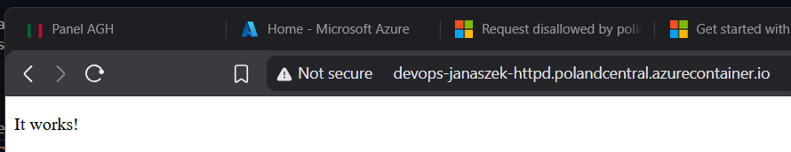
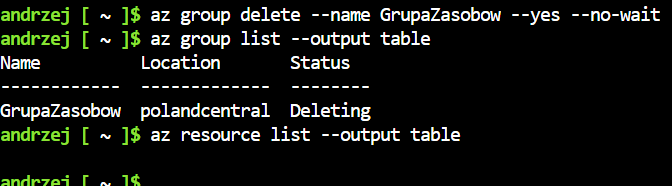

### Wrzucecnie obrazu na dockerhub

1. otagowanie `docker tag`
2. pusznięcie `docker push`

### Azure - resource group i kontener

Właczenie providera
`az provider register --namespace Microsoft.ContainerInstance`

Utworzenie resource group
`az group create --name GrupaZasobow --location polandcentral`

Zmiana obrazu:
```
docker pull httpd:latest
docker tag httpd:latest janaszek/my-httpd:1.0
docker push janaszek/my-httpd:1.0
```

Utworzenie kontenera
```
az container create \
  --resource-group GrupaZasobow \
  --name moj-kontener-httpd \
  --image janaszek/my-httpd:1.0 \
  --dns-name-label devops-janaszek-httpd \
  --ports 80 \
  --ip-address Public \
  --os-type linux \
  --memory 1.5 \
  --cpu 1
```

Sprawdzenie działania kontenera `az container show --resource-group GrupaZasobow --name moj-kontener-httpd --output table`



Sprwdzenie logów: `az container logs --resource-group GrupaZasobow --name moj-kontener-httpd`


### Srawdzenie działania (http)



### Sprzątanie

Ususnięcie grupy: `az group delete --name GrupaZasobow --yes --no-wait`

Sprwdzenie czy żadne zsoby nie wiszą jeszcze w tle

