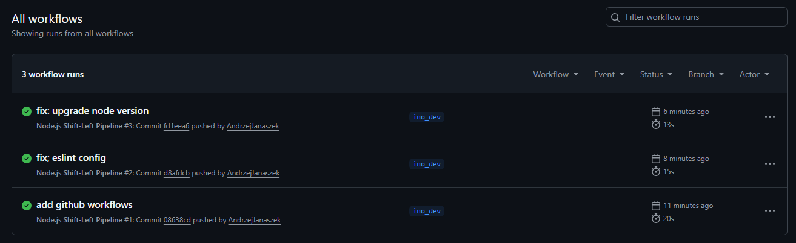
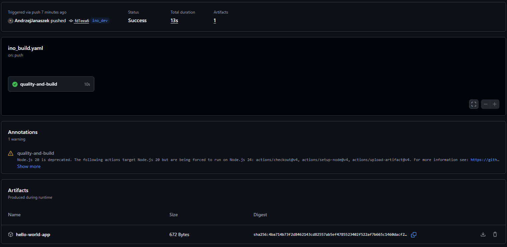

# Przygotowanie prostej aplikacji zamiast forka

Przygotowanie prostej aplikacji serwera node express na porcie 3000 z testem i eslintem sprawdzajhącym składnie.

app.js
```js
const express = require('express');
const app = express();
const PORT = process.env.PORT || 3000;

app.get('/', (req, res) => {
  res.send('Hello World from INO Dev!');
});

// Warunek, żeby testy nie blokowały portu podczas uruchamiania
if (require.main === module) {
  app.listen(PORT, () => {
    console.log(`Server is running on port ${PORT}`);
  });
}

module.exports = app;
```


test
```js
const request = require('supertest');
const app = require('./app');

describe('GET /', () => {
  it('should return Hello World', async () => {
    const res = await request(app).get('/');
    expect(res.statusCode).toEqual(200);
    expect(res.text).toBe('Hello World from INO Dev!');
  });
});
```

### Push na repozytorium

# Dodanie github workflows na branchu `ino_dev`

plik github workflows
`(.github/workflows/ino_build.yaml)`
```yaml
name: Node.js Shift-Left Pipeline

on:
  push:
    branches:
      - ino_dev

jobs:
  quality-and-build:
    runs-on: ubuntu-latest

    steps:
    - name: Checkout Repository
      uses: actions/checkout@v4

    - name: Setup Node.js
      uses: actions/setup-node@v4
      with:
        node-version: '24'
        cache: 'npm'

    - name: Install Dependencies
      run: npm ci

    - name: Run Linter (Code Quality)
      run: npm run lint
      continue-on-error: true

    - name: Run Tests
      run: npm run test

    - name: Upload Deployment Artifact
      uses: actions/upload-artifact@v4
      with:
        name: hello-world-app
        path: |
          app.js
          package.json
```

### push na repo i sprawdzenie wyników


