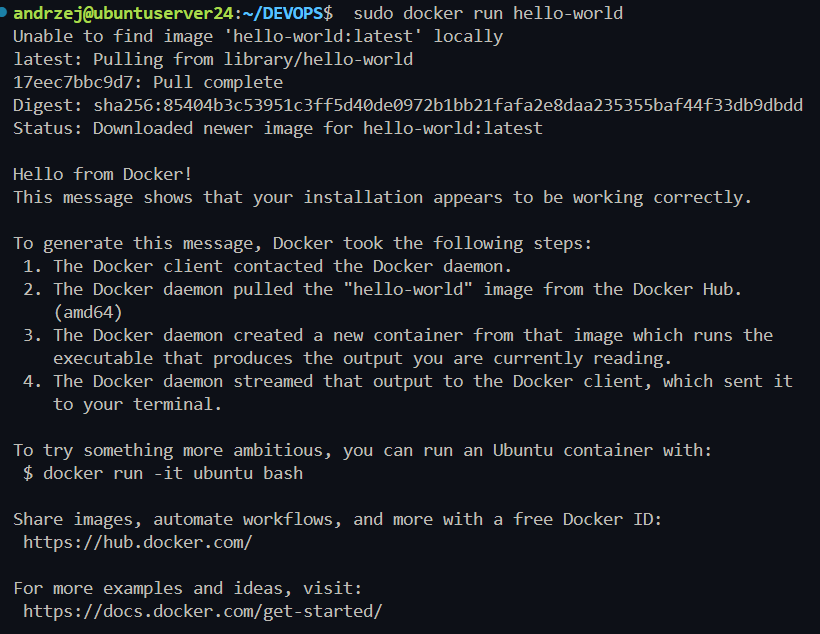
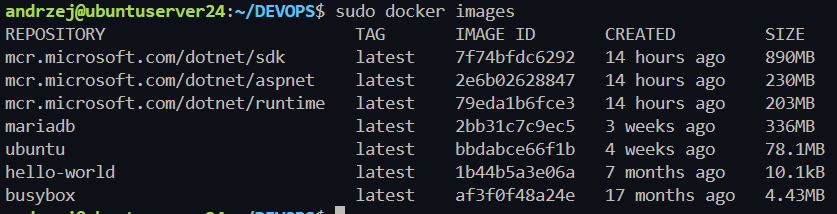
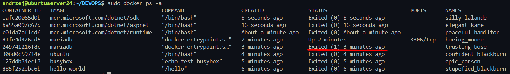
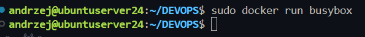
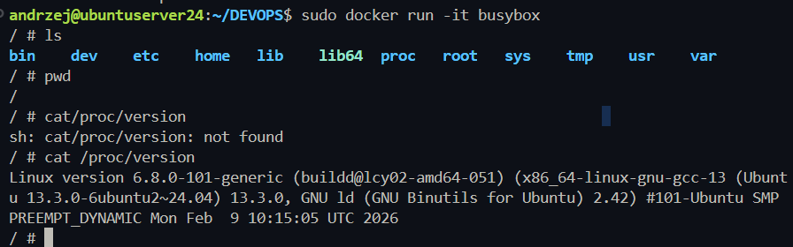
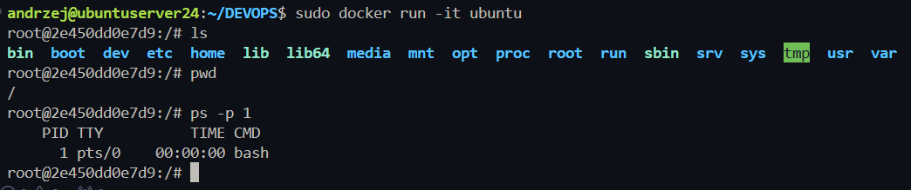
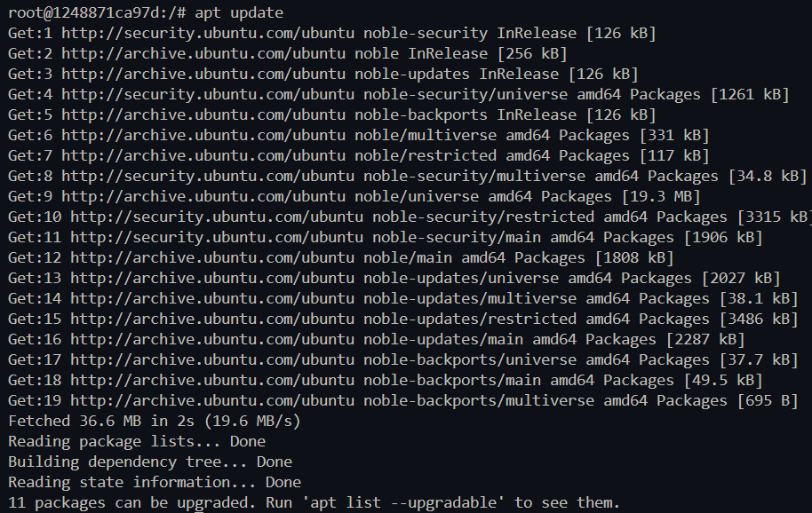
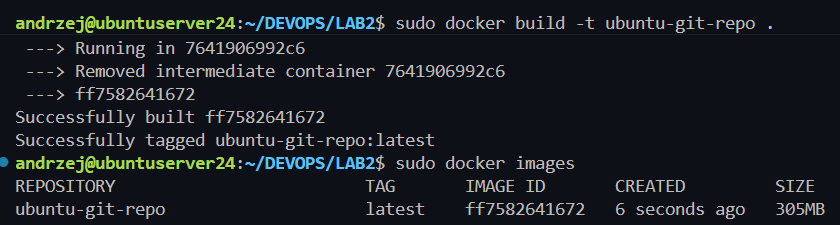
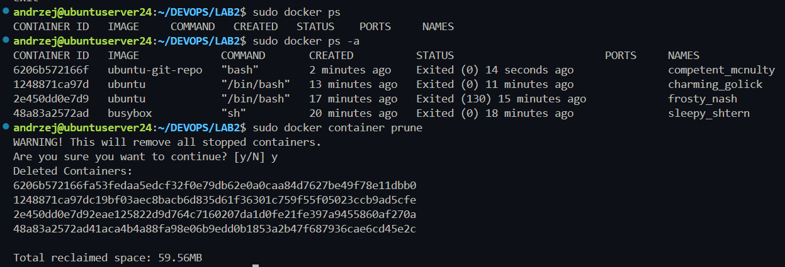
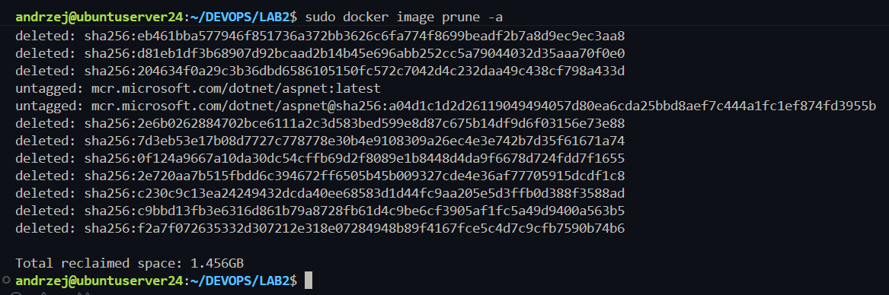

# Sprawozdanie - DevOps - Lab 2 - Andrzej Janaszek

## 1. Instalacja Dockera


Update pakietów \
`sudo apt update`

Instalacja \
`sudo apt install docker.io`

Uruchomienie testowego obrazu \
`sudo docker run hello-world`

Sprawdzenie wersji Dockera
```
andrzej@ubuntuserver24:~/DEVOPS$ docker --version
Docker version 28.2.2, build 28.2.2-0ubuntu1~24.04.1
```



## 3. Zapoznanie z obrazami
### Pobrane obrazy i ich rozmiar `sudo docker images`


### Kontenery po uruchomieniu i ich statusy (kody wyjścia). Jeden kontener ma status 1 ponieważ nie została podana zmienna środowiskowa odpowiadająca za hasło roota (mariadb)



## 4.Uruchomienie busybox

### Efekt uruchomienia


### Podłączenie interaktywne i sprawdzenie wersji


## 5. System (ubuntu) w kontenerze
### Uruchomienie interaktywne


### Procesy dockera na Hoscie


### Update pakietów


## 6. Własny obraz
### Zbudowanie obrazu


### Sprawdzenie repo i gita


## 7. Uruchomione kontenery


## 8. Wyczyszczenie obrazów
