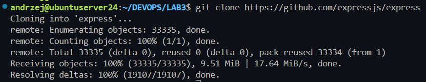
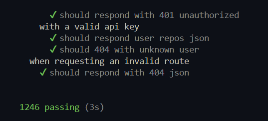
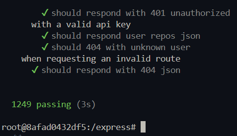
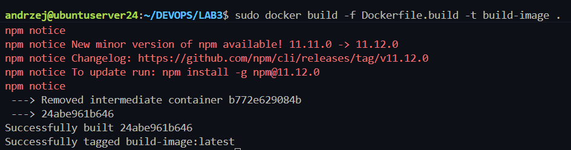
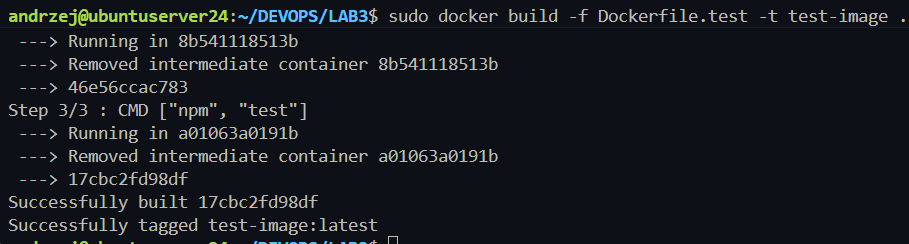
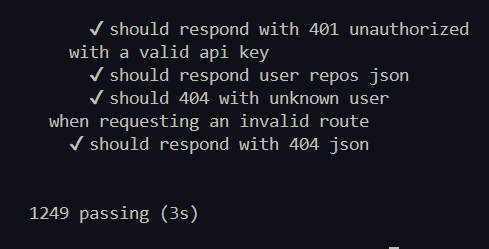

# LAB3

## 1. Repo

### Znalezione repo: https://github.com/expressjs/express

- Klonowanie
- Instalacja npm `npm install`
- Testowanie `npm test`




### Uruchomienie w kontenerze (interaktywnie)

- Uruchomienie kontenera: `sudo docker run -it node bash`
- Klonowanie repo: `git clone https://github.com/expressjs/express`
- instalacja zależności: `npm install`
- Testy: `npm test`



### Automatyzacja -> Dockerfiles

Dockerfile.build
```Dockerfile
FROM node

WORKDIR /app

RUN git clone https://github.com/expressjs/express.git .

RUN npm install
```

Dockerfile.test
```Dockerfile
FROM build-image

WORKDIR /app

CMD ["npm", "test"]
```


Zbudowanie obrazu budującego 'build-image' (Dockerfile.build) \
`sudo docker build -f Dockerfile.build -t build-image .`

Zbudowanie obrazu testującego 'test-image' (Dockerfile.test) \
`sudo docker build -f Dockerfile.test -t test-image .`




### Uruchomienie kontenera z obrazu test-image

`sudo docker run test-image`



## Dodatkowe

### Automatyzacja - Docker Compose

```yml
services:
  build:
    build:
      context: .
      dockerfile: Dockerfile.build
    image: build-image

  test:
    build:
      context: .
      dockerfile: Dockerfile.test
    image: test-image
    depends_on:
      - build
```

Instalacja docker-compose na VM

Uruchomienie konfiguracji
`sudo docker-compose up --build`

## Analiza wdrożeniowa

Najlepiej byłoby zrobić osobne docker-compose dla developmentu i dla produkcji.
Wersja `dev` zawierałaby wszystkie zależności, w tym wykorzystywane podczas pracy nad oprogramowaniem. W wersji `production` budowalibyśmy projekt bez `dev dependencies` oraz usuwał wszystkie zbędne pliki powstałe podczas budowania. Dzięki temu nie musielibysmy osobno "oczyszczać" kontenera, ponieważ docelowo budowałby się on w czystej formie.


Jeżeli oprogramowanie byłoby przeznaczone do działania poza kontenerem w klasycznych systemach można wypuścić je jako pakiet (gotowa binarka / setup instalacyjny).