## Cześć 1

### Utworzenie 2 voluminów - wejściowy i wyjściowy

`sudo docker volume create input_volume
input_volume`

`sudo docker volume create output_volume
output_volume`

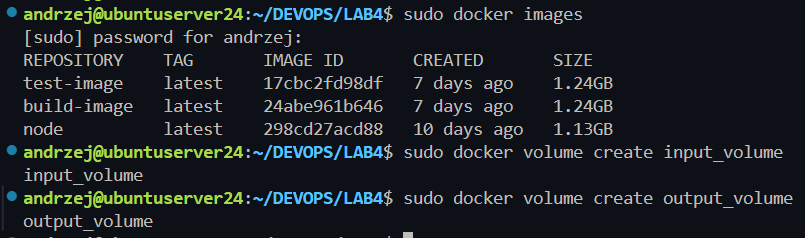

### budowanie obrazu (czystego) który tylko kopiuje pliki z src do working directory

`sudo docker build -t clean-image -f Dockerfile.clean .`

Plik Dockera:
```Dockerfile
FROM node

WORKDIR /app
```

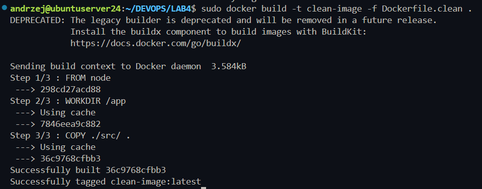

### Podłączenie woluminów do kontenera
```
sudo docker run -it -v input_volume:/input -v output_volume:/output clean-image bash
```


### Klonowanie repo

1. Pomocniczy kontener który kopiuje repo do woluminu - separacja odpowiedzialności
4. Dodatkowy kontener z gitem - minimalny dodatkowy nakład
2. Bind mount lokalnego katalogu - dodaje relację od hosta
3. Ręczne kopiowanie do plików dockera - raczej zła praktyka, wydaje się nadużyciem

Klonowanie przez kontener pomocniczy:
```
sudo docker run --rm \
-v input_volume:/data \
alpine \
sh -c "apk add --no-cache git && git clone https://github.com/keithamus/npm-scripts-example.git /data"
```

- `alpine` - minimalny/lekki system
- `--no-cache` - nie keszuje zmian
- `--rm` - usuniecie kontenera

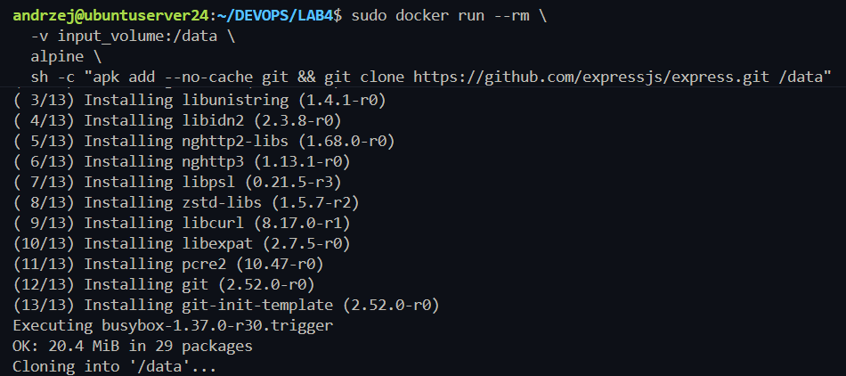

### Zbudowanie repo w clean kontenerze

Uruchomienie kontenera z wolujminami i zmienionym working directory na /input/ (gdzie jest repo - wolumin wejściowy)
```
docker run -it \
  -v input_volume:/input \
  -v output_volume:/output \
  -w /input \
  clean-image \
  bash
```


Zmiana repo na takie które ma `build`
`https://github.com/keithamus/npm-scripts-example.git`


czyszczenie wolumina wjeściowego
`sudo docker run --rm -v input_volume:/data alpine sh -c "rm -rf /data/*"`

Klonowanie nowego repo
```
docker run --rm -v input_volume:/data alpine sh -c "apk add --no-cache git && git clone https://github.com/keithamus/npm-scripts-example.git /data/repo"
```

BUDOWANIE REPO

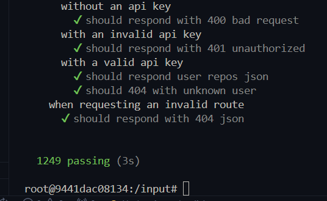

```
docker run -it \
  -v input_volume:/input \
  -v output_volume:/output \
  -w /input \
  clean-image \
  bash
```

```
cd repo
npm install
npm run build
```

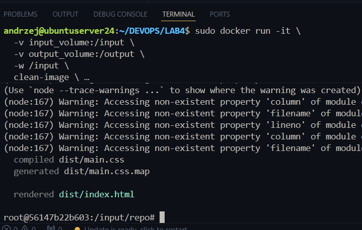

Kopiopwanie na owlumin wyjsciowy

`cp -r dist/* /output/`

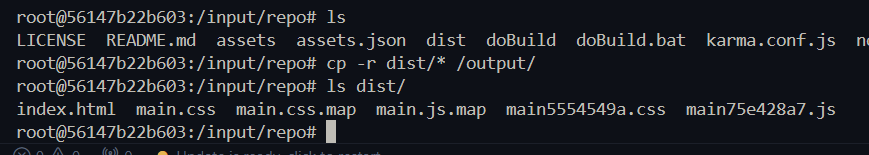

Sprawdzenie

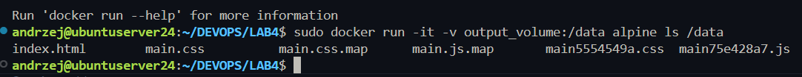

### Klonowanie wewnątrz kontenera

Uruchomienie

```
sudo docker run -it \
  -v input_volume:/input \
  -v output_volume:/output \
  -w /input \
  clean-image \
  bash
```

```
mkdir repo2
cd repo2
git clone https://github.com/keithamus/npm-scripts-example.git .
npm install
npm run build
```

Można tę opracje jak najbardziej zautomatyzować przy pomocy np. RUN --mount
```
FROM node

WORKDIR /app

RUN --mount=type=bind,source=./src,target=/app \
    git clone https://github.com/keithamus/npm-scripts-example.git . && \
    npm install && \
    npm run build
```


Dzieki temu :
- Repozytorium nie jest wbudowane w obraz → obraz pozostaje „czysty”
- Można buildować tymczasowo używając lokalnych plików lub woluminów
- Nie trzeba instalować Git w obrazie, jeśli używasz tymczasowego mounta
- Wynik builda można w kolejnym etapie skopiować do obrazu lub do woluminu

## Cześć 2 "Eksponowanie portu i łączność między kontenerami"

Uruchomienie kontenerów

```
sudo docker run -it --name iperf-server ubuntu:22.04 bash
apt update && apt install -y iperf3
iperf3 -s
```

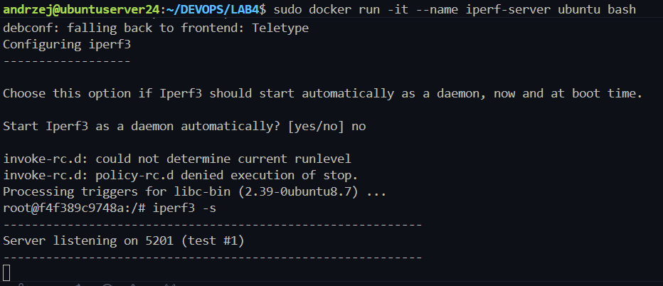


```
sudo docker run -it --name iperf-client --rm ubuntu bash
apt update && apt install -y iperf3
```

Sprwadzenie ip serwera
```
andrzej@ubuntuserver24:~/DEVOPS$ sudo docker inspect -f '{{range.NetworkSettings.Networks}}{{.IPAddress}}{{end}}' iperf-server
172.17.0.2
```

połaczenie z serwerem
`iperf3 -c 172.17.0.2`


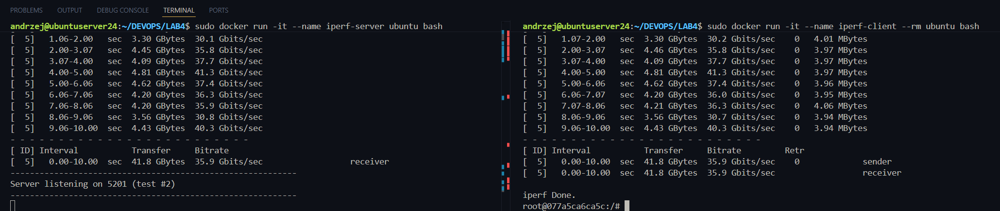


## Włąsna sieć

Tworzenie
`sudo docker network create --driver bridge my-net`

Sprawdzenie
`sudo docker network ls`

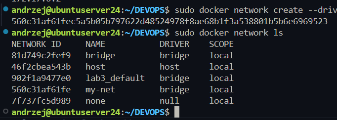


Serwer w sieic
```
docker run -dit --name iperf-server --network my-net ubuntu bash
docker exec -it iperf-server bash
apt update && apt install -y iperf3
iperf3 -s
```

Client
```
docker run -it --name iperf-client --network my-net ubuntu bash
apt update && apt install -y iperf3
iperf3 -c iperf-server
```

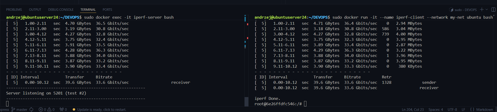


Uruchomienie konterenra serwera z wystawionym portem

```
sudo docker stop iperf-server
sudo docker rm iperf-server
sudo docker run -dit --name iperf-server -p 5201:5201 ubuntu bash
sudo docker exec -it iperf-server bash
apt update && apt install -y iperf3
iperf3 -s
```

połączenie z hosta
```
iperf3 -c 127.0.0.1
```


### wyniki testó

przekierowanie do pliku
```
sudo docker exec -it iperf-server bash
iperf3 -s > /iperf-log.txt
```

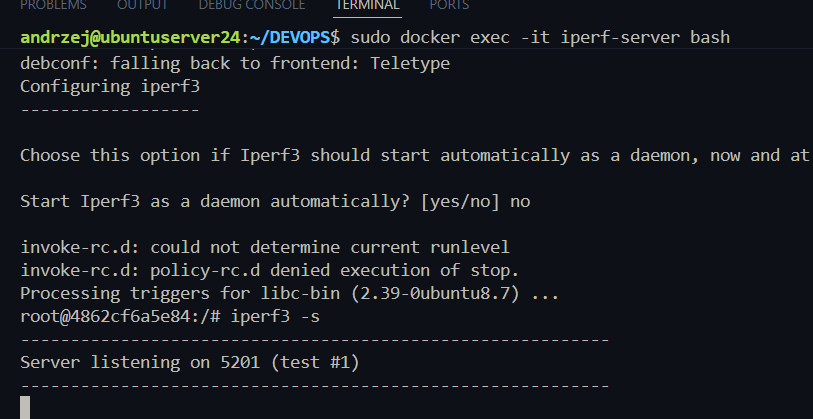
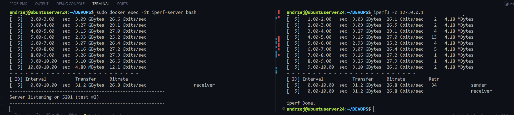


Otrzymane logi:

`sudo docker exec -it iperf-server cat /iperf-log.txt`
```
andrzej@ubuntuserver24:~/DEVOPS$ sudo docker exec -it iperf-server cat /iperf-log.txt
-----------------------------------------------------------
Server listening on 5201 (test #1)
-----------------------------------------------------------
Accepted connection from 172.17.0.1, port 44486
[  5] local 172.17.0.2 port 5201 connected to 172.17.0.1 port 44500
[ ID] Interval           Transfer     Bitrate
[  5]   0.00-1.00   sec  3.02 GBytes  25.9 Gbits/sec                  
[  5]   1.00-2.00   sec  3.14 GBytes  26.9 Gbits/sec                  
[  5]   2.00-3.00   sec  3.10 GBytes  26.6 Gbits/sec                  
[  5]   3.00-4.00   sec  3.30 GBytes  28.3 Gbits/sec                  
[  5]   4.00-5.00   sec  3.07 GBytes  26.4 Gbits/sec                  
[  5]   5.00-6.00   sec  3.24 GBytes  27.9 Gbits/sec                  
[  5]   6.00-7.00   sec  3.21 GBytes  27.5 Gbits/sec                  
[  5]   7.00-8.00   sec  3.14 GBytes  26.9 Gbits/sec                  
[  5]   8.00-9.00   sec  3.08 GBytes  26.4 Gbits/sec                  
[  5]   9.00-10.00  sec  3.01 GBytes  25.9 Gbits/sec                  
[  5]  10.00-10.00  sec   896 KBytes  6.04 Gbits/sec                  
- - - - - - - - - - - - - - - - - - - - - - - - -
[ ID] Interval           Transfer     Bitrate
[  5]   0.00-10.00  sec  31.3 GBytes  26.9 Gbits/sec                  receiver
```


# 3. Usługi w rozumieniu systemu, kontenera i klastra

```bash
sudo docker run -dit --name ssh-server -p 2222:22 ubuntu bash
docker exec -it ssh-server bash

apt update && apt install -y openssh-server
# 8->polska, 59->warszawa

mkdir /var/run/sshd

passwd
# root
# root

sed -i 's/#PermitRootLogin prohibit-password/PermitRootLogin yes/' /etc/ssh/sshd_config
sed -i 's/#PasswordAuthentication yes/PasswordAuthentication yes/' /etc/ssh/sshd_config

/usr/sbin/sshd
```

Połącznie
```bash
# reset klucza przez wcześniejsze problemy
ssh-keygen -f '/home/andrzej/.ssh/known_hosts' -R '[127.0.0.1]:2222'

ssh root@127.0.0.1 -p 2222
```
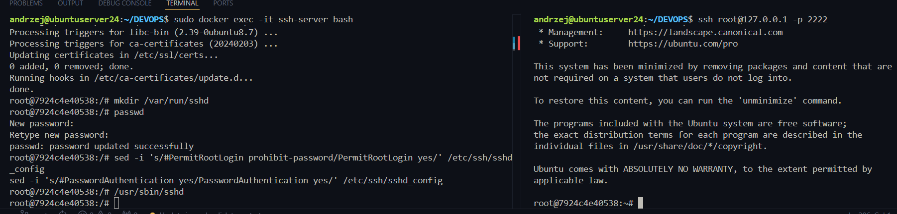

Zalety:
- Standardowy protokół do zdalnego dostępu
- Możliwość debugowania i sprawdzania kontenera
- Działa zdalnie spoza hosta

Wady:
- Niepotrzebne w produkcji
- Mniej bezpieczne - zwiększa możliwości ataku

Dobre do testó, debugowania, nauki

 
# Jenkins

```
sudo docker volume create jenkins_home
sudo docker volume create docker_sock
```

```
sudo docker run -d \
--name jenkins \
-p 8080:8080 -p 50000:50000 \
-v jenkins_home:/var/jenkins_home \
-v /var/run/docker.sock:/var/run/docker.sock \
jenkins/jenkins:lts
```

`-p 8080:8080`- interfejs WWW Jenkinsa \
`-p 50000:50000` - port agenta (slave) \
`-v /var/run/docker.sock` - umożliwia Jenkinsowi uruchamianie kontenerów (DIND)

Wykaz kontenerów:
```
sudo dcoker ps
```

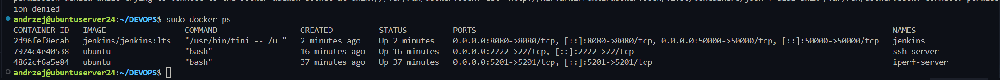


```
ssh -L 880:localhost:8080 andrzej@127.0.0.1 -p 2137
```
*Port 880 bo literówka

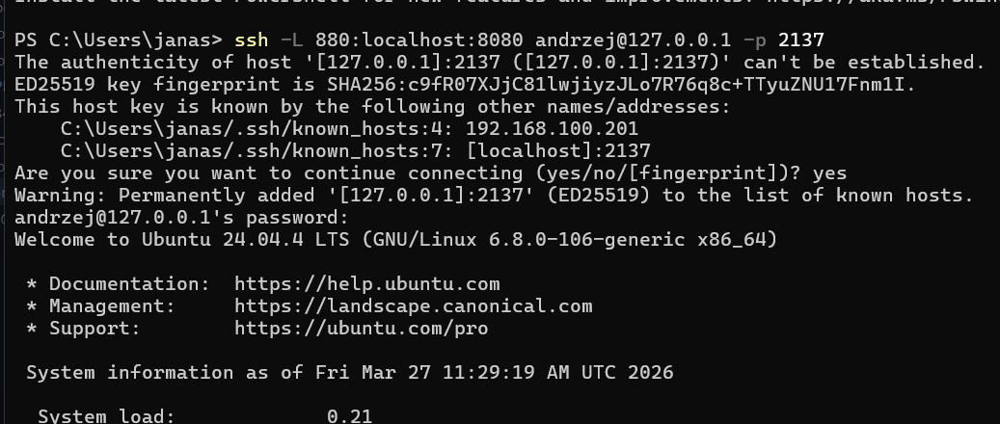
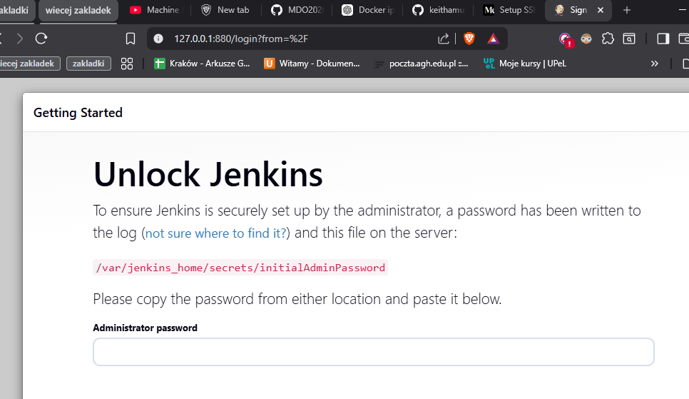