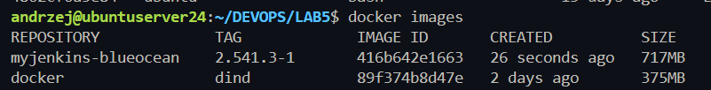
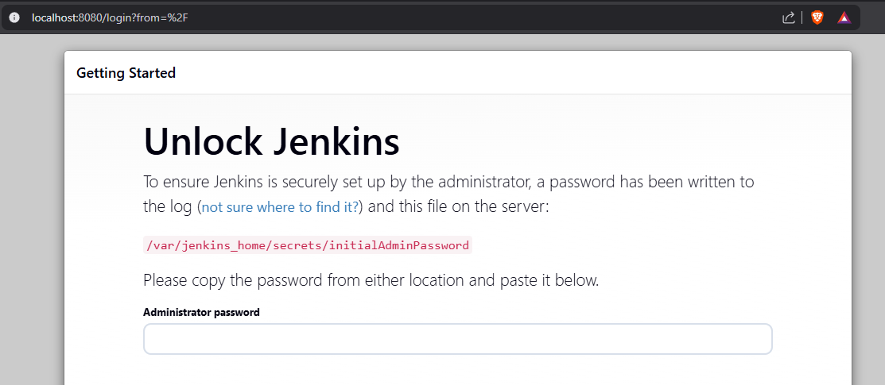
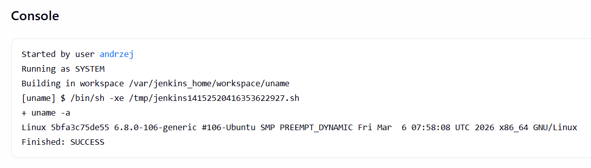
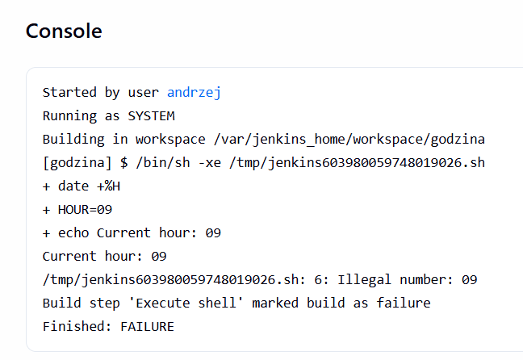
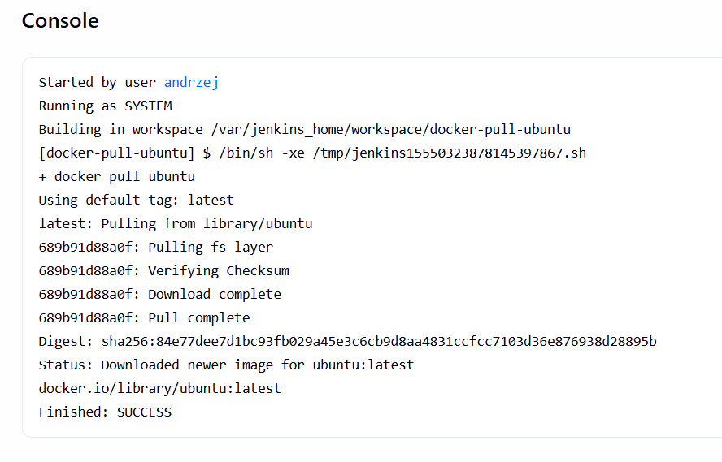
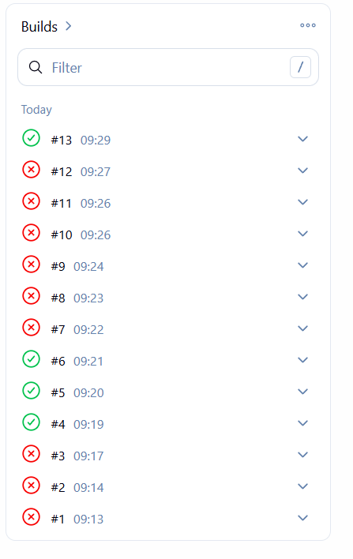
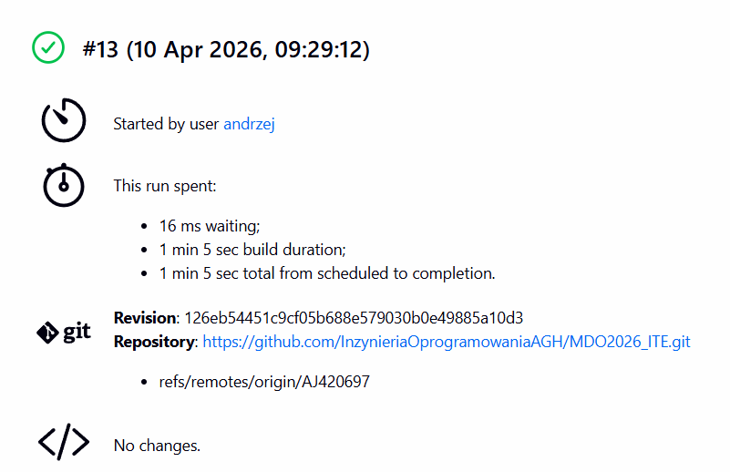

# Lab 5


## Przygotowanie - instalacja jenkinsa


2.
utworzenie sieci docker

sudo docker network create jenkins
33f5ebda3091eef45aac5ab1a8c5eac88be5978acf00ced83bb52a0d044cfab1


3.
pobranie didn obrazu
sudo docker image pull docker:dind


```
docker run --name jenkins-docker --rm --detach \
  --privileged --network jenkins --network-alias docker \
  --env DOCKER_TLS_CERTDIR=/certs \
  --volume jenkins-docker-certs:/certs/client \
  --volume jenkins-data:/var/jenkins_home \
  --publish 2376:2376 \
  docker:dind --storage-driver overlay2
  ```


4.a
 ` docker build -t myjenkins-blueocean:2.541.3-1 .`




 4.b

```
docker run \
  --name jenkins-blueocean \
  --restart=on-failure \
  --detach \
  --network jenkins \
  --env DOCKER_HOST=tcp://docker:2376 \
  --env DOCKER_CERT_PATH=/certs/client \
  --env DOCKER_TLS_VERIFY=1 \
  --publish 8080:8080 \
  --publish 50000:50000 \
  --volume jenkins-data:/var/jenkins_home \
  --volume jenkins-docker-certs:/certs/client:ro \
  myjenkins-blueocean:2.541.3-1 
  ```



Sprawdzenie hasła do pierwsdzego logowania
`docker exec jenkins-blueocean cat /var/jenkins_home/secrets/initialAdminPassword`
f417d19c5a2744899e66fb9503fe9ec1


## Zadanie wstępne: uruchomienie

### Projekt `uname`

dodanie itemu typu freesstyle
dodanie kroku budowania -> `execute shell`
zbudowanie
sprawdzenie logów



### Projekt z godzina


```bash
HOUR=$(date +%H)

echo "Current hour: $HOUR"

if [ $((HOUR % 2)) -ne 0 ]; then
  echo "Hour is odd → FAIL"
  exit 1
else
  echo "Hour is even → OK"
fi
```
prosty bashowy skrypt wygenerowany w ChatGPT

dodany aanlogicznie jak poprzednio



Zgodnie z przewidywaniami program zwraca błąd


### Docker pull

Analogiczni dodanie wykonania skryptu powłoki

Poprawne pobranie obrazu ubuntu



## Zadanie wstępne: obiekt typu pipeline

Utworzenie obiektu typu pipeline

Przetestowanie jak pisze się konfiguracje (wiele prób)



Udane zbudowanie konfiguracji:
- clone repo
- budowanie obrazu dockera z Sprawozdanie3/Dockerfile.build

