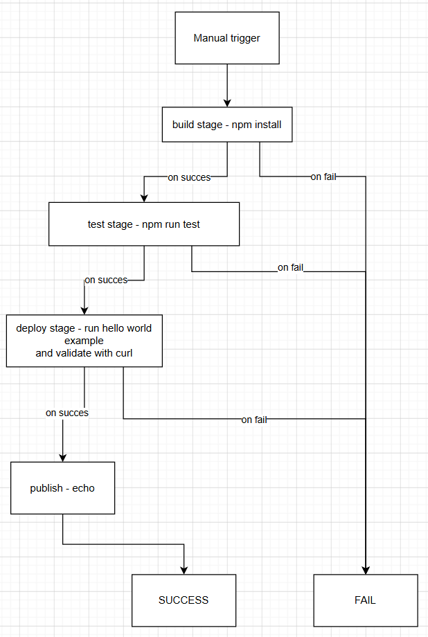
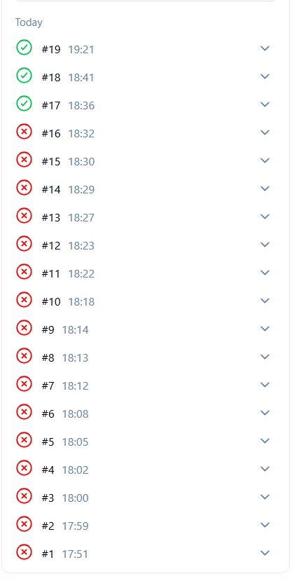
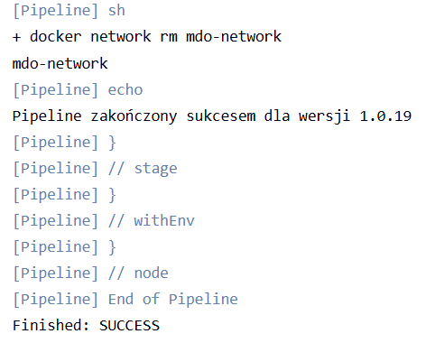
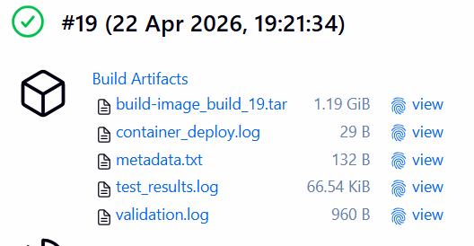

# Sprawozdanie lab 6

Jenkins DinD
https://www.jenkins.io/doc/book/installing/docker/
```
docker run \
  --name jenkins-docker \
  --rm \
  --detach \
  --privileged \
  --network jenkins \
  --network-alias docker \
  --env DOCKER_TLS_CERTDIR=/certs \
  --volume jenkins-docker-certs:/certs/client \
  --volume jenkins-data:/var/jenkins_home \
  --publish 2376:2376 \
  docker:dind \
  --storage-driver overlay2
  ```


## Plan pipelinu



## Struktura pipeline scriptu

- `Checkout` na własny branch z repo MDO2026_ITE
- `Build` uruchomienie kontenera na bazie Dockerfile.build z lab3
- `Test` uruchomienie testów na bazie Dopckerfile.test z lab3 i zapis logów
- `Deploy` uruchomienie aplikacji w osobnym kontenerze i jej przetestowanie curl'em w osobnym kontenerze z lekim linuxem
- `Poublish` po prostu komenda `echo`
- archiwizacja artefaktów


Decyzja o braku forka (konfiguracja pipelinu z własnego repo, a w repo testowym nie trzeba nic zmieniać, korzytam jedynie z przykładu `hello-world`)

Sukces po długich zmaganiach :)

Udało się osiągnąć zamierzenia z diagramu UML.





## Wersjonowanie artefaktów

Outputy z wykonywania czynności (test, deploy, walidacja) przekierowywane do plików i w `post` są tworzone artefakty.
artefakty są odpowiednio nazwane. Wchodząc w odpowiedni build mamy dostęp do jego artefaktów. 



## Publish

Wyniki publishu zapisywane są jako skompresowana paczka .tar

# Lista todo

## Pipeline: lista kontrolna
Scharakteryzuj plan na *pipeline* i przedstaw postęp prac. Czy mamy pomysł na każdy krok poniżej?

### Ścieżka krytyczna
Podstawowy zbiór czynności do wykonania w ramach zadania z pipelinem CI/CD. Ścieżką krytyczną jest:
- [x] commit (lub tzw. *manual trigger* @ Jenkins)
- [x] clone
- [x] build
- [x] test
- [x] deploy
- [x] publish

Poniższe czynności wykraczają ponad tę ścieżkę, ale zrealizowanie ich pozwala stworzyć pełny, udokumentowany, jednoznaczny i łatwy do utrzymania pipeline z niskim progiem wejścia dla nowych *maintainerów*.


### Pełna lista kontrolna
Zweryfikuj dotychczasową postać sprawozdania oraz planowane czynności względem ścieżki krytycznej oraz poniższej listy. Realizacja punktu wymaga opisania czynności,
wykazania skuteczności (np. zrzut ekranu), podania poleceń i uzasadnienia decyzji dot. implementacji.

- [x] Aplikacja została wybrana
- [x] Licencja potwierdza możliwość swobodnego obrotu kodem na potrzeby zadania
- [x] Wybrany program buduje się
- [x] Przechodzą dołączone do niego testy
- [x] Zdecydowano, czy jest potrzebny fork własnej kopii repozytorium
- [x] Stworzono diagram UML zawierający planowany pomysł na proces CI/CD
- [x] Wybrano kontener bazowy lub stworzono odpowiedni kontener wstepny (runtime dependencies)
- [x] *Build* został wykonany wewnątrz kontenera
- [x] Testy zostały wykonane wewnątrz kontenera (kolejnego)
- [x] Kontener testowy jest oparty o kontener build
- [x] Logi z procesu są odkładane jako numerowany artefakt, niekoniecznie jawnie
- [x] Zdefiniowano kontener typu 'deploy' pełniący rolę kontenera, w którym zostanie uruchomiona aplikacja (niekoniecznie docelowo - może być tylko integracyjnie)
- [ ] Uzasadniono czy kontener buildowy nadaje się do tej roli/opisano proces stworzenia nowego, specjalnie do tego przeznaczenia
- [x] Wersjonowany kontener 'deploy' ze zbudowaną aplikacją jest wdrażany na instancję Dockera
- [x] Następuje weryfikacja, że aplikacja pracuje poprawnie (*smoke test*) poprzez uruchomienie kontenera 'deploy'
- [x] Zdefiniowano, jaki element ma być publikowany jako artefakt
- [x] Uzasadniono wybór: kontener z programem, plik binarny, flatpak, archiwum tar.gz, pakiet RPM/DEB
- [x] Opisano proces wersjonowania artefaktu (można użyć *semantic versioning*)
- [x] Dostępność artefaktu: publikacja do Rejestru online, artefakt załączony jako rezultat builda w Jenkinsie
- [x] Przedstawiono sposób na zidentyfikowanie pochodzenia artefaktu
- [x] Pliki Dockerfile i Jenkinsfile dostępne w sprawozdaniu w kopiowalnej postaci oraz obok sprawozdania, jako osobne pliki
- [x] Zweryfikowano potencjalną rozbieżność między zaplanowanym UML a otrzymanym efektem


# Zawartość Dockerfile oraz jenkins file

BUILD
```dockerfile
FROM node

WORKDIR /app

RUN git clone https://github.com/expressjs/express.git .

RUN npm install
```

TEST
```dockerfile
FROM build-image

WORKDIR /app

CMD ["npm", "test"]
```

JENKINSFILE
```jenkinsfile
pipeline {
    agent any

    environment {
        BUILD_IMG = 'build-image'
        TEST_IMG  = 'test-image'
        DEPLOY_NAME = 'express-app-deploy'
        NETWORK_NAME = 'mdo-network'
        // Wersjonowanie na podstawie numeru buildu Jenkinsa (Semantic Versioning 1.0.BUILD_ID)
        APP_VERSION = "1.0.${env.BUILD_ID}"
    }

    stages {
        stage('Checkout') {
            steps {
                git branch: 'AJ420697', url: 'https://github.com/InzynieriaOprogramowaniaAGH/MDO2026_ITE.git'
            }
        }

        stage('Build') {
            steps {
                echo "Budowanie wersji ${APP_VERSION}..."
                sh "docker build -f grupa2/AJ420697/Sprawozdanie3/Dockerfile.build -t ${BUILD_IMG}:${APP_VERSION} -t ${BUILD_IMG}:latest ."
            }
        }

        stage('Test') {
            steps {
                script {
                    // Przekierowujemy wynik testów do pliku, żeby mieć artefakt
                    sh "docker build -f grupa2/AJ420697/Sprawozdanie3/Dockerfile.test -t ${TEST_IMG} ."
                    sh "docker run --rm ${TEST_IMG} > test_results.log 2>&1"
                }
            }
            post {
                always {
                    archiveArtifacts artifacts: 'test_results.log', fingerprint: true
                }
            }
        }

        stage('Deploy & Smoke Test') {
            steps {
                script {
                    sh "docker network create ${NETWORK_NAME} || true"

                    sh """
                    docker run -d \
                        --name ${DEPLOY_NAME} \
                        --network ${NETWORK_NAME} \
                        --network-alias moja-apka \
                        ${BUILD_IMG}:latest \
                        node examples/hello-world/index.js
                    """
                    
                    sleep 5
                    
                    // Zapisujemy logi kontenera do pliku
                    sh "docker logs ${DEPLOY_NAME} > container_deploy.log 2>&1"

                    echo 'Walidacja (Smoke Test)...'
                    // Zapisujemy wynik curla do pliku
                    sh """
                    docker run --rm \
                        --network ${NETWORK_NAME} \
                        alpine/curl \
                        curl -v http://moja-apka:3000/ > validation.log 2>&1
                    """
                }
            }
            post {
                always {
                    // Archiwizacja wszystkich logów z tego etapu
                    archiveArtifacts artifacts: '*.log', allowEmptyArchive: true
                }
            }
        }

        stage('Publish') {
            steps {
                script {
                    echo "Publishing Docker image ${BUILD_IMG} as version ${APP_VERSION}..."

                    // 1. Zapisujemy obraz do pliku .tar z numerem buildu w nazwie
                    // Dzięki temu nazwa pliku jednoznacznie identyfikuje pochodzenie
                    sh "docker save ${BUILD_IMG}:${APP_VERSION} -o ${BUILD_IMG}_build_${env.BUILD_ID}.tar"
                    
                    // 2. Tworzymy plik metadanych (identyfikacja pochodzenia wewnątrz artefaktu)
                    sh """
                        echo 'Build Information' > metadata.txt
                        echo 'Build Number: ${env.BUILD_ID}' >> metadata.txt
                        echo 'Git Commit: ${sh(script: 'git rev-parse HEAD', returnStdout: true).trim()}' >> metadata.txt
                        echo 'Image Tag: ${BUILD_IMG}:${APP_VERSION}' >> metadata.txt
                        echo 'Date: \$(date)' >> metadata.txt
                    """

                    // 3. Archiwizujemy oba pliki w Jenkinsie
                    archiveArtifacts artifacts: "${BUILD_IMG}_build_${env.BUILD_ID}.tar, metadata.txt", fingerprint: true
                    
                    echo "Artifacts archived: ${BUILD_IMG}_build_${env.BUILD_ID}.tar and metadata.txt"
                }
            }
        }
    }

    post {
        always {
            echo 'Sprzątanie środowiska...'
            sh "docker stop ${DEPLOY_NAME} || true"
            sh "docker rm ${DEPLOY_NAME} || true"
            sh "docker network rm ${NETWORK_NAME} || true"
        }
        success {
            echo "Pipeline zakończony sukcesem dla wersji ${APP_VERSION}"
        }
    }
}
```