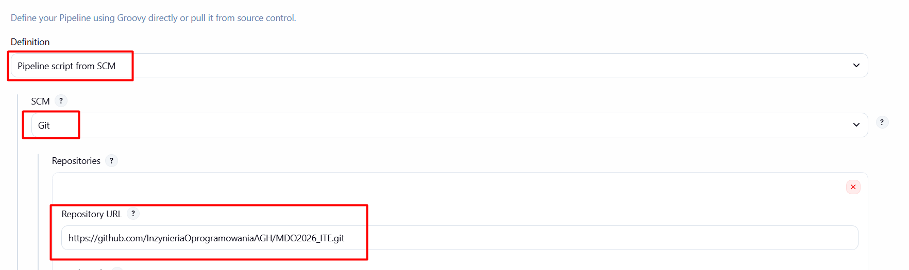
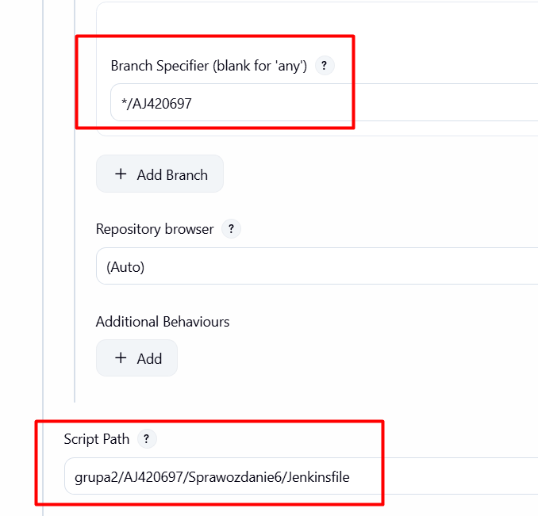
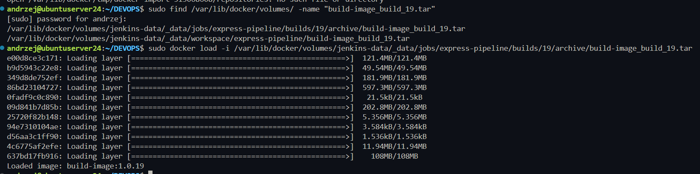
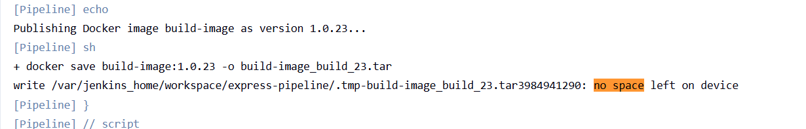
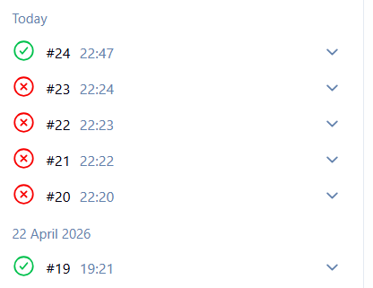

# Sprawozdanie lab 7 - Andrzej Janaszek

Dodano pipeline SCM




Dodano czyszczenie konfiguracji żeby zawsze build działał na nowych plikach

Uruchomienie builda buudje wszystko od nowa (bez cashowania)

```groovy
 options {
        // czyszczenie katalogu roboczeog
        skipDefaultCheckout() 
    }

    stages {
        stage('Checkout & Clean') {
            steps {
                // czyszczenie
                cleanWs()
                checkout scm
            }
        }
        ...
```

Sprawdzono możliwość uruchomienia końcowego artefaktu


Ze względu na to że paczka .tar ma ponad 1GB sprawia to problemy typu `no space left` przy budowaniu (VM ma tylko 20GB). Pamięć została opróżniona aby umożliwić build 23. 





### Definition of done

Artefakt można pobrać z rejestru jenkinsa, można go uruchomić


```bash
andrzej@ubuntuserver24:~/DEVOPS$ sudo find /var/lib/docker/volumes/ -name "build-image_build_19.tar"
[sudo] password for andrzej: 
/var/lib/docker/volumes/jenkins-data/_data/jobs/express-pipeline/builds/19/archive/build-image_build_19.tar
/var/lib/docker/volumes/jenkins-data/_data/workspace/express-pipeline/build-image_build_19.tar

andrzej@ubuntuserver24:~/DEVOPS$ sudo docker load -i /var/lib/docker/volumes/jenkins-data/_data/jobs/express-pipeline/builds/19/archive/build-image_build_19.tar
```

run obrazu
```
docker run -d -p 8888:3000 --name load-test-v19 build-image:1.0.19
```

### Kroki Jenkinsfile
Zweryfikuj, czy definicja pipeline'u obecna w repozytorium pokrywa ścieżkę krytyczną:

- [x] Przepis dostarczany z SCM, a nie wklejony w Jenkinsa lub sprawozdanie (co załatwia nam `clone` )
- [x] Posprzątaliśmy i wiemy, że odbyło się to skutecznie - mamy pewność, że pracujemy na najnowszym (a nie *cache'owanym* kodzie)
- [x] Etap `Build` dysponuje repozytorium i plikami `Dockerfile`
- [x] Etap `Build` tworzy obraz buildowy, np. `BLDR`
- [x] Etap `Build` (krok w tym etapie) lub oddzielny etap (o innej nazwie), przygotowuje artefakt - **jeżeli docelowy kontener ma być odmienny**, tj. nie wywodzimy `Deploy` z obrazu `BLDR`
- [x] Etap `Test` przeprowadza testy
- [x] Etap `Deploy` przygotowuje **obraz lub artefakt** pod wdrożenie. W przypadku aplikacji pracującej jako kontener, powinien to być obraz z odpowiednim entrypointem. W przypadku buildu tworzącego artefakt niekoniecznie pracujący jako kontener (np. interaktywna aplikacja desktopowa), należy przesłać i uruchomić artefakt w środowisku docelowym.
- [x] Etap `Deploy` przeprowadza wdrożenie (start kontenera docelowego lub uruchomienie aplikacji na przeznaczonym do tego celu kontenerze sandboxowym)
- [x] Etap `Publish` wysyła obraz docelowy do Rejestru i/lub dodaje artefakt do historii builda
- [x] Ponowne uruchomienie naszego *pipeline'u* powinno zapewniać, że pracujemy na najnowszym (a nie *cache'owanym*) kodzie. Innymi słowy, *pipeline* musi zadziałać więcej niż jeden raz 😎