# Inwentaryzacja

Zmiana nazwy hosta:

```bash
andrzej@ubuntuserver24:~$ sudo hostnamectl set-hostname orchestrator
[sudo] password for andrzej:
andrzej@ubuntuserver24:~$ hostname
orchestrator
```

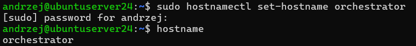


dodanie hostów w /etc/hosts na obu maszynach wirtualnych

```bash
andrzej@ubuntuserver24:~$ sudo nano /etc/hosts
andrzej@ubuntuserver24:~$ cat /etc/hosts
127.0.0.1 localhost
127.0.1.1 ubuntuserver24

192.168.56.102 ansible-target
192.168.56.101 orchestrator

...
```


test pingiem

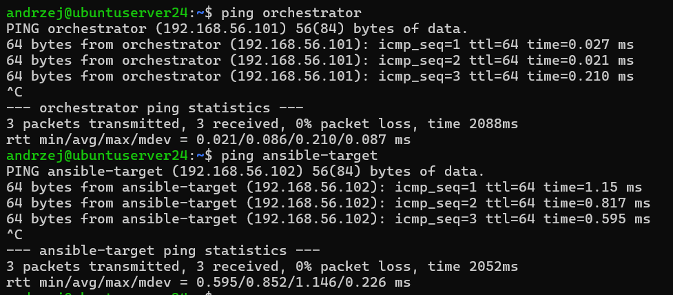

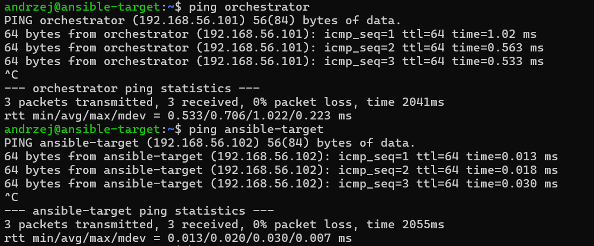


połaczenie ssh bez hasła

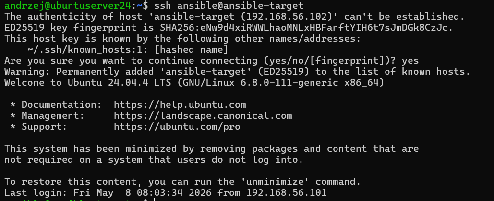


### ansible `inventory.ini`

utworzenie katalogu `ansible` w home directory
utworzenie pliku inventory.ini

```ini
[Orchestrators]
orchestrator

[Endpoints]
ansible-target ansible_user=ansible
```

test działania ansible ping
```bash
ansible all -i inventory.ini -m ping
```

Problem z pingowaniem hosta (głównej VM)
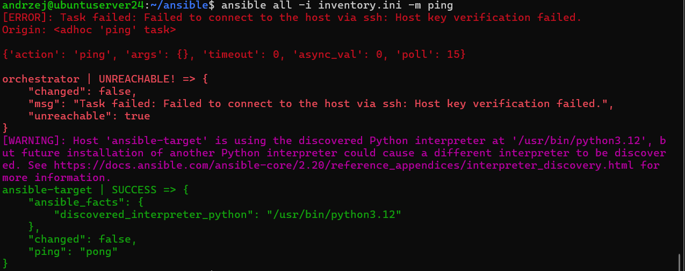

rozwiązanie: dodanie `ansible_connection=local` w inventory.ini przy tym hoscie

Końcowa wersjia pliku `inventory.ini`
```ini
[Orchestrators]
orchestrator ansible_connection=local

[Endpoints]
ansible-target ansible_user=ansible
```

Pomyślny ping
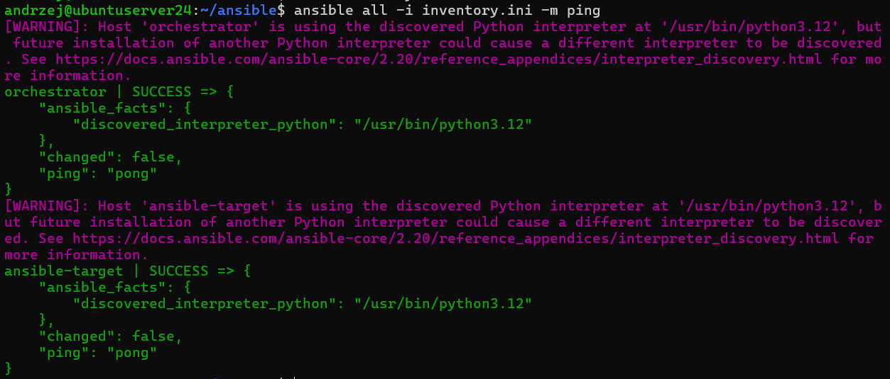

# Zdalne wywoływanie procedur

Utworzenie `playbook'a`

`ping.yml`

```yaml
- hosts: all
  tasks:
    - name: Ping all machines
      ansible.builtin.ping:
```

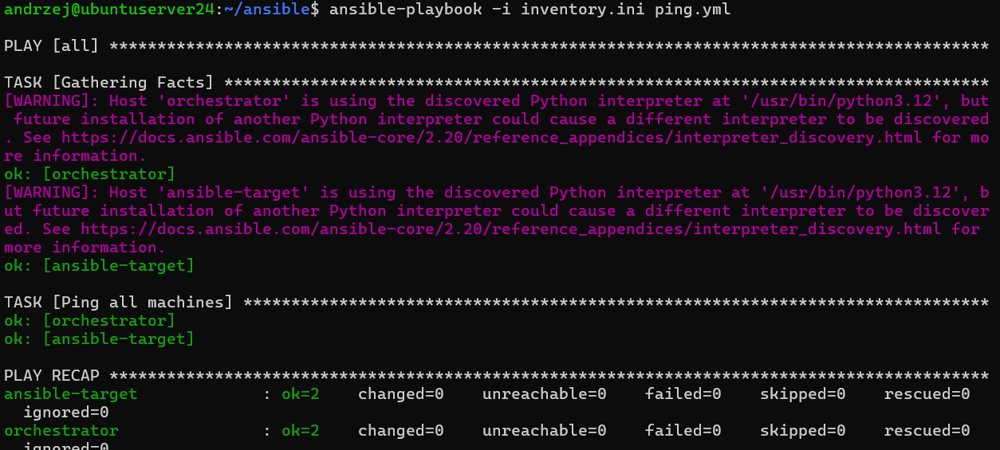

Kopiowanie `inventory.ini`

utworzenie pliku `copy_inventory.yml`

```yml
- hosts: Endpoints
  tasks:
    - name: Copy inventory file
      ansible.builtin.copy:
        src: inventory.ini
        dest: /home/ansible/inventory.ini
        owner: ansible
        group: ansible
        mode: '0644'
```

wykonanie kopiowania 
```
ansible-playbook -i inventory.ini copy_inventory.yml
```

Wynik za pierwszym razem:
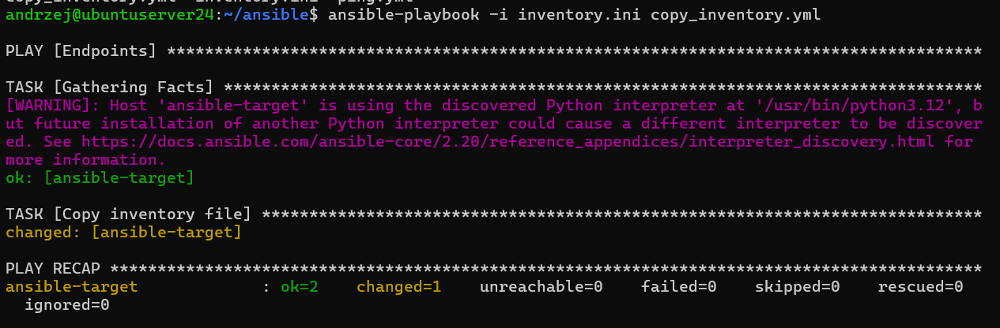

Wynik za drugim razem:
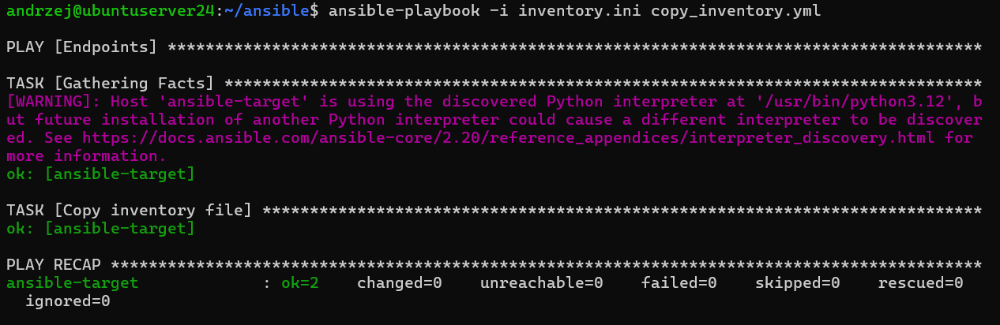

Wywołanie tego drugi raz nic nie zmienia ani nie rzuca błędu czy aexception, poneiważ ansible jest `idempotentny` czyli bierze pod uwagę aktualny stan faktyczny i jeżeli nie jest potrzebne przeprowadzenie danej operacji to jej nie przeprowadza.


Dodanie usera ansible do odpowiednich grup
```bash
andrzej@ansible-target:~$ sudo usermod -aG sudo ansible
[sudo] password for andrzej:
andrzej@ansible-target:~$ groups ansible
ansible : ansible sudo users
```


plik do aktualizacji pakietów
```yml
- hosts: Endpoints
  become: true

  tasks:
    - name: Update apt cache
      ansible.builtin.apt:
        update_cache: yes

    - name: Upgrade packages
      ansible.builtin.apt:
        upgrade: dist
```


```bash
ansible-playbook -i inventory.ini update.yml -K
```
`-K` żeby zapytało o hasło dla sudo

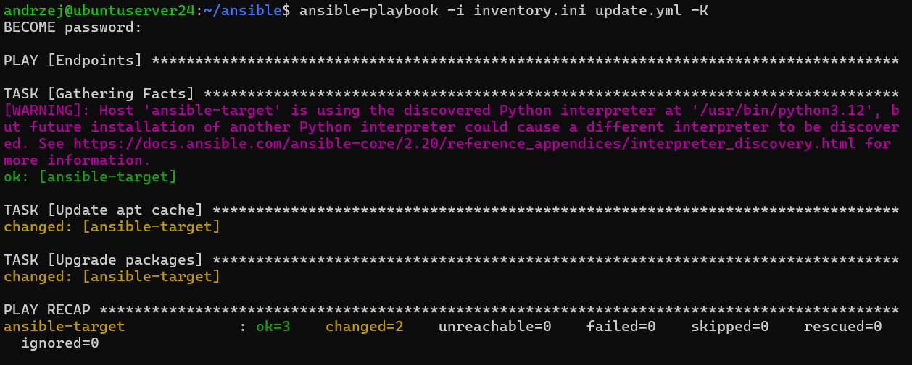


restart usług

plik `restart_services.yml`
```yml
- hosts: Endpoints
  become: true

  tasks:
    - name: Restart SSH service
      ansible.builtin.service:
        name: ssh
        state: restarted

    - name: Restart RNG daemon
      ansible.builtin.service:
        name: rngd
        state: restarted
```

```sh
ansible-playbook -i inventory.ini restart_services.yml -K
```

Po uruchomieniu błąd: brak usługi rngd na maszynie ansible-target. Usłuyga została doinstalowana `sudo apt install rng-tools5` (dla rng-tools nie działa i usługa rngd się nie uruchamia, przynajmniej nie pod tą nazwą).

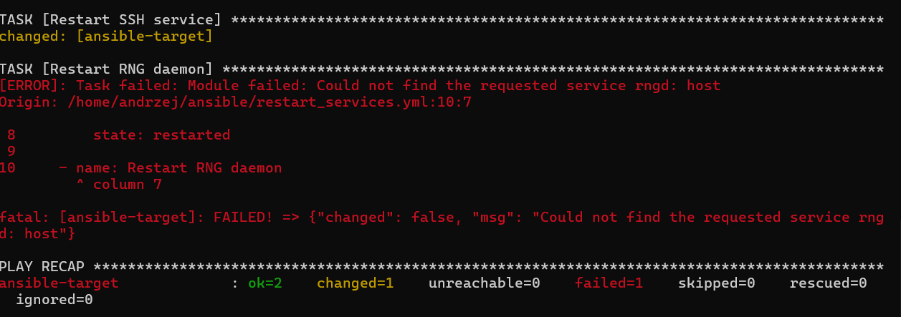

zrestartowanie serwisów

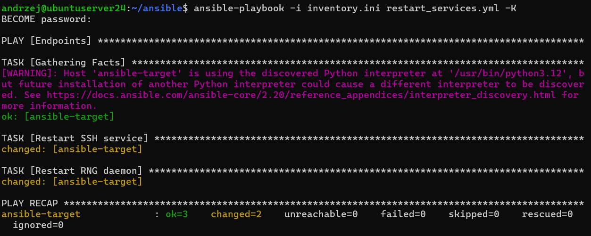


zatrzymanie ssh na ansible-target `sudo systemctl stop ssh` i `sudo systemctl stop ssh.socket`

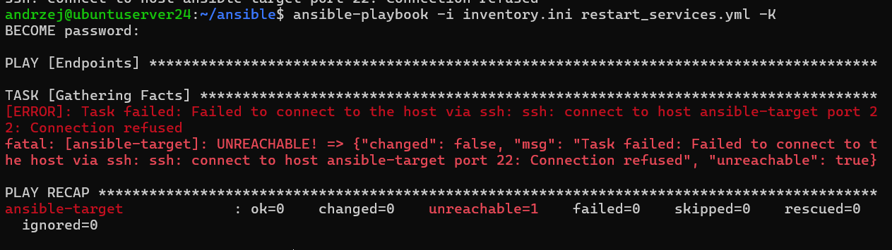

Ponowny restart serwisów daje bład
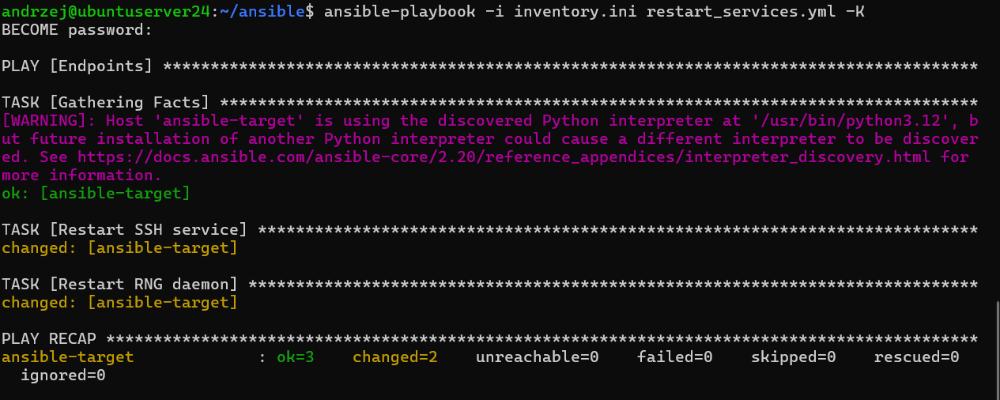

Odpięcie karty siecowej

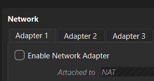

Wynik restartu usług

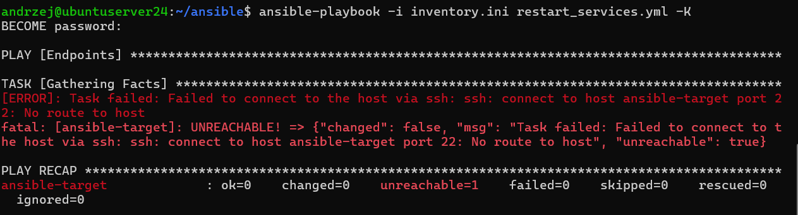


# Zarządzanie stworzonym artefaktem


`install_docker.yml`

```
- hosts: Endpoints
  become: true

  tasks:
    - name: Install Docker
      ansible.builtin.apt:
        name: docker.io
        state: present
        update_cache: yes

    - name: Start Docker
      ansible.builtin.service:
        name: docker
        state: started
        enabled: true

    - name: Check Docker version
      ansible.builtin.command: docker --version
      register: docker_version
      changed_when: false

    - debug:
        var: docker_version.stdout
```

`ansible-playbook -i inventory.ini install_docker.yml -K`

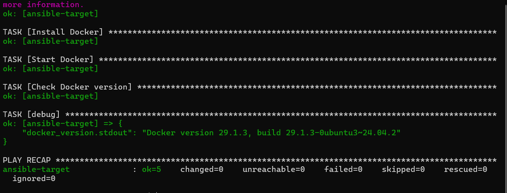


### Tymczasowe skopiowanie artefaktu do home/ansible z dockera jenkinsa `docker cp jenkins-blueocean:/var/jenkins_home/jobs/express-pipeline/builds/24/archive/build-image_build_24.tar .`
```bash
andrzej@orchestrator:~/ansible$ docker cp jenkins-blueocean:/var/jenkins_home/jobs/express-pipeline/builds/24/archive/build-image_build_24.tar .
Successfully copied 1.28GB to /home/andrzej/ansible/.
```
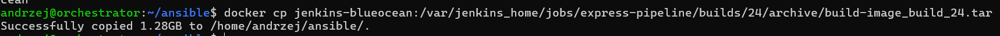

### Ansible roles

`ansible-galaxy role init deploy_container`

`deploy_container/tasks/main.yml`
```yml
- name: Copy container image
  ansible.builtin.copy:
    src: build-image_build_24.tar
    dest: /tmp/build-image_build_24.tar


- name: Load Docker image
  ansible.builtin.command:
    cmd: docker load -i /tmp/build-image_build_24.tar
  register: load_result

- name: Extract image name
  ansible.builtin.set_fact:
    image_name: "{{ (load_result.stdout | regex_search('Loaded image: (.*)', '\\1'))[0] }}"

- debug:
    var: image_name

- name: Run container
  community.docker.docker_container:
    name: app-hello-world
    image: "{{ image_name }}"
    state: started
    ports:
      - "6666:3000"

- name: Check container
  ansible.builtin.command:
    cmd: docker ps
  register: docker_ps
  changed_when: false

- debug:
    var: docker_ps.stdout

- name: Stop container
  community.docker.docker_container:
    name: app-hello-world
    state: absent
```

`ansible-galaxy role init deploy_container`


`site.yml`

```yml
- hosts: Endpoints
  become: true
  tasks:
    - debug:
        msg: "PLAYBOOK"

  roles:
    - deploy_container
```

`ansible-playbook -i inventory.ini site.yml -K -v`

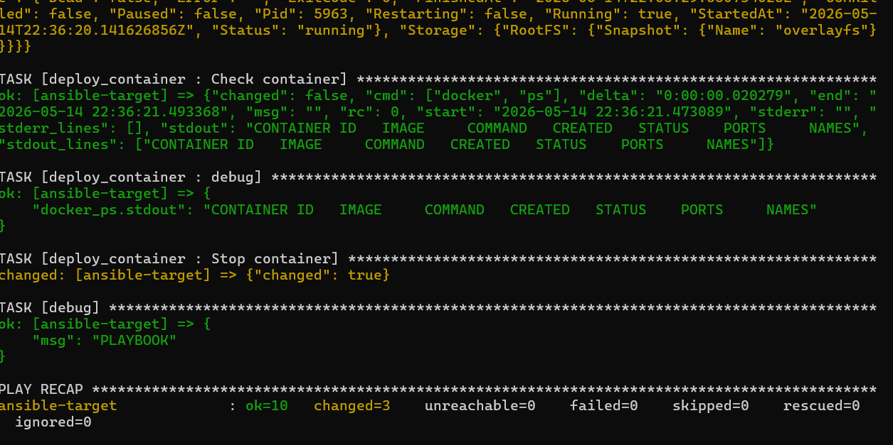

