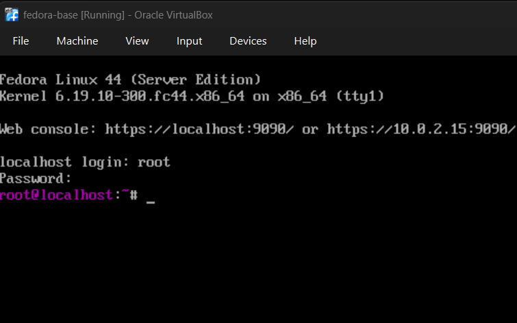
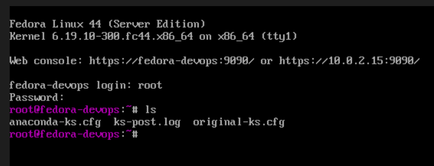
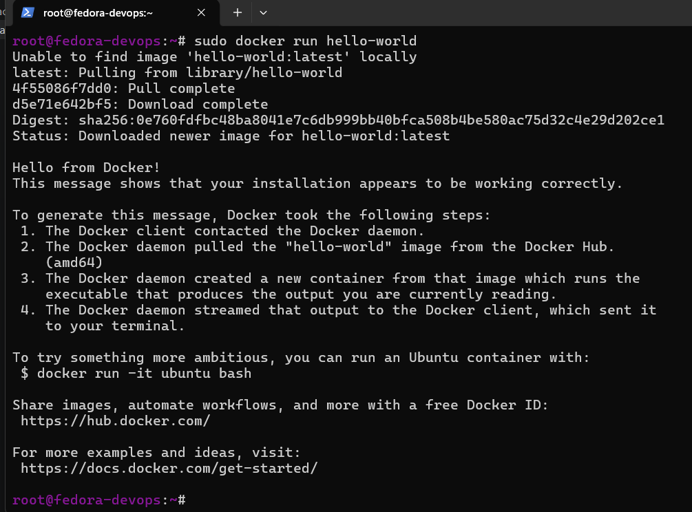
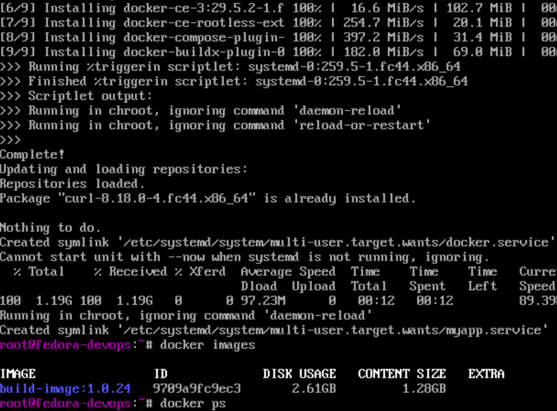

# 1- 
instalacja fedory




# 2
domyślny plik anaconda ks
```
# Generated by Anaconda 44.30
# Keyboard layouts
keyboard --vckeymap=pl --xlayouts='pl'
# System language
lang pl_PL.UTF-8

%packages
@^server-product-environment
@container-management
@domain-client
@guest-agents
@server-hardware-support

%end

# System authorization information
authselect enable-feature with-fingerprint

# Run the Setup Agent on first boot
firstboot --enable

# Generated using Blivet version 3.13.2
ignoredisk --only-use=sda
autopart
# Partition clearing information
clearpart --none --initlabel

# System timezone
timezone Europe/Warsaw --utc

# Root password
rootpw --iscrypted --allow-ssh $y$j9T$ELItq33xIzjXnYqHvgnz6P4A$6u4dTgp139sG3oma61/.XF/D1g/LVWCE2oSa64vbev
```

# 3
modyfikacja pliku

```
# Generated by Anaconda 44.30
# Keyboard layouts
keyboard --vckeymap=pl --xlayouts='pl'
# System language
lang pl_PL.UTF-8

# Host name
network --hostname=fedora-devops

url --mirrorlist=http://mirrors.fedoraproject.org/mirrorlist?repo=fedora-44&arch=x86_64
repo --name=updates --mirrorlist=http://mirrors.fedoraproject.org/mirrorlist?repo=updates-released-f44&arch=x86_64


%packages
@^server-product-environment
@container-management
@domain-client
@guest-agents
@server-hardware-support

%end

# System authorization information
# authselect enable-feature with-fingerprint

# Run the Setup Agent on first boot
firstboot --enable

# Generated using Blivet version 3.13.2
ignoredisk --only-use=sda
autopart
# Partition clearing information
clearpart --all --initlabel

# System timezone
timezone Europe/Warsaw --utc

# Root password
rootpw --iscrypted --allow-ssh $y$j9T$ELItq33xIzjXnYqHvgnz6P4A$6u4dTgp139sG3oma61/.XF/D1g/LVWCE2oSa64vbevD


# POST
%post --log=/root/ks-post.log
echo "Post install running"
%end
```


# 4
edycja konfiguaacji instalacji fedory
dodanie: `inst.ks=http://192.168.56.1:8000/anaconda-ks.cfg` do konfiguracji
wczesnijesze zahostowanie servera http z plikiem kick starterowym na hoscie
`python -m http.server 8000`
i sprwadzenie ip `ipconfig`

# 5
poprawne automatyczne zainstalowanie z kickstartera


# 6
Próba instalowania dockera na VM (po prostu - nie automatycznie)

kroki z `https://docs.docker.com/engine/install/fedora/`
```
sudo dnf remove docker \
                  docker-client \
                  docker-client-latest \
                  docker-common \
                  docker-latest \
                  docker-latest-logrotate \
                  docker-logrotate \
                  docker-selinux \
                  docker-engine-selinux \
                  docker-engine


sudo dnf config-manager addrepo --from-repofile https://download.docker.com/linux/fedora/docker-ce.repo


sudo dnf install docker-ce docker-ce-cli containerd.io docker-buildx-plugin docker-compose-plugin


sudo systemctl enable --now docker


sudo docker run hello-world
```



porpawna instalacja i uruchomienie, brak problemów.


ostateczny plik kickstart pobierający zależność (dockera) oraz artefackt (aktualnei z hosta po http) i odpalający ten artefakt


```
# Generated by Anaconda 44.30
# Keyboard layouts
keyboard --vckeymap=pl --xlayouts='pl'
# System language
lang pl_PL.UTF-8

# Host name
network --hostname=fedora-devops

url --mirrorlist=http://mirrors.fedoraproject.org/mirrorlist?repo=fedora-44&arch=x86_64
repo --name=updates --mirrorlist=http://mirrors.fedoraproject.org/mirrorlist?repo=updates-released-f44&arch=x86_64


%packages
@^server-product-environment
@container-management
@domain-client
@guest-agents
@server-hardware-support

%end

# System authorization information
# authselect enable-feature with-fingerprint

# Run the Setup Agent on first boot
firstboot --enable

# Generated using Blivet version 3.13.2
ignoredisk --only-use=sda
autopart
# Partition clearing information
clearpart --all --initlabel

# System timezone
timezone Europe/Warsaw --utc

# Root password
rootpw --iscrypted --allow-ssh $y$j9T$ELItq33xIzjXnYqHvgnz6P4A$6u4dTgp139sG3oma61/.XF/D1g/LVWCE2oSa64vbevD


# POST
%post --log=/root/post.log

dnf -y install dnf-plugins-core

dnf config-manager addrepo --from-repofile https://download.docker.com/linux/fedora/docker-ce.repo

dnf -y install docker-ce docker-ce-cli containerd.io docker-buildx-plugin docker-compose-plugin
dnf -y install curl

systemctl enable --now docker

curl http://192.168.56.1:8000/build-image_build_24.tar -o /var/lib/app.tar

# przygotowanie katalogu na obraz
mkdir -p /var/lib/myapp

mv /var/lib/app.tar /var/lib/myapp/app.tar

# systemd service (uruchomienie po BOOT, nie w %post)
cat <<EOF > /etc/systemd/system/myapp.service
[Unit]
Description=My Docker App
Requires=docker.service
After=docker.service

[Service]
Restart=always

# najpierw load image (już w działającym systemie)
ExecStartPre=/usr/bin/docker load -i /var/lib/myapp/app.tar

# start kontenera
ExecStart=/usr/bin/docker run --rm -p 6666:3000 build-image:latest

ExecStop=/usr/bin/docker stop \$(/usr/bin/docker ps -q --filter ancestor=build-image:latest)

[Install]
WantedBy=multi-user.target
EOF

systemctl daemon-reload
systemctl enable myapp.service

%end
```


