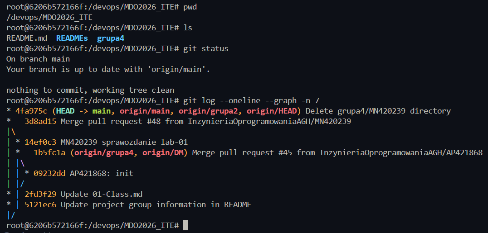
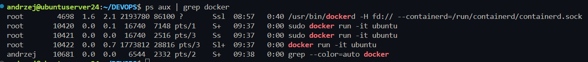

# Sprawozdanie Podsumowujące Labolatoria DevOps 1 do 4 - Andrzej Janaszek

## Labolatoria 1

### W skrócie

Konfiguracja środowiska tj. maszyny wirtualnej, połaczenia z nią z VS Code oraz konfiguracja transferu plików (File Zilla). Zapoznanie się z git hookami. Pierwszy Pull Request.

### Na laboratoriach wykonano następujące czynności:

- skonfigurowano maszynę wirtualną oraz przekierowanie portu SSH (Host:2137 → VM:22)
- zainstalowano i skonfigurowano wtyczkę Remote SSH w VS Code w celu zdalnego połączenia z maszyną
- skonfigurowano połączenie SFTP w programie FileZilla do przesyłania plików
- wygenerowano klucz SSH oraz dodano go do konta GitHub
- wykonano klonowanie repozytorium przy użyciu protokołu HTTP
- wykonano klonowanie repozytorium przy użyciu protokołu SSH
- przełączono się na istniejący branch grupowy
- utworzono własny branch do pracy nad zadaniami
- utworzono Git Hook weryfikujący poprawność prefixu w wiadomości commit
- zapoznano się z procesem tworzenia Pull Requesta i jego wykorzystaniem w pracy zespołowej

### Lista komend/poleceń:
- ssh
    - `ssh-keygen -t ed25519 -C "kluczyk DevOps agh"`
- git
    - `git clone [https:repo]`
    - `git clone [ssh:repo]`
    - `git checkout -b grupa2 origin/grupa2`
    - `git checkout -b AJ420697`

### Kod git hooka
```bash
#!/bin/bash

PREFIX="AJ420697"
msg="$(cat "$1")"

if [[ $msg =~ ^$PREFIX ]]; then
    echo "[OK]: jest prefix w commit msg"
    exit 0
else
    echo "[ERROR]: Commit musi zaczynać się od prefixa inicjały i nr"
    exit 1
fi
```


## Labolatoria 2

### W skrócie

Zapoznanie z podstawami Dockera - uruchamianie kontenerów, tworzenie obrazów, czyszczenie itd.

### Na laboratoriach wykonano następujące czynności:

- zaktualizowano listę pakietów oraz zainstalowano środowisko Docker
- zweryfikowano poprawność instalacji poprzez uruchomienie testowego kontenera hello-world
- zapoznano się z listą dostępnych obrazów oraz ich rozmiarami
- przeanalizowano uruchomione kontenery oraz ich statusy i kody wyjścia
- uruchomiono kontener na bazie obrazu busybox oraz przetestowano jego działanie w trybie - interaktywnym
- uruchomiono kontener z systemem Ubuntu oraz wykonano podstawowe operacje systemowe (np. - aktualizacja pakietów)
- porównano procesy działające w kontenerze i na hoście
- zbudowano własny obraz Dockera na podstawie przygotowanej konfiguracji
- przetestowano działanie własnego obrazu, w tym dostęp do repozytorium i narzędzia git
- zarządzano uruchomionymi kontenerami (przeglądanie, zatrzymywanie, usuwanie)
- wykonano czyszczenie nieużywanych obrazów Dockera (prune)

### Lista wybranych komend/poleceń:
- `sudo apt update`
- `sudo apt install docker.io`
- `sudo docker run hello-world`
- `sudo docker build -t ubutnu-git-repo .`
- `sudo docker ps -a`
- `sudo docker image prune -a`


### Sprawdzenie repo i gita



### Procesy dockera na Hoscie



## Labolatoria 3

### W skrócie

Zapoznanie z Dockerfile oraz DockerCompose, utomatyzacja przy ich pomocy. Analiza wykorzystania narzędzi przy wdrożeniu.

### Na laboratoriach wykonano następujące czynności:

- wyszukano repozytorium projektu (Express.js) oraz sklonowano je lokalnie
- zainstalowano zależności projektu przy użyciu `npm install`
- uruchomiono testy projektu za pomocą `npm test`
- uruchomiono środowisko Node.js w kontenerze Dockera w trybie interaktywnym
- przeprowadzono klonowanie repozytorium oraz instalację zależności wewnątrz kontenera
- wykonano testy aplikacji w środowisku kontenerowym
- przygotowano pliki Dockerfile do automatyzacji procesu budowania i testowania aplikacji
- zbudowano obraz Dockera odpowiedzialny za przygotowanie środowiska (build-image)
- zbudowano obraz Dockera odpowiedzialny za uruchamianie testów (test-image)
- uruchomiono kontener na podstawie przygotowanego obrazu testowego
- skonfigurowano automatyzację przy użyciu Docker Compose
- uruchomiono wieloetapowy proces budowania i testowania przy użyciu docker-compose up --build
- przeanalizowano podejście do wdrożeń z podziałem na środowisko developerskie i produkcyjne
- omówiono optymalizację obrazu produkcyjnego poprzez usunięcie zbędnych zależności i plików
- rozważono alternatywne formy dystrybucji aplikacji poza środowiskiem kontenerowym


### Lista wybranych komend/poleceń:

- `sudo docker run -it node bash`
- `sudo docker build -f Dockerfile.test -t test-image .`
- `sudo docker run test-image`
- `sudo docker-compose up --build`


### Pliki Dockerfile dla obrazów `build` oraz `test`

#### Dockerfile.build
```Dockerfile
FROM node

WORKDIR /app

RUN git clone https://github.com/expressjs/express.git .

RUN npm install
```

#### Dockerfile.test
```Dockerfile
FROM build-image

WORKDIR /app

CMD ["npm", "test"]
```


### Autmatyzacja przy pomocy DockerCompose
```yml
services:
  build:
    build:
      context: .
      dockerfile: Dockerfile.build
    image: build-image

  test:
    build:
      context: .
      dockerfile: Dockerfile.test
    image: test-image
    depends_on:
      - build
```

### Analiza wdrożeniowa

Najlepiej byłoby zrobić osobne docker-compose dla developmentu i dla produkcji.
Wersja `dev` zawierałaby wszystkie zależności, w tym wykorzystywane podczas pracy nad oprogramowaniem. W wersji `production` budowalibyśmy projekt bez `dev dependencies` oraz usuwał wszystkie zbędne pliki powstałe podczas budowania. Dzięki temu nie musielibysmy osobno "oczyszczać" kontenera, ponieważ docelowo budowałby się on w czystej formie.


Jeżeli oprogramowanie byłoby przeznaczone do działania poza kontenerem w klasycznych systemach można wypuścić je jako pakiet (gotowa binarka / setup instalacyjny).


## Labolatoria 4


### W skrócie

Praca z woluminami w Dcokerze. Komunikacja miedzy sieciowa miedzy kontenerami. Podstawowa konfiguracja Jenkinsa.

### Na laboratoriach wykonano następujące czynności:

- utworzono woluminy Dockera do przechowywania danych wejściowych i wyjściowych
- zbudowano prosty (czysty) obraz Dockera oraz uruchomiono kontener z podłączonymi woluminami
- zrealizowano klonowanie repozytorium do woluminu przy użyciu kontenera pomocniczego
- wykonano proces budowania aplikacji w kontenerze oraz zapisano wynik do woluminu wyjściowego
- porównano różne podejścia do dostarczania kodu do kontenera (woluminy, bind mount, kopiowanie)
- przeprowadzono automatyzację procesu budowania z wykorzystaniem mechanizmu RUN --mount
- uruchomiono kontenery serwera i klienta do testowania komunikacji sieciowej (iperf3)
- sprawdzono komunikację między kontenerami poprzez adres IP
- utworzono własną sieć Docker i zestawiono komunikację między kontenerami po nazwach usług
- skonfigurowano przekierowanie portów i umożliwiono połączenie z kontenerem z poziomu hosta
- przeprowadzono testy wydajności sieci oraz zapisano ich wyniki do pliku
- uruchomiono usługę SSH w kontenerze oraz zestawiono zdalne połączenie
- omówiono zalety i wady uruchamiania usług systemowych w kontenerach
- uruchomiono środowisko Jenkins w kontenerze wraz z woluminami i dostępem do Dockera
- skonfigurowano dostęp do Jenkinsa poprzez tunel SSH oraz interfejs webowy


## Dokładniejszy opis labów 4 (ze wzgledu na nietrywialność w stosunku do poprzednich)

### Podłączenie woluminów do kontenera
```
sudo docker run -it \
-v input_volume:/input \
-v output_volume:/output \
clean-image \
bash
```


### Klonowanie repo

1. Pomocniczy kontener który kopiuje repo do woluminu - separacja odpowiedzialności
4. Dodatkowy kontener z gitem - minimalny dodatkowy nakład
2. Bind mount lokalnego katalogu - dodaje relację od hosta
3. Ręczne kopiowanie do plików dockera - raczej zła praktyka, wydaje się nadużyciem

Klonowanie przez kontener pomocniczy:
```
sudo docker run --rm \
-v input_volume:/data \
alpine \
sh -c "apk add --no-cache git && git clone https://github.com/keithamus/npm-scripts-example.git /data"
```

- `alpine` - minimalny/lekki system
- `--no-cache` - nie keszuje zmian
- `--rm` - usuniecie kontenera


### Zbudowanie repo w clean kontenerze

Uruchomienie kontenera z wolujminami i zmienionym working directory na /input/ (gdzie jest repo - wolumin wejściowy)

Zmiana repo na takie które ma `build`
`https://github.com/keithamus/npm-scripts-example.git`
czyszczenie wolumina wjeściowego

`sudo docker run --rm -v input_volume:/data alpine sh -c "rm -rf /data/*"`

Klonowanie nowego repo
```
docker run --rm -v input_volume:/data alpine sh -c "apk add --no-cache git && git clone https://github.com/keithamus/npm-scripts-example.git /data/repo"
```

Kopiopwanie na wolumin wyjsciowy `cp -r dist/* /output/`


### Klonowanie wewnątrz kontenera


```
mkdir repo2
cd repo2
git clone https://github.com/keithamus/npm-scripts-example.git .
npm install
npm run build
```

Można tę opracje jak najbardziej zautomatyzować przy pomocy np. RUN --mount
```Dockerfile
FROM node

WORKDIR /app

RUN --mount=type=bind,source=./src,target=/app \
    git clone https://github.com/keithamus/npm-scripts-example.git . && \
    npm install && \
    npm run build
```

### "Eksponowanie portu i łączność między kontenerami"

Uruchomienie kontenerów

```
sudo docker run -it --name iperf-server ubuntu:22.04 bash
apt update && apt install -y iperf3
iperf3 -s
```


```
sudo docker run -it --name iperf-client --rm ubuntu bash
apt update && apt install -y iperf3
```

Sprwadzenie ip serwera
```
andrzej@ubuntuserver24:~/DEVOPS$ sudo docker inspect -f '{{range.NetworkSettings.Networks}}{{.IPAddress}}{{end}}' iperf-server
172.17.0.2
```

połaczenie z serwerem
`iperf3 -c 172.17.0.2`


## Własna sieć

Tworzenie
`sudo docker network create --driver bridge my-net`

Sprawdzenie
`sudo docker network ls`

Serwer w sieci
```
docker run -dit --name iperf-server --network my-net ubuntu bash
docker exec -it iperf-server bash
apt update && apt install -y iperf3
iperf3 -s
```

Client
```
docker run -it --name iperf-client --network my-net ubuntu bash
apt update && apt install -y iperf3
iperf3 -c iperf-server
```


Uruchomienie konterenra serwera z wystawionym portem

```
sudo docker stop iperf-server
sudo docker rm iperf-server
sudo docker run -dit --name iperf-server -p 5201:5201 ubuntu bash
sudo docker exec -it iperf-server bash
apt update && apt install -y iperf3
iperf3 -s
```

połączenie z hosta
```
iperf3 -c 127.0.0.1
```


### wyniki testów

przekierowanie do pliku
```
sudo docker exec -it iperf-server bash
iperf3 -s > /iperf-log.txt
```


Otrzymane logi:

`sudo docker exec -it iperf-server cat /iperf-log.txt`
```
andrzej@ubuntuserver24:~/DEVOPS$ sudo docker exec -it iperf-server cat /iperf-log.txt
-----------------------------------------------------------
Server listening on 5201 (test #1)
-----------------------------------------------------------
Accepted connection from 172.17.0.1, port 44486
[  5] local 172.17.0.2 port 5201 connected to 172.17.0.1 port 44500
[ ID] Interval           Transfer     Bitrate
[  5]   0.00-1.00   sec  3.02 GBytes  25.9 Gbits/sec                  
[  5]   1.00-2.00   sec  3.14 GBytes  26.9 Gbits/sec                  
[  5]   2.00-3.00   sec  3.10 GBytes  26.6 Gbits/sec                  
[  5]   3.00-4.00   sec  3.30 GBytes  28.3 Gbits/sec                  
[  5]   4.00-5.00   sec  3.07 GBytes  26.4 Gbits/sec                  
[  5]   5.00-6.00   sec  3.24 GBytes  27.9 Gbits/sec                  
[  5]   6.00-7.00   sec  3.21 GBytes  27.5 Gbits/sec                  
[  5]   7.00-8.00   sec  3.14 GBytes  26.9 Gbits/sec                  
[  5]   8.00-9.00   sec  3.08 GBytes  26.4 Gbits/sec                  
[  5]   9.00-10.00  sec  3.01 GBytes  25.9 Gbits/sec                  
[  5]  10.00-10.00  sec   896 KBytes  6.04 Gbits/sec                  
- - - - - - - - - - - - - - - - - - - - - - - - -
[ ID] Interval           Transfer     Bitrate
[  5]   0.00-10.00  sec  31.3 GBytes  26.9 Gbits/sec                  receiver
```


### Usługi w rozumieniu systemu, kontenera i klastra

```bash
sudo docker run -dit --name ssh-server -p 2222:22 ubuntu bash
docker exec -it ssh-server bash

apt update && apt install -y openssh-server
# 8->polska, 59->warszawa

mkdir /var/run/sshd

passwd
# root
# root

sed -i 's/#PermitRootLogin prohibit-password/PermitRootLogin yes/' /etc/ssh/sshd_config
sed -i 's/#PasswordAuthentication yes/PasswordAuthentication yes/' /etc/ssh/sshd_config

/usr/sbin/sshd
```

Połącznie
```bash
# reset klucza przez wcześniejsze problemy
ssh-keygen -f '/home/andrzej/.ssh/known_hosts' -R '[127.0.0.1]:2222'

ssh root@127.0.0.1 -p 2222
```

 
## Jenkins

```
sudo docker volume create jenkins_home
sudo docker volume create docker_sock
```

```
sudo docker run -d \
--name jenkins \
-p 8080:8080 -p 50000:50000 \
-v jenkins_home:/var/jenkins_home \
-v /var/run/docker.sock:/var/run/docker.sock \
jenkins/jenkins:lts
```

`-p 8080:8080`- interfejs WWW Jenkinsa \
`-p 50000:50000` - port agenta (slave) \
`-v /var/run/docker.sock` - umożliwia Jenkinsowi uruchamianie kontenerów (DIND)

Wykaz kontenerów:
```
sudo dcoker ps
```


```
ssh -L 880:localhost:8080 andrzej@127.0.0.1 -p 2137
```
*Port 880 bo literówka