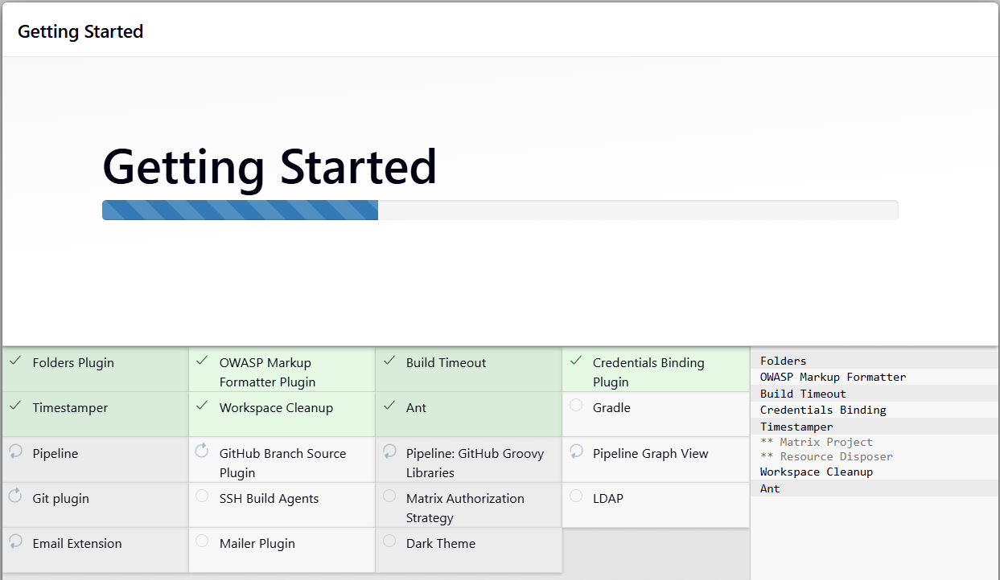

# Sprawozdanie zbiorcze - Andrzej Janaszek - lab 5-7

## Lab 5 – Konfiguracja środowiska Jenkins


W ramach laboratorium przygotowano środowisko Jenkins działające w kontenerze Docker oraz przetestowano działania obiektyu typu `freestyle` oraz `pipeline`.

Wykonane kroki:
- utworzenie sieci Docker jenkins
- uruchomienie kontenera docker:dind
- zbudowanie własnego obrazu myjenkins-blueocean
- uruchomienie Jenkinsa z obsługą Dockera
- konfiguracja pierwszego logowania
- testy działania freestyle jobs oraz pipeline



## Lab 6 – Implementacja pipeline’u CI/CD

Struktura pipeline scriptu
- `Checkout` na własny branch z repo MDO2026_ITE
- `Build` uruchomienie kontenera na bazie Dockerfile.build z lab3
- `Test` uruchomienie testów na bazie Dopckerfile.test z lab3 i zapis logów
- `Deploy` uruchomienie aplikacji w osobnym kontenerze i jej przetestowanie curl'em w osobnym kontenerze z lekim linuxem
- `Publish` po prostu komenda echo
- archiwizacja artefaktów


Podjęto decyzje o braku forka (konfiguracja pipelinu z własnego repo, a w repo testowym nie trzeba nic zmieniać, korzytam jedynie z przykładu hello-world)

Przygotowano diagram UML przedstawiający plan procesu.


## Lab 7 – Rozszerzenie pipeline’u i SCM

### Integracja SCM

Pipeline został przeniesiony do repozytorium jako Jenkinsfile.

Dzięki temu: konfiguracja pipeline’u jest wersjonowana, Jenkins automatycznie pobiera definicję pipeline’u z Git. Workspace jest czyszczony.


### Czyszczenie
Dodano:

```
skipDefaultCheckout()
cleanWs()
```

co pozwala uniknąć cache’owania, zapewnić budowanie wyłącznie na świeżych plikach, zagwarantować powtarzalność buildów

### Publikacja artefaktu

Artefakt publikowany jest jako: `build-image_build_<BUILD_ID>.tar`

Artefakt taki można pobrać z Jenkinsa, załadować komendą docker load i uruchomić lokalnie.

## Weryfikacja działania artefaktyu

Weryfikacja końcowego artefaktu

Zweryfikowano:
- możliwość pobrania obrazu
- poprawne uruchomienie aplikacji
- działanie deployowanego kontenera


### Problem z miesjcem w maszynie wirtualnej

Ze względu na duży rozmiar obrazu (~1GB) pojawił się problem: `no space left on device`

Problem rozwiazany został przez ręczne czyszczenie pamięci Dockera, usuwanie nieużywanych obrazów i wolumenów.

