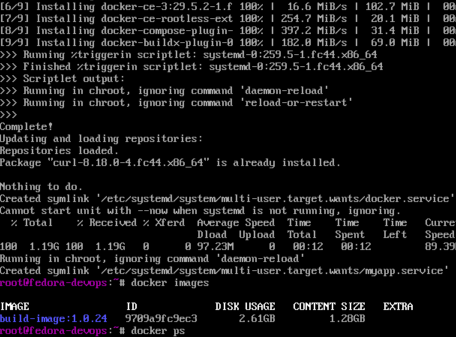
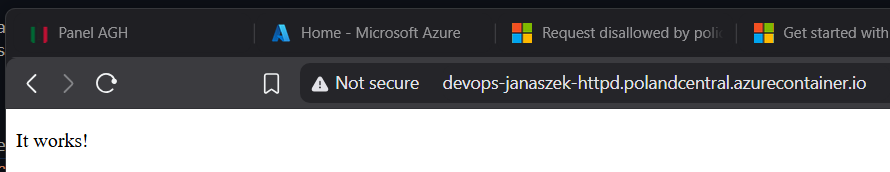
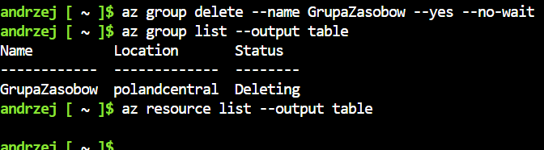

# Sprawozdanie zbiorcze z laboratoriów 8–12 z przedmiotu DevOps

## Cel laboratoriów

Celem laboratoriów było praktyczne zapoznanie się z narzędziami i technikami wykorzystywanymi w procesach DevOps. W ramach zajęć zrealizowano zadania związane z automatyzacją administracji systemami przy użyciu Ansible, automatyczną instalacją systemów operacyjnych z wykorzystaniem Kickstart, wdrażaniem aplikacji w środowisku Kubernetes oraz publikacją i uruchamianiem kontenerów w chmurze Microsoft Azure.

---

# Laboratorium 8 – Automatyzacja administracji przy użyciu Ansible

Pierwszym etapem było przygotowanie środowiska składającego się z dwóch maszyn wirtualnych pełniących role orchestratora oraz hosta zarządzanego. Skonfigurowano nazwy hostów, wpisy w plikach `/etc/hosts` oraz bezhasłową komunikację SSH opartą o klucze publiczne.

```
andrzej@ubuntuserver24:~$ sudo hostnamectl set-hostname orchestrator
[sudo] password for andrzej:
andrzej@ubuntuserver24:~$ hostname
orchestrator
```
---
```
andrzej@ubuntuserver24:~$ sudo nano /etc/hosts
andrzej@ubuntuserver24:~$ cat /etc/hosts
127.0.0.1 localhost
127.0.1.1 ubuntuserver24

192.168.56.102 ansible-target
192.168.56.101 orchestrator
...
```


Następnie utworzono plik inwentaryzacji `inventory.ini`, definiujący grupy hostów oraz parametry połączeń. W trakcie konfiguracji napotkano problem z komunikacją z hostem lokalnym, który rozwiązano poprzez ustawienie parametru: `ansible_connection=local`

```ini
[Orchestrators]
orchestrator ansible_connection=local

[Endpoints]
ansible-target ansible_user=ansible
```

Zweryfikowano poprawność działania środowiska za pomocą modułu `ping` zarówno z poziomu pojedynczego polecenia Ansible, jak i dedykowanego playbooka.

```
ansible all -i inventory.ini -m ping
```

```yaml
- hosts: all
  tasks:
    - name: Ping all machines
      ansible.builtin.ping:
```

W kolejnej części przygotowano playbook kopiujący plik na host docelowy. Ponowne uruchomienie zadania wykazało idempotentność Ansible – wykonanie nie powodowało zmian, gdy stan docelowy był już osiągnięty.

Następnie utworzono playbook odpowiedzialny za aktualizację pakietów systemowych oraz restart usług. Podczas realizacji ćwiczenia wystąpił problem związany z brakiem usługi `rngd`, który rozwiązano poprzez instalację pakietu `rng-tools5`.

W dalszej części laboratorium przygotowano playbook instalujący środowisko Docker na hoście zarządzanym. Po instalacji zweryfikowano poprawność działania usługi oraz wersję silnika Docker.

```yaml
- hosts: Endpoints
  become: true

  tasks:
    - name: Install Docker
      ansible.builtin.apt:
        name: docker.io
        state: present
        update_cache: yes

    - name: Start Docker
      ansible.builtin.service:
        name: docker
        state: started
        enabled: true

    - name: Check Docker version
      ansible.builtin.command: docker --version
      register: docker_version
      changed_when: false

    - debug:
        var: docker_version.stdout
```


Ostatnim etapem było wykorzystanie ról Ansible. Utworzono rolę odpowiedzialną za wdrożenie wcześniej przygotowanego artefaktu aplikacji. Proces obejmował:

* skopiowanie archiwum obrazu Docker,
* załadowanie obrazu do lokalnego rejestru,
* uruchomienie kontenera,
* weryfikację działania,
* usunięcie kontenera po zakończeniu testów.

Pozwoliło to na pełną automatyzację procesu wdrażania aplikacji.

---

# Laboratorium 9 – Automatyczna instalacja systemu Fedora z wykorzystaniem Kickstart

W ramach laboratorium przeprowadzono instalację systemu Fedora Server oraz analizę wygenerowanego przez instalator pliku Kickstart.

Plik został następnie zmodyfikowany poprzez dodanie własnych ustawień, obejmujących między innymi:

* nazwę hosta,
* konfigurację repozytoriów,
* automatyczne czyszczenie dysku,
* konfigurację użytkownika root,
* sekcję wykonywaną po instalacji (`%post`).

Aby przeprowadzić instalację automatyczną, przygotowano serwer HTTP udostępniający plik Kickstart (`python -m http.server 8000`). Następnie podczas uruchamiania instalatora dodano parametr:

```bash
inst.ks=http://192.168.56.1:8000/anaconda-ks.cfg
```

Pozwoliło to na całkowicie automatyczne przeprowadzenie procesu instalacji systemu.

W dalszej części laboratorium zweryfikowano ręczną instalację Dockera na systemie Fedora zgodnie z oficjalną dokumentacją producenta. Po poprawnym uruchomieniu kontenera testowego przygotowano rozszerzoną wersję pliku Kickstart automatyzującą cały proces.

W sekcji `%post` dodano:

* instalację Dockera,
* konfigurację repozytorium Docker CE,
* pobranie artefaktu aplikacji,
* przygotowanie katalogów roboczych,
* utworzenie usługi systemd odpowiedzialnej za uruchamianie kontenera po starcie systemu.

Ostateczna wersja pliku kickstarterowego:

```
# Generated by Anaconda 44.30
# Keyboard layouts
keyboard --vckeymap=pl --xlayouts='pl'
# System language
lang pl_PL.UTF-8

# Host name
network --hostname=fedora-devops

url --mirrorlist=http://mirrors.fedoraproject.org/mirrorlist?repo=fedora-44&arch=x86_64
repo --name=updates --mirrorlist=http://mirrors.fedoraproject.org/mirrorlist?repo=updates-released-f44&arch=x86_64

%packages
@^server-product-environment
@container-management
@domain-client
@guest-agents
@server-hardware-support

%end

# System authorization information
# authselect enable-feature with-fingerprint

# Run the Setup Agent on first boot
firstboot --enable

# Generated using Blivet version 3.13.2
ignoredisk --only-use=sda
autopart
# Partition clearing information
clearpart --all --initlabel

# System timezone
timezone Europe/Warsaw --utc

# Root password
rootpw --iscrypted --allow-ssh $y$j9T$ELItq33xIzjXnYqHvgnz6P4A$6u4dTgp139sG3oma61/.XF/D1g/LVWCE2oSa64vbevD

# POST
%post --log=/root/post.log

dnf -y install dnf-plugins-core

dnf config-manager addrepo --from-repofile https://download.docker.com/linux/fedora/docker-ce.repo

dnf -y install docker-ce docker-ce-cli containerd.io docker-buildx-plugin docker-compose-plugin
dnf -y install curl

systemctl enable --now docker

curl http://192.168.56.1:8000/build-image_build_24.tar -o /var/lib/app.tar

# przygotowanie katalogu na obraz
mkdir -p /var/lib/myapp

mv /var/lib/app.tar /var/lib/myapp/app.tar

# systemd service (uruchomienie po BOOT, nie w %post)
cat <<EOF > /etc/systemd/system/myapp.service
[Unit]
Description=My Docker App
Requires=docker.service
After=docker.service

[Service]
Restart=always

# najpierw load image (już w działającym systemie)
ExecStartPre=/usr/bin/docker load -i /var/lib/myapp/app.tar

# start kontenera
ExecStart=/usr/bin/docker run --rm -p 6666:3000 build-image:latest

ExecStop=/usr/bin/docker stop \$(/usr/bin/docker ps -q --filter ancestor=build-image:latest)

[Install]
WantedBy=multi-user.target
EOF

systemctl daemon-reload
systemctl enable myapp.service

%end
```

W rezultacie po zakończeniu instalacji system był gotowy do pracy i automatycznie uruchamiał wdrożoną aplikację.



---

# Laboratorium 10 – Wprowadzenie do Kubernetes i Minikube

Laboratorium rozpoczęto od instalacji narzędzi Minikube oraz `kubectl`.

Podczas pierwszej próby uruchomienia klastra pojawił się problem związany z wykonywaniem polecenia jako użytkownik root. Rozwiązaniem było utworzenie dedykowanego użytkownika oraz dodanie go do grupy Docker.

```
useradd -m andrzej
passwd andrzej
usermod -aG docker andrzej
```

Po uruchomieniu klastra przy użyciu sterownika Docker zweryfikowano jego stan poleceniami:

```bash
kubectl get nodes
minikube status
```

Następnie uruchomiono dashboard Kubernetes. Ze względu na fakt, że dashboard był dostępny wyłącznie lokalnie, wykorzystano tunel SSH umożliwiający dostęp z komputera gospodarza.

W kolejnej części przygotowano prostą aplikację Node.js udostępniającą komunikat „hello world”. Dla aplikacji utworzono obraz Docker, który następnie zapisano jako artefakt.

Po przełączeniu środowiska Docker na rejestr Minikube obraz został załadowany do klastra i uruchomiony jako pojedynczy Pod przy użyciu polecenia:

```bash
kubectl run hello-node \
  --image=hello-node:1.0 \
  --port=3000 \
  --labels app=hello-node
```

Zweryfikowano poprawność działania poprzez:
```
# wypisanie podów
kubectl get pods

# sprawdzenie logów poda
kubectl logs hello-node

# przekierowanie portu
kubectl port-forward pod/hello-node 3000:3000

# curl w osobnym terminalu
curl localhost:3000
```

Następnie ręczne wdrożenie zastąpiono deklaratywną konfiguracją Deployment. Utworzono manifest definiujący wdrożenie serwera Nginx z czterema replikami. Po wdrożeniu sprawdzono status replik oraz poprawność działania usługi.

W celu udostępnienia aplikacji wykorzystano obiekt Service typu NodePort oraz mechanizm `port-forward`.

---

# Laboratorium 11 – Zarządzanie wdrożeniami w Kubernetes

Na początku laboratorium przygotowano nowe wersje aplikacji:

* wersję 2.0 działającą poprawnie,
* wersję 2.1 zawierającą celowo wprowadzony błąd.

Obrazy zostały załadowane do środowiska Minikube i wykorzystane podczas kolejnych wdrożeń.

Przeprowadzono eksperymenty związane ze skalowaniem aplikacji poprzez zmianę liczby replik. Obserwowano zachowanie klastra podczas zwiększania oraz zmniejszania liczby działających podów.

Następnie przetestowano mechanizm historii wdrożeń i cofania zmian. Za pomocą polecenia:

```bash
kubectl rollout undo
```

przywrócono poprzednią, poprawnie działającą wersję aplikacji.

W celu automatycznej kontroli procesu wdrażania przygotowano skrypt monitorujący status deploymentu. Skrypt sprawdzał, czy wdrożenie zakończyło się sukcesem w czasie krótszym niż 60 sekund. Pozwoliło to na wykrywanie nieudanych aktualizacji, takich jak wdrożenie błędnej wersji 2.1.

```bash
#!/bin/bash

DEPLOYMENT_NAME="hello-deployment"
TIMEOUT="60s"

echo "Sprawdzam status wdrożenia $DEPLOYMENT_NAME (limit: $TIMEOUT)..."

if kubectl rollout status deployment/$DEPLOYMENT_NAME --timeout=$TIMEOUT; then
    echo "Sukces: Aplikacja została pomyślnie wdrożona w wyznaczonym czasie!"
    exit 0
else
    echo "Błąd: Wdrożenie przekroczyło limit czasu 60 sekund lub zakończyło się niepowodzeniem!"
    exit 1
fi
```

Kolejnym elementem laboratorium było porównanie strategii wdrożeń.

Dla strategii **Recreate** zaobserwowano całkowite usunięcie starych podów przed utworzeniem nowych egzemplarzy aplikacji. Powodowało to chwilową niedostępność usługi.

Następnie przetestowano strategię **RollingUpdate**, w której aktualizacja przebiegała stopniowo. Stare pody były zastępowane nowymi partiami zgodnie z parametrami:

```yaml
maxUnavailable: 2
maxSurge: 20%
```

Ostatnim zadaniem było przygotowanie wdrożenia typu **Canary**. Utworzono dwa niezależne deploymenty:

* produkcyjny zawierający 9 replik starej wersji,
* kanarkowy zawierający 1 replikę nowej wersji.

Takie rozwiązanie umożliwia przekierowanie około 10% ruchu do nowej wersji aplikacji i ograniczenie ryzyka podczas wdrażania zmian.

---

# Laboratorium 12 – Wdrożenie kontenera w chmurze Microsoft Azure

Ostatnie laboratorium poświęcono wykorzystaniu usług chmurowych Microsoft Azure.

Pierwszym krokiem było opublikowanie obrazu kontenera w serwisie Docker Hub. W tym celu pobrano przykładowy obraz serwera HTTP Apache, oznaczono go własnym tagiem i przesłano do publicznego repozytorium.

Następnie przy użyciu narzędzia Azure CLI aktywowano odpowiedniego providera oraz utworzono grupę zasobów w regionie Poland Central (ze względu na problemy z innym regionem).

Kolejnym etapem było uruchomienie usługi Azure Container Instance z wykorzystaniem wcześniej opublikowanego obrazu. Podczas tworzenia kontenera określono:

* nazwę zasobu,
* publiczny adres IP,
* nazwę DNS,
* liczbę procesorów,
* ilość pamięci RAM.
  
```
az container create \
  --resource-group GrupaZasobow \
  --name moj-kontener-httpd \
  --image janaszek/my-httpd:1.0 \
  --dns-name-label devops-janaszek-httpd \
  --ports 80 \
  --ip-address Public \
  --os-type linux \
  --memory 1.5 \
  --cpu 1
```

Po wdrożeniu zweryfikowano poprawność działania przy użyciu poleceń Azure CLI umożliwiających pobieranie informacji o kontenerze oraz analizę logów.
Sprawdzenie działania kontenera `az container show --resource-group GrupaZasobow --name moj-kontener-httpd --output table`. Sprwdzenie logów: `az container logs --resource-group GrupaZasobow --name moj-kontener-httpd`

Działanie aplikacji zostało dodatkowo potwierdzone poprzez wykonanie połączenia HTTP z publicznie dostępnym adresem usługi.



Na zakończenie laboratorium przeprowadzono proces usuwania zasobów poprzez skasowanie całej grupy zasobów. Pozwoliło to uniknąć pozostawienia nieużywanych komponentów generujących koszty.

Ususnięcie grupy: `az group delete --name GrupaZasobow --yes --no-wait`

Sprwdzenie czy żadne zsoby nie wiszą tle.




# Podsumowanie

W ramach laboratoriów 8–12 zrealizowano pełny proces związany z automatyzacją wdrażania i utrzymania aplikacji. Rozpoczęto od konfiguracji infrastruktury oraz automatyzacji zadań administracyjnych przy użyciu Ansible. Następnie wykorzystano Kickstart do automatycznej instalacji systemu operacyjnego wraz z niezbędnym oprogramowaniem. Kolejne laboratoria poświęcono konteneryzacji i orkiestracji aplikacji w środowisku Kubernetes, obejmując zagadnienia związane z wdrożeniami, aktualizacjami, skalowaniem oraz strategiami publikacji nowych wersji. Ostatnim etapem było przeniesienie aplikacji do środowiska chmurowego Microsoft Azure i uruchomienie jej w usłudze Azure Container Instance.

Przeprowadzone ćwiczenia pozwoliły zdobyć praktyczne doświadczenie z narzędziami wykorzystywanymi współcześnie w procesach DevOps oraz zrozumieć pełny cykl życia aplikacji – od przygotowania infrastruktury, poprzez automatyzację wdrożeń, aż do publikacji usług w środowisku chmurowym.
