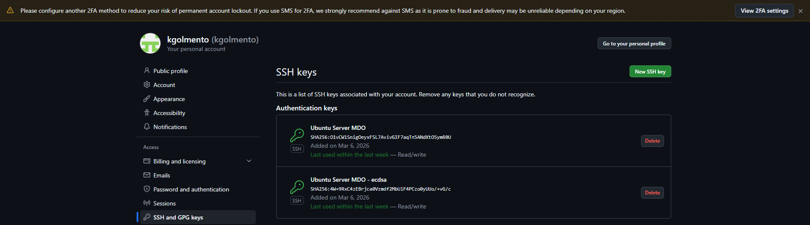
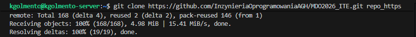
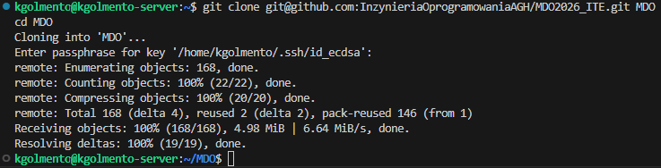
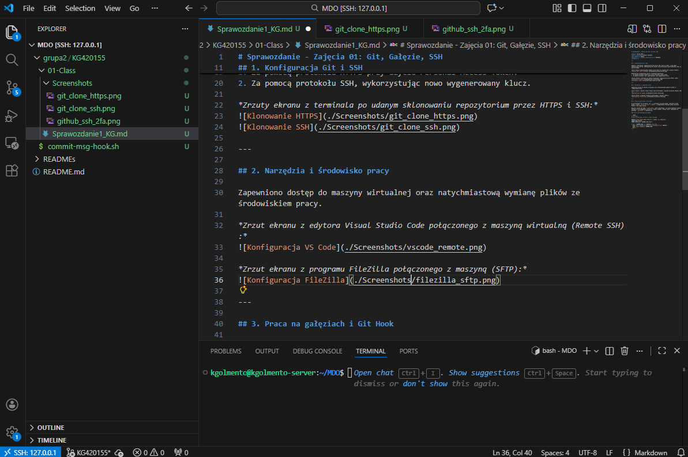
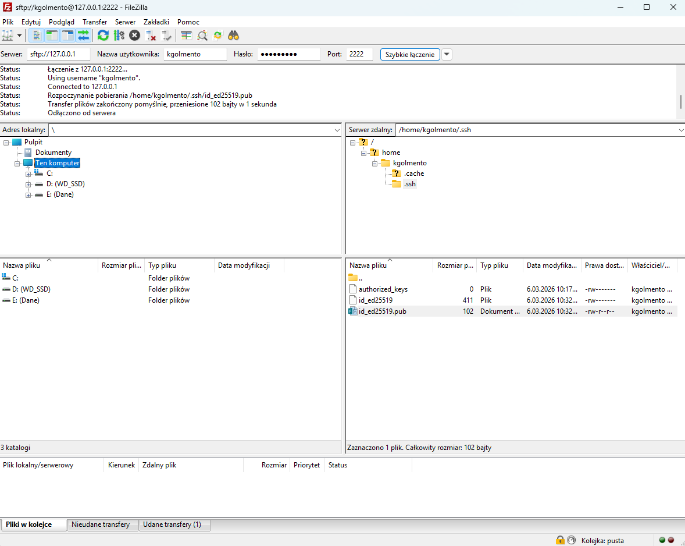
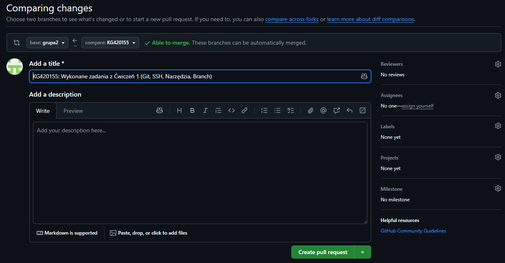
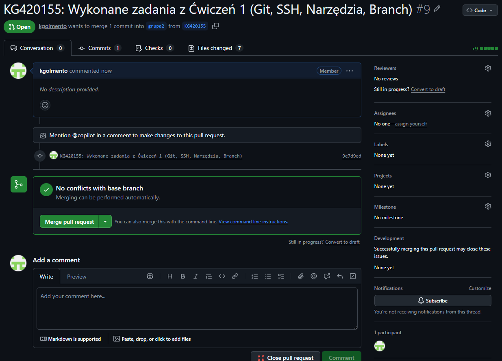

# Sprawozdanie - Zajęcia 01: Git, Gałęzie, SSH

**Data:** 06.03.2026 r.
**Imię i nazwisko:** Kacper Golmento
**Nr indeksu:** 420155
**Inicjały i nr indeksu (nazwa gałęzi):** KG420155
**Grupa:** 2

---

## 1. Konfiguracja Git i SSH

Zgodnie z poleceniem, wygenerowałem dwa klucze SSH (inne niż RSA), w tym jeden zabezpieczony hasłem. Skonfigurowałem również uwierzytelnianie dwuskładnikowe (2FA) na koncie GitHub.

*Zrzut ekranu przedstawiający dodane klucze SSH oraz aktywne 2FA w panelu GitHub:*


Repozytorium przedmiotowe zostało sklonowane dwukrotnie:
1. Za pomocą protokołu HTTPS przy użyciu Personal Access Token.
2. Za pomocą protokołu SSH, wykorzystując nowo wygenerowany klucz.

*Zrzuty ekranu z terminala po udanym sklonowaniu repozytorium przez HTTPS i SSH:*



---

## 2. Narzędzia i środowisko pracy

Zapewniłem dostęp do maszyny wirtualnej oraz natychmiastową wymianę plików ze środowiskiem pracy. 

*Zrzut ekranu z edytora Visual Studio Code połączonego z maszyną wirtualną (Remote SSH):*


*Zrzut ekranu z programu FileZilla połączonego z maszyną (SFTP):*


---

## 3. Praca na gałęziach i Git Hook

Po przełączeniu się na gałąź `main`, a następnie na gałąź grupy, utworzyłem własną gałąź o nazwie `KG420155`. W odpowiednim katalogu grupy utworzyłem folder o tej samej nazwie.

Napisałem skrypt Git hook (`commit-msg`), który weryfikuje, czy każda wiadomość commita zaczyna się od wymaganych inicjałów i numeru indeksu. Skrypt został skopiowany do katalogu `.git/hooks` w repozytorium.

### Treść zastosowanego Git Hooka:

```bash
#!/bin/bash
# Hook sprawdzający prefiks w commit message

PREFIX="KG420155"
COMMIT_MSG_FILE=$1
COMMIT_MSG=$(cat "$COMMIT_MSG_FILE")

if [[ ! "$COMMIT_MSG" == "$PREFIX"* ]]; then
  echo "Błąd: Wiadomość commita musi zaczynać się od '$PREFIX'."
  echo "Twoja wiadomość: $COMMIT_MSG"
  exit 1
fi
```

---

## 4. Próba wciągnięcia gałęzi (Pull Request)

Zgodnie z instrukcją podjąłem próbę wciągnięcia własnej gałęzi (`grupa2/KG420155`) do gałęzi grupowej (`grupa2`). Operację tę zrealizowano za pomocą mechanizmu Pull Request na platformie GitHub.

*Zrzut ekranu z przeglądarki przedstawiający formularz otwarcia nowego Pull Requesta na GitHubie (widoczne gałęzie źródłowa i docelowa):*


*Zrzut ekranu przedstawiający status utworzonego Pull Requesta (np. informację o braku konfliktów i gotowości do wciągnięcia zmian):*


GitHub nie zgłosił żadnych konfliktów merge'owania.

Następnie zaktualizowano niniejsze sprawozdanie o przebieg tego kroku, dodano commita uwzględniającego Git Hook i wysłano aktualizację do zdalnego źródła na własnej gałęzi.