# Sprawozdanie - Zajęcia 02: Git, Docker

**Data:** 13.03.2026 r.
**Imię i nazwisko:** Kacper Golmento
**Nr indeksu:** 420155
**Inicjały i nr indeksu (nazwa gałęzi):** KG420155
**Grupa:** 2

---

## 1. Instalacja Dockera

Zgodnie z wytycznymi, na maszynie wirtualnej z systemem Ubuntu Server zainstalowałem środowisko Docker. Wykorzystałem dystrybucyjny pakiet `docker.io` pobrany za pomocą menedżera `apt`, zamiast Snap. Rozwiązania typu Snap czy Flatpak mają duży narzut plików, co  nierzadko prowadzi do problemów z konfiguracją. Następnie założyłem również konto w serwisie Docker Hub.

*Zrzuty ekranu przedstawiające instalację Dockera i aktywne konto w Docker Hub:*
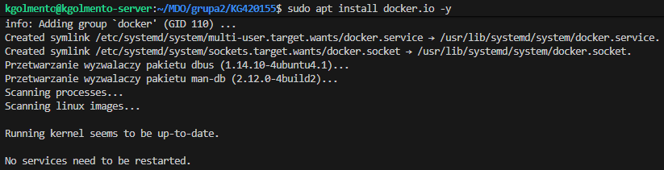
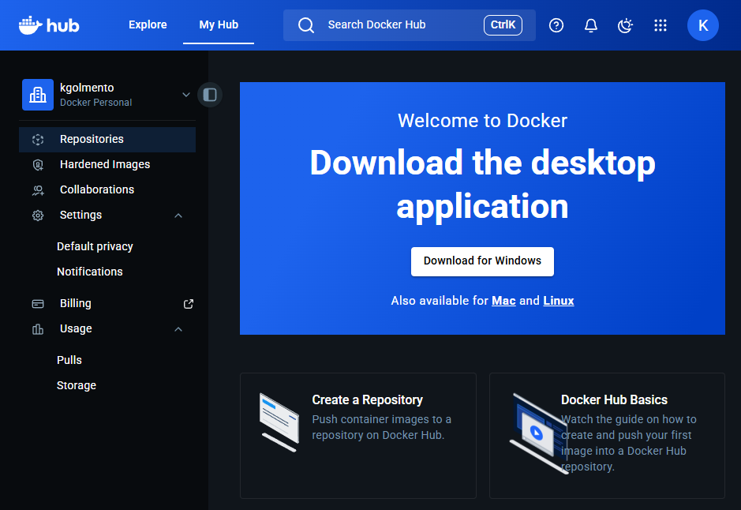

---

## 2. Zapoznanie się i analiza obrazów

Pobrałem i uruchomiłem sugerowane obrazy bazowe: `hello-world`, `busybox`, `ubuntu`, `mariadb` oraz `mcr.microsoft.com/dotnet/runtime:8.0`. 

*Zrzut ekranu przedstawiający uruchomienie Hello World'a:*
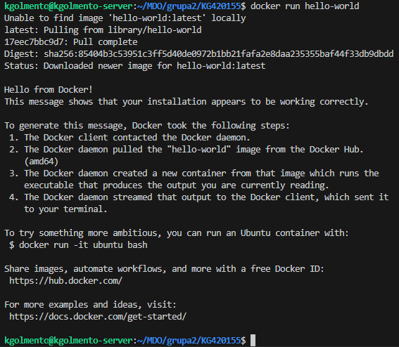

Działanie innych obrazów będzie przedstawione w kolejnych krokach w sprawozdaniu.

*Zrzut ekranu przedstawiający rozmiary pobranych obrazów (`docker images`):*
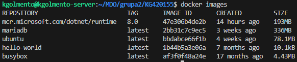

Rozmiary obrazów znacząco się różnią – od minimalnego `busybox` (ok. 4MB), poprzez `ubuntu` (ok. 70-80MB), aż po potężne obrazy takie jak `mariadb` czy środowisko uruchomieniowe .NET, które zawierają w sobie preinstalowane biblioteki i zależności. Jest to odwrotny efekt niż bym się spodziewał, raczej przewidywałbym, że kontener ubuntu okaże się największy.

Zweryfikowałem również kody wyjścia (Exit Codes) zakończonych kontenerów. Kontenery wykonujące jednorazowe skrypty (jak `hello-world`) kończą pracę z kodem `0`, co w systemach uniksowych oznacza poprawne wykonanie zadania.

*Zrzut ekranu przedstawiający kody wyjścia (`docker ps -a`):*
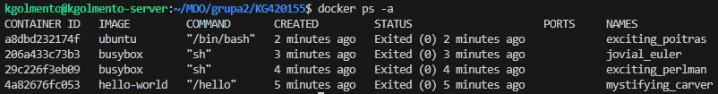

---

## 3. Praca interaktywna z kontenerami

### Obraz BusyBox
Uruchomiłem kontener z obrazu `busybox` w trybie interaktywnym z podłączeniem standardowego wejścia (flagi `-it`), co pozwoliło na wykonanie powłoki systemowej. Wewnątrz wywołałem polecenie sprawdzające wersję narzędzia.

*Zrzut ekranu z uruchomienia i weryfikacji wersji BusyBox:*
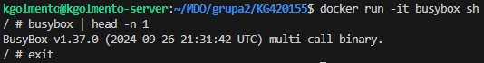

### System w kontenerze (Ubuntu)
Następnie uruchomiono "system w kontenerze" wykorzystując obraz `ubuntu`. 

Wewnątrz kontenera proces z identyfikatorem `PID 1` to wywołana powłoka `bash` (co zweryfikowano poleceniem `cat /proc/1/comm`). Wynika to z architektury Dockera – kontener nie uruchamia pełnego systemu init (np. `systemd`), lecz traktuje komendę startową jako główny proces. Z perspektywy hosta, proces ten jest widoczny jako potomek procesu demona Dockera (`containerd-shim`), co udowodniono listując procesy na hoście.

Będąc w kontenerze, pomyślnie zaktualizowano listę pakietów (`apt update`).

*Zrzuty ekranu pokazujące PID 1 w kontenerze, aktualizację pakietów oraz procesy dockera na hoście:*
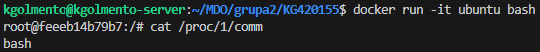
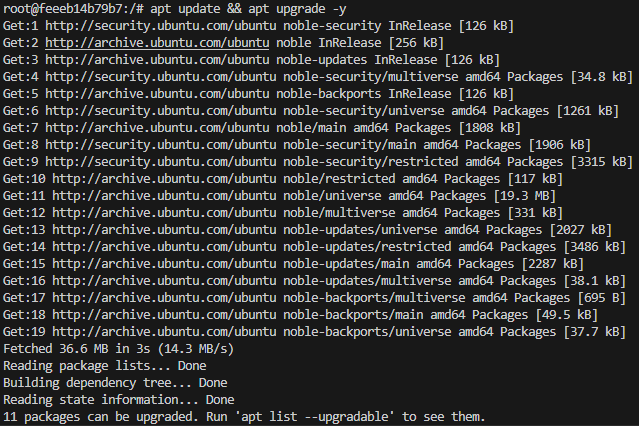
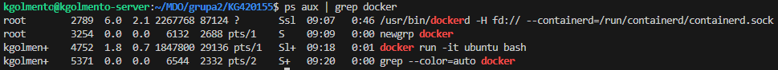

---

## 4. Budowa własnego obrazu (Dockerfile)

Opracowałem własny plik `Dockerfile` oparty na systemie Ubuntu, którego celem jest przygotowanie środowiska z zainstalowanym Gitem i pobranym repozytorium przedmiotu.

Podczas pisania instrukcji zastosowałem dobre praktyki optymalizacji obrazów. Komendy aktualizacji i instalacji (`apt-get update && apt-get install -y git`) połączyłem w jedną (instrukcja `RUN`) wraz z czyszczeniem pamięci podręcznej menedżera pakietów (`rm -rf /var/lib/apt/lists/*`). Zapobiega to utrwalaniu niepotrzebnych plików tymczasowych w kolejnych warstwach obrazu, co znacząco zmniejsza jego finalny rozmiar.

**Treść pliku Dockerfile:**

```dockerfile
FROM ubuntu:latest

RUN apt-get update && \
    apt-get install -y git && \
    rm -rf /var/lib/apt/lists/*

WORKDIR /app

RUN git clone [https://github.com/InzynieriaOprogramowaniaAGH/MDO2026_ITE.git](https://github.com/InzynieriaOprogramowaniaAGH/MDO2026_ITE.git)

CMD ["/bin/bash"]
```

Kontener uruchomił się prawidłowo, repozytorium zostało sklonowane.

*Zrzuty ekranu pokazujące budowę i uruchomienie kontenera:*
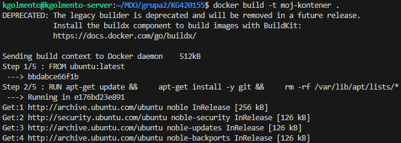
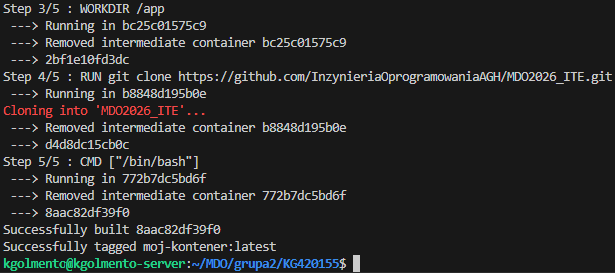
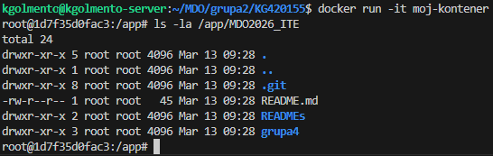

---

## 5. Czyszczenie środowiska i aktualizacja repozytorium

Po zakończeniu pracy przeprowadziłem inspekcję i sprzątanie środowiska:

1. Wyświetliłem listę wszystkich kontenerów, po czym użyłem komendy docker container prune -f do usunięcia kontenerów o statusie "Exited".

*Zrzuty ekranu przedstawiające wyświetlenie i usunięcie nieaktywnych kontenerów:*
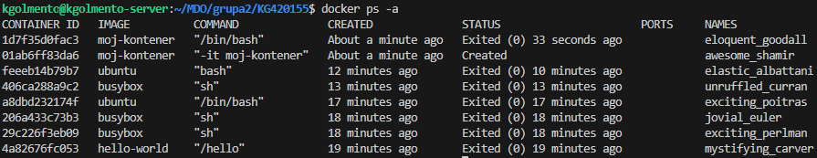
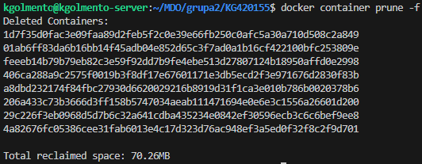

2. Wyczyściłem lokalny magazyn obrazów za pomocą polecenia docker image prune -a -f, zwalniając miejsce na maszynie wirtualnej.

*Zrzut ekranu przedstawiający czyszczenie obrazów:*
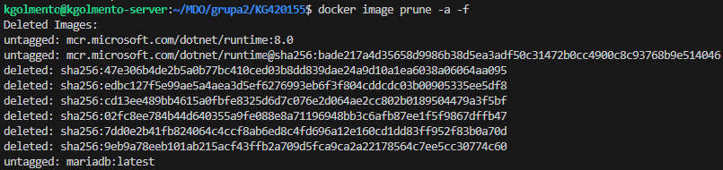
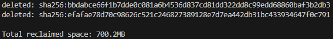

Na koniec umieściłem w nim przygotowany plik Dockerfile wraz z niniejszym sprawozdaniem i zrzutami ekranu, po czym wykonałem commita (z zachowaniem odpowiedniego prefiksu) i wypchnąłem zmiany na zdalne repozytorium GitHub.

*Zrzut ekranu przedstawiający dodanie Dockerfile'a do repozytorium:*
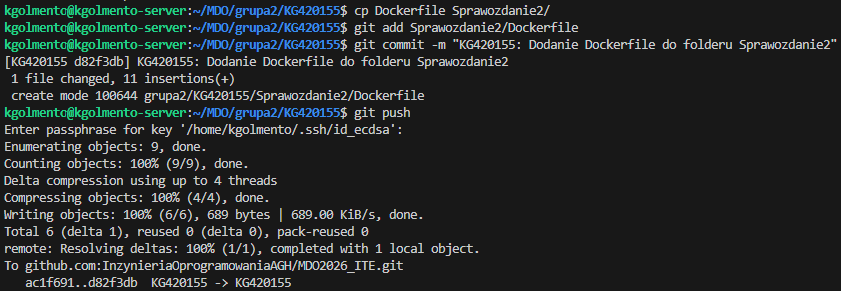