# Sprawozdanie z Laboratorium 10: Wdrażanie na zarządzalne kontenery: Kubernetes (1)
**Autor:** Krzysztof Mamcarz (KM414315)

## 1. Instalacja i konfiguracja klastra Kubernetes
Zgodnie z instrukcją, pierwszym krokiem było zaopatrzenie się w implementację stosu Kubernetes za pomocą narzędzia `minikube` oraz pobranie klienta sterującego `kubectl`. Narzędzia te pobrano i zainstalowano bezpośrednio w środowisku Ubuntu.

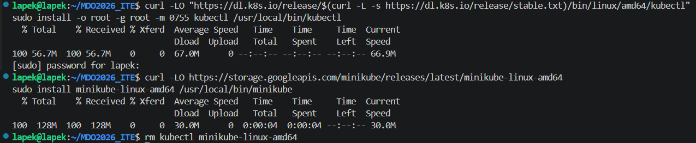

Następnie przeprowadzono instalację klastra z wykorzystaniem silnika Docker jako sterownika środowiska (`--driver=docker`). Proces zakończył się pomyślnie komunikatem potwierdzającym gotowość klastra.

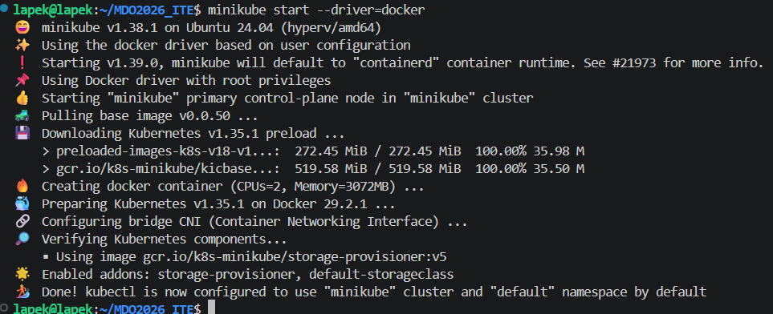

Aby dowieść, że klaster pracuje prawidłowo, wyświetlono listę aktywnych węzłów roboczych. Wykazano obecność węzła `minikube` w stanie `Ready`.

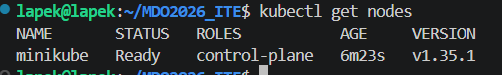

Zgodnie z wymaganiem przedstawienia łączności, uruchomiono wbudowany panel administracyjny (Dashboard).

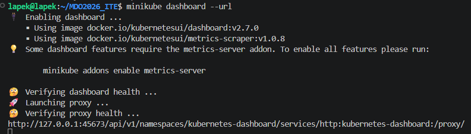

Wygenerowany adres URL otwarto w przeglądarce, uzyskując dostęp do graficznego interfejsu zarządzania klastrem.

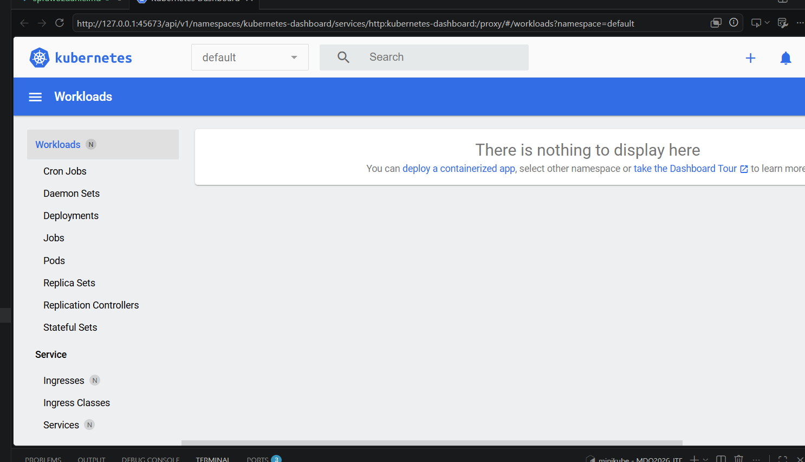

## 2. Uruchamianie oprogramowania (pojedynczy kontener)
Kolejnym etapem było uruchomienie wybranej aplikacji (serwera Nginx) wewnątrz klastra. Za pomocą polecenia `kubectl run` utworzono pojedynczy Pod. Weryfikacja poleceniem `kubectl get pods` udowodniła, że kontener aplikacji wystartował i pracuje w stanie `Running`.

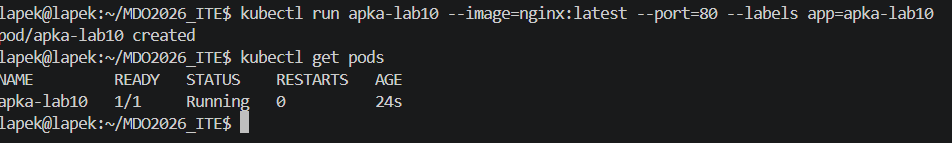

Aby dotrzeć do funkcjonalności eksponowanej przez aplikację, wyprowadzono port za pomocą polecenia port-forwardingu, łącząc lokalny port 8080 ze standardowym portem 80 kontenera.

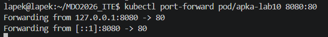

Przedstawiono poprawną komunikację z usługą za pomocą zapytania HTTP z wykorzystaniem programu `curl`. Zwrócony nagłówek potwierdził działanie serwera Nginx.

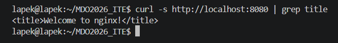

## 3. Przekucie wdrożenia w plik deklaratywny (Deployment)
Pojedynczy Pod został zastąpiony profesjonalnym wdrożeniem zdefiniowanym jako plik YML. Utworzono plik `deployment.yml`, wzbogacając wdrożenie o docelowe 4 repliki aplikacji.

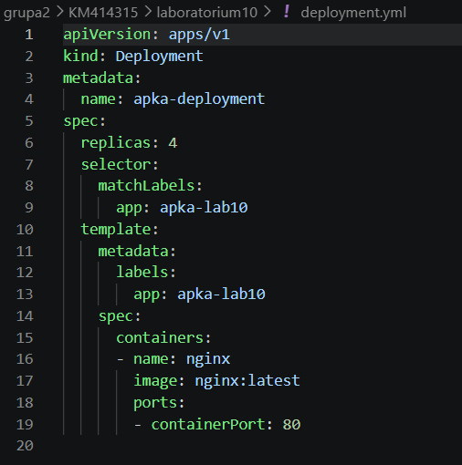

Rozpoczęto wdrożenie komendą `kubectl apply`, a stan operacji zbadano za pomocą `kubectl rollout status`, co potwierdziło pomyślne zaaplikowanie nowej konfiguracji.

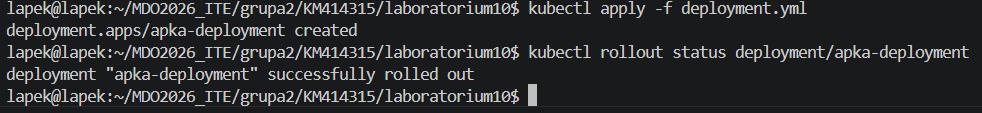

Sprawdzenie stanu zasobów w klastrze (`get pods`) ukazało działające równolegle 4 instancje (repliki) kontenera zarządzane przez nowo utworzony Deployment.

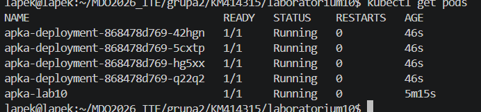

Na koniec wyeksponowano wdrożenie na zewnątrz jako zunifikowany Serwis.

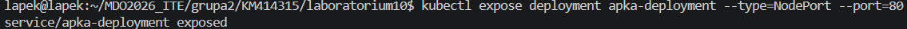

Zastosowano ponowne przekierowanie portów, tym razem kierując ruch bezpośrednio do warstwy usługi (`svc/apka-deployment`) na porcie 8000.

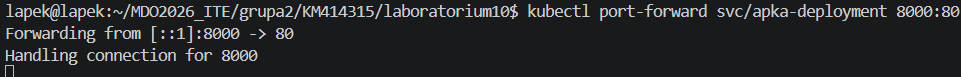

Finalne wywołanie `curl` na nowym porcie powiodło się, udowadniając, że Serwis prawidłowo udostępnia połączoną aplikację opartą na czterech niezależnych replikach, co spełnia wszystkie cele zadania.

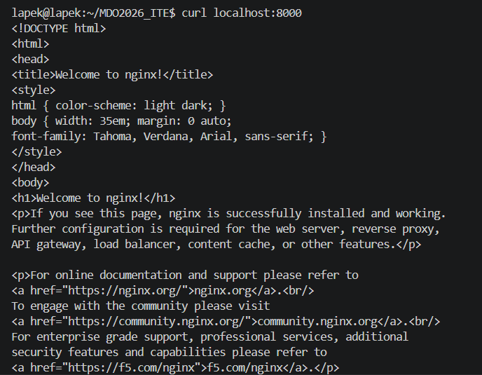