# Sprawozdanie z Laboratorium 11: Wdrażanie na zarządzalne kontenery: Kubernetes (2)
**Autor:** Krzysztof Mamcarz (KM414315)

## 1. Modyfikacja Deploymentu (Skalowanie)
Pierwszym krokiem było zbadanie elastyczności zarządzania zasobami poprzez aktualizację wdrożenia. Wykorzystano polecenie `kubectl scale` do dynamicznej zmiany liczby instancji aplikacji. Zwiększono liczbę replik do 8.

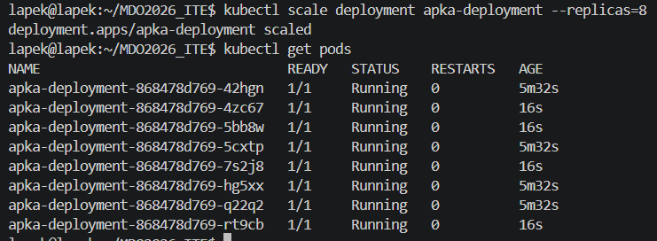

Następnie przetestowano redukcję zasobów, pomniejszając pulę działających kontenerów do zaledwie 1 repliki.

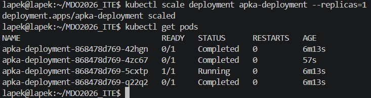

Wdrożenie wygaszono całkowicie, zmniejszając liczbę replik do 0, co zatrzymało aplikację bez usuwania definicji infrastruktury z klastra.

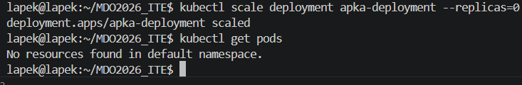

Ostatecznie przywrócono pełną operacyjność systemu, skalując wdrożenie ponownie w górę do 4 replik.

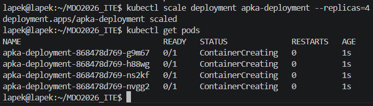

## 2. Przygotowanie własnych obrazów
W celu wykonania testów aktualizacji, przygotowano nową, starszą oraz wadliwą wersję obrazu z wybranym programem. Utworzono plik `Dockerfile.dobre` dla stabilnych wersji (`v1` i `v2`).

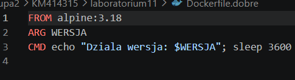

Następnie przygotowano plik `Dockerfile.zle`, wymuszający krytyczny błąd działania natychmiast po uruchomieniu, symulujący wadliwe oprogramowanie.

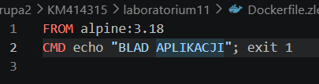

Wykorzystując mechanizm budowania, wygenerowano trzy oddzielne wersje lokalne bez potrzeby przesyłania ich przez zewnętrzny *pipeline*.

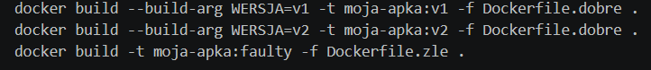

Obrazy załadowano bezpośrednio do wewnętrznego środowiska maszyny roboczej przy pomocy polecenia `minikube image load` (lokalnie+przeniesienie).

Na koniec zoptymalizowano przestrzeń dyskową maszyny-hosta, usuwając obrazy z głównego demona Docker, podczas gdy klaster korzystał z własnej skopiowanej puli.

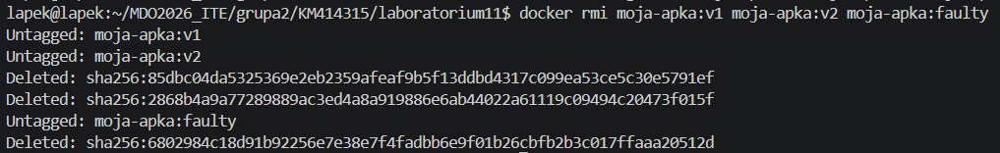

## 3. Aktualizacje, obsługa błędów i Rollout
Zastosowano nową wersję obrazu dla pracującego wdrożenia (`v1`). Zaobserwowano bezprzerwowy przebieg aktualizacji dzięki domyślnej strategii klastra.

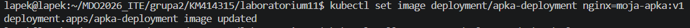

Następnie zasymulowano wdrożenie wadliwego obrazu poleceniem `kubectl set image`. Weryfikacja wykazała, że nowe repliki wpadły w stan awarii (`Error` oraz `CrashLoopBackOff`), natomiast klaster zapobiegł usunięciu stabilnych kontenerów starszej wersji.

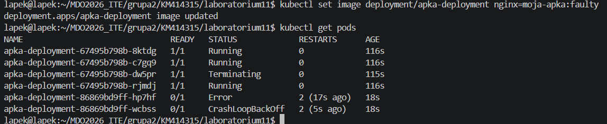

W celu zidentyfikowania problemów i odzyskania dostępności usługi, przywrócono poprzednią wersję wdrożenia korzystając z komendy ratunkowej `kubectl rollout undo`.

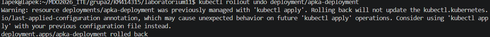

Poprawność wycofania modyfikacji udowodniono listując aktywne zasoby, które wróciły do zdrowego stanu.

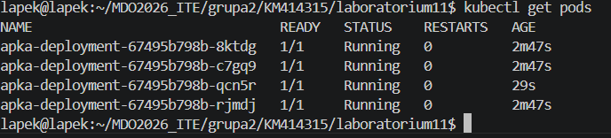

Przeanalizowano także zapisane kolejne zmiany konfiguracyjne za pomocą `kubectl rollout history`, co ułatwia korelację problemów z wykonywanymi czynnościami operatorskimi.

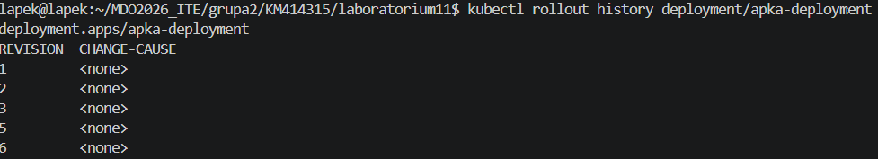

## 4. Automatyczna kontrola wdrożenia
Napisano skrypt bashowy implementujący wbudowane polecenie monitorujące stan aplikacji. Jego zadaniem jest weryfikacja, czy wdrożenie zdąży wstać w wyznaczonym oknie czasowym (60 sekund).

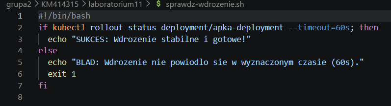

Skrypt uruchomiono dla pomyślnie nałożonej łatki – zgłosił sukces potwierdzając gotowość architektury.

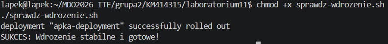

## 5. Zaawansowane strategie wdrożenia
Zastosowano przygotowane pliki YAML w celu weryfikacji i opisania różnic w sposobach wdrażania zmian.

**Strategia: Recreate**
Stworzono plik z parametrem powołującym starą infrastrukturę do całkowitego usunięcia przed zbudowaniem nowej.

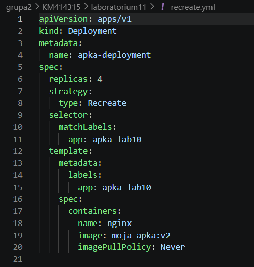

Zaobserwowano, że klaster brutalnie usuwa wszystkie Pody (`Terminating`), doprowadzając do tymczasowej przerwy w dostępie, po czym tworzy instancje bazujące na nowym manifeście (`ContainerCreating`).

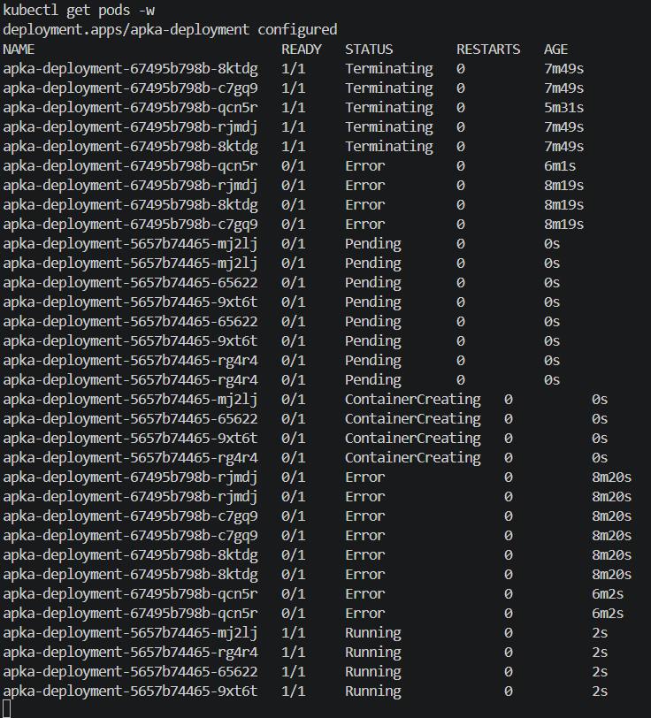

**Strategia: Zmodyfikowany Rolling Update**
Wprowadzono parametry przyspieszające aktualizację fazową (`maxUnavailable: 2`, `maxSurge: 25%`).

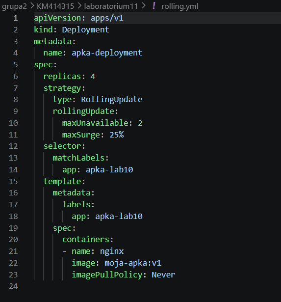

Tutaj, w przeciwieństwie do *Recreate*, pody starszej generacji działały równolegle z nowymi, co wyeliminowało barierę dostępności (brak *downtime*).

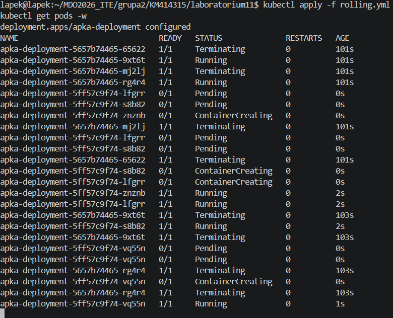

**Strategia: Canary Deployment**
Wykorzystując etykiety Serwisu z poprzedniego zadania (`app: apka-lab10`), wdrożono niezależny mikroskopijny Deployment o rozmiarze 1 repliki.

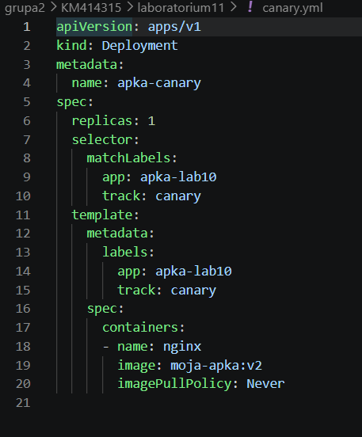

Test dowiódł, że środowisko z wieloma replikami jest rozdzielone. Klaster utrzymał główną, 4-podową bazę (stabilną), dorzucając jednego "kanarka" (z obrazem w wersji v2), który przejął cześć przydzielonego do serwisu ruchu sieciowego, umożliwiając bezpieczne testy na produkcji bez ryzyka usterki globalnej.

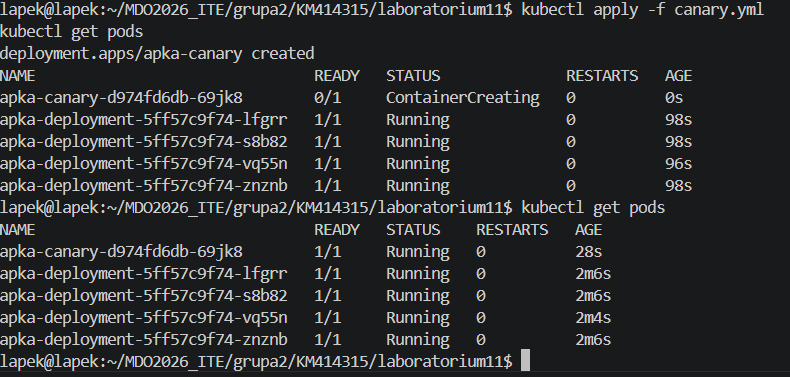