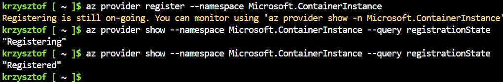
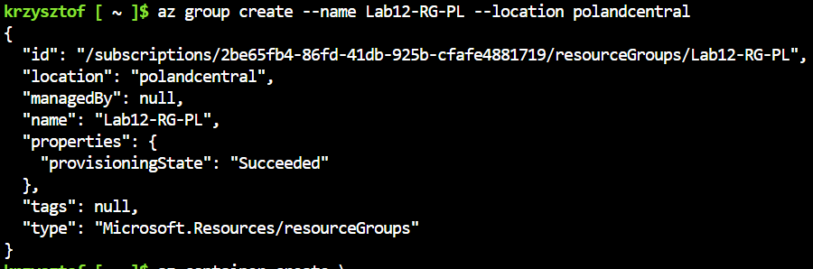
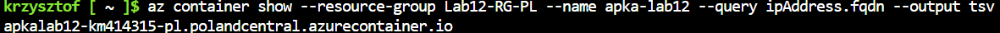
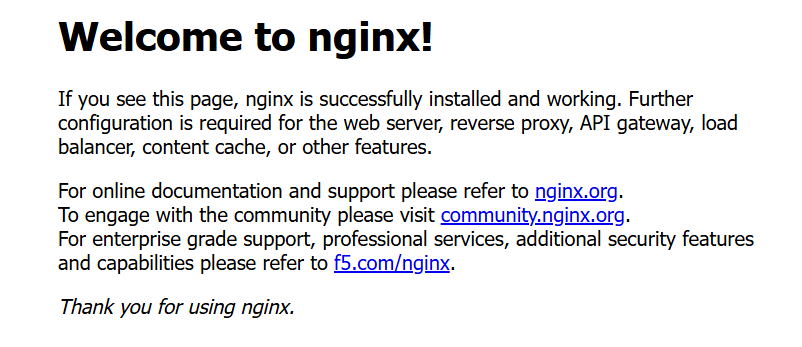
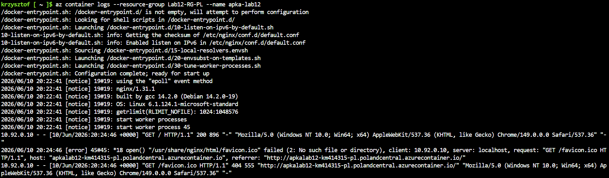
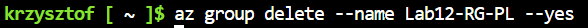

# Sprawozdanie z Laboratorium 12: Wdrażanie na zarządzalne kontenery w chmurze (Azure)
**Autor:** Krzysztof Mamcarz (KM414315)

## Wstęp
Celem laboratorium było zapoznanie się z platformą chmurową Microsoft Azure oraz usługą Azure Container Instances (ACI). Zadanie polegało na wdrożeniu publicznie dostępnego obrazu kontenera z rejestru Docker Hub bezpośrednio do chmury, bez konieczności lokalnego budowania aplikacji czy tworzenia prywatnego rejestru wewnątrz Azure. Do realizacji zadania wykorzystano wbudowane w przeglądarkę środowisko Azure Cloud Shell (powłoka Bash).

## 1. Przygotowanie środowiska i utworzenie Grupy Zasobów
Ze względu na ograniczenia subskrypcji studenckiej, przed rozpoczęciem pracy konieczne było ręczne zarejestrowanie dostawcy usługi kontenerowej (`Microsoft.ContainerInstance`) w systemie Azure.



Następnie, zgodnie z instrukcją, utworzono nową grupę zasobów (Resource Group) o nazwie `Lab12-RG-PL`. Aby zminimalizować ryzyko blokad regionalnych, jako lokalizację wybrano centrum danych w Polsce (`polandcentral`).



## 2. Wdrożenie kontenera z Docker Hub
Kolejnym krokiem było wdrożenie kontenera w przygotowanej grupie zasobów. Użyto oficjalnego obrazu serwera `nginx:latest`, co było zgodne z założeniem braku wymogu budowania prywatnego Docker Registry w chmurze. 
Z uwagi na restrykcje użytego regionu, wdrożenie wymagało jawnego zadeklarowania systemu operacyjnego (`--os-type Linux`) oraz przydziału zasobów sprzętowych (`--cpu 1`, `--memory 1.5`). Kontener został pomyślnie uruchomiony na porcie 80 i otrzymał unikalną etykietę DNS.

```bash
krzysztof [ ~ ]$ az container create \
  --resource-group Lab12-RG-PL \
  --name apka-lab12 \
  --image nginx:latest \
  --dns-name-label apkalab12-km414315-pl \
  --os-type Linux \
  --cpu 1 \
  --memory 1.5 \
  --ports 80
{
  "confidentialComputeProperties": null,
  "containerGroupProfile": null,
  "containers": [
    {
      "command": null,
      "configMap": {
        "keyValuePairs": {}
      },
      "environmentVariables": [],
      "image": "nginx:latest",
      "instanceView": {
        "currentState": {
          "detailStatus": "",
          "exitCode": null,
          "finishTime": null,
          "startTime": "2026-06-10T20:22:40.930000+00:00",
          "state": "Running"
        },
        "events": [
          {
            "count": 1,
            "firstTimestamp": "2026-06-10T20:22:25+00:00",
            "lastTimestamp": "2026-06-10T20:22:25+00:00",
            "message": "pulling image \"nginx@sha256:0a0b02fec34ea28aac0f7e0cf8403e5c9ee5fc201162eae5bf891a84e5599281\"",
            "name": "Pulling",
            "type": "Normal"
          },
          {
            "count": 1,
            "firstTimestamp": "2026-06-10T20:22:32+00:00",
            "lastTimestamp": "2026-06-10T20:22:32+00:00",
            "message": "Successfully pulled image \"nginx@sha256:0a0b02fec34ea28aac0f7e0cf8403e5c9ee5fc201162eae5bf891a84e5599281\"",
            "name": "Pulled",
            "type": "Normal"
          },
          {
            "count": 1,
            "firstTimestamp": "2026-06-10T20:22:40+00:00",
            "lastTimestamp": "2026-06-10T20:22:40+00:00",
            "message": "Started container",
            "name": "Started",
            "type": "Normal"
          }
        ],
        "previousState": null,
        "restartCount": 0
      },
      "livenessProbe": null,
      "name": "apka-lab12",
      "ports": [
        {
          "port": 80,
          "protocol": "TCP"
        }
      ],
      "readinessProbe": null,
      "resources": {
        "limits": null,
        "requests": {
          "cpu": 1.0,
          "gpu": null,
          "memoryInGb": 1.5
        }
      },
      "securityContext": null,
      "volumeMounts": null
    }
  ],
  "diagnostics": null,
  "dnsConfig": null,
  "encryptionProperties": null,
  "extensions": null,
  "id": "/subscriptions/2be65fb4-86fd-41db-925b-cfafe4881719/resourceGroups/Lab12-RG-PL/providers/Microsoft.ContainerInstance/containerGroups/apka-lab12",
  "identity": null,
  "imageRegistryCredentials": null,
  "initContainers": [],
  "instanceView": {
    "events": [],
    "state": "Running"
  },
  "ipAddress": {
    "autoGeneratedDomainNameLabelScope": "Unsecure",
    "dnsNameLabel": "apkalab12-km414315-pl",
    "fqdn": "apkalab12-km414315-pl.polandcentral.azurecontainer.io",
    "ip": "20.215.139.193",
    "ports": [
      {
        "port": 80,
        "protocol": "TCP"
      }
    ],
    "type": "Public"
  },
  "isCreatedFromStandbyPool": false,
  "location": "polandcentral",
  "name": "apka-lab12",
  "osType": "Linux",
  "priority": null,
  "provisioningState": "Succeeded",
  "resourceGroup": "Lab12-RG-PL",
  "restartPolicy": null,
  "sku": "Standard",
  "standbyPoolProfile": null,
  "subnetIds": null,
  "tags": {},
  "type": "Microsoft.ContainerInstance/containerGroups",
  "volumes": null,
  "zones": null
}
```

## 3. Weryfikacja działania usługi
Po zainicjowaniu kontenera należało dowieść, że proces pracuje prawidłowo i eksponuje swoją usługę na zewnątrz. W pierwszej kolejności odpytano API Azure o w pełni kwalifikowaną nazwę domeny (FQDN) nowo powołanej aplikacji.



Uzyskany adres URL otwarto w przeglądarce internetowej. Wyświetlona strona powitalna udowodniła poprawność konfiguracji sieciowej i dostępność usługi HTTP serwowanej przez kontener Nginx.



Aby ostatecznie potwierdzić działanie systemu z perspektywy administratora, pobrano zrzut logów kontenera. Zapisy te potwierdzają proces startowy serwera oraz rejestrują zapytania HTTP wygenerowane podczas poprzedniego testu w przeglądarce.



## 4. Zatrzymanie zasobów i czyszczenie
Mając na uwadze, że utrzymywanie aktywnych zasobów w chmurze zużywa przyznane kredyty studenckie, po zakończeniu weryfikacji przystąpiono do natychmiastowego usunięcia infrastruktury. Wydano polecenie `az group delete`, które bezpowrotnie usunęło kontener oraz samą grupę zasobów, zapobiegając naliczaniu dalszych kosztów.

