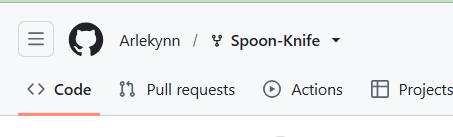
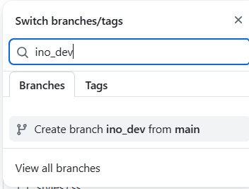
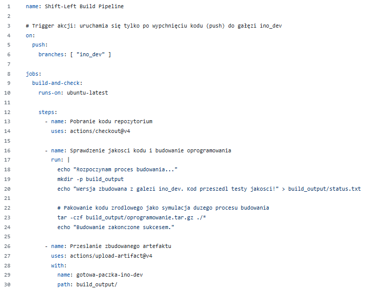
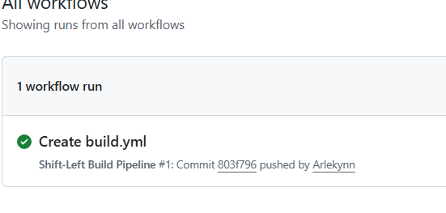
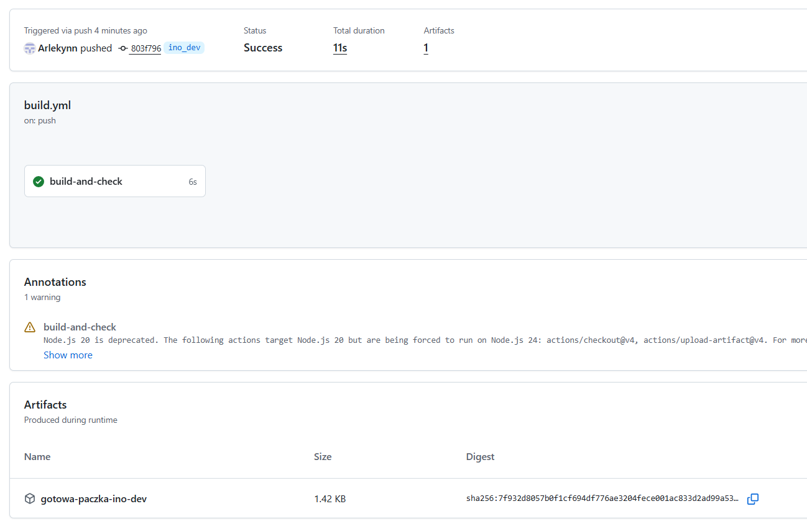

# Sprawozdanie z Laboratorium 13: Shift-left i GitHub Actions
**Autor:** Krzysztof Mamcarz 

## Wstęp
Celem laboratorium było praktyczne zapoznanie się z koncepcją *Shift-left* oraz mechanizmami automatyzacji Continuous Integration (CI) oferowanymi przez platformę GitHub Actions. Podejście to polega na przeniesieniu procesów testowania i budowania oprogramowania na najwcześniejszy możliwy etap cyklu deweloperskiego. Zadanie zrealizowano w pełni z wykorzystaniem darmowego planu (Free Tier) dla kont osobistych na platformie GitHub.

## 1. Przygotowanie repozytorium i gałęzi
Zgodnie z wymogami laboratorium, pracę rozpoczęto od utworzenia kopii (tzw. fork) przykładowego repozytorium `Spoon-Knife` na własnym koncie studenckim. Operacja ta zapobiega niepożądanemu wgrywaniu skryptów CI/CD do głównego (upstream) projektu.

Następnie, w ramach skopiowanego repozytorium, wykreowano nową, dedykowaną gałąź deweloperską o nazwie `ino_dev`. Wszystkie kolejne prace integracyjne były prowadzone wyłącznie w tym odizolowanym środowisku.

## 2. Implementacja potoku (Workflow)
Kolejnym krokiem było utworzenie własnej akcji automatyzującej proces weryfikacji i budowania. W katalogu `.github/workflows/` utworzono plik konfiguracyjny YAML realizujący założenia zadania. 

Kluczowym elementem skryptu jest jego wyzwalacz (*trigger*). Został on skonfigurowany w taki sposób, aby reagować wyłącznie na operację `push` (wypchnięcie kodu) zrealizowaną na gałęzi `ino_dev`. Dodatkowo skrypt symuluje sprawdzanie jakości kodu (*code quality*) oraz tworzy zarchiwizowaną paczkę z oprogramowaniem.

## 3. Weryfikacja działania i publikacja artefaktu
Zatwierdzenie (commit) pliku konfiguracyjnego na gałęzi `ino_dev` natychmiast wyzwoliło zaprojektowaną Akcję. Środowisko GitHub Actions wykryło zmianę i automatycznie uruchomiło środowisko uruchomieniowe (Runner) bazujące na systemie Ubuntu.

Szczegółowa inspekcja pojedynczego przebiegu potoku potwierdza pełen sukces operacji. Proces wykonania zdefiniowanego zadania `build-and-check` zajął kilkanaście sekund. Zgodnie z wytycznymi, wygenerowany w trakcie procesu kompilacji plik został pomyślnie przechwycony i załączony na platformie jako tzw. Artefakt (`gotowa-paczka-ino-dev`).

**Wnioski:** Wykorzystanie platform CI/CD takich jak GitHub Actions znacząco ułatwia wczesne wykrywanie błędów w kodzie (Shift-left). Automatyzacja budowania paczek i weryfikacji bezpośrednio po wysłaniu zmian przez dewelopera gwarantuje, że do dalszych etapów (lub na serwery produkcyjne) trafi wyłącznie sprawny i poprawnie skompilowany kod.