# Sprawozdanie: Zajęcia 04 - Dodatkowa terminologia w konteneryzacji, instancja Jenkins

Celem niniejszego laboratorium było zapoznanie się z koncepcją zachowywania stanu w środowisku skonteneryzowanym (wolumeny) oraz eksperymenty z komunikacją sieciową (sieci własne, DNS, porty). Zwieńczeniem zajęć było przygotowanie i uruchomienie instancji serwera CI Jenkins.

---

## 1. Zachowywanie stanu między kontenerami (Wolumeny)

Realizację zadań rozpoczęto od utworzenia dwóch niezależnych wolumenów Dockera: `vol_wejsciowy` oraz `vol_wyjsciowy`. Służą one do przetrzymywania kodu i wygenerowanych artefaktów poza cyklem życia kontenerów.

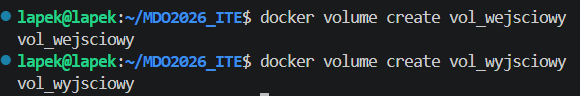

Zgodnie z wymaganiami, zbudowano środowisko bez umieszczania narzędzia Git w kontenerze bazowym. W tym celu użyto kontenera pomocniczego z obrazem `alpine/git`, który pobrał repozytorium do podłączonego wolumenu wejściowego i zakończył działanie (flaga `--rm`). Zapewnia to separację narzędzi i "czystość" właściwego kontenera budującego.

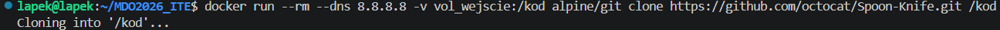

Następnie uruchomiono kontener bazowy (`ubuntu`), który zamontował oba wolumeny. Zaktualizowano w nim pakiety, zainstalowano narzędzie `tar` i spakowano kod pobrany z wolumenu wejściowego, zapisując wynik (`build.tar.gz`) na wolumenie wyjściowym.

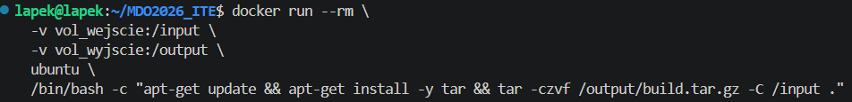

Poprawność operacji zweryfikowano uruchamiając kolejny, jednorazowy kontener sprawdzający zawartość wolumenu wyjściowego.

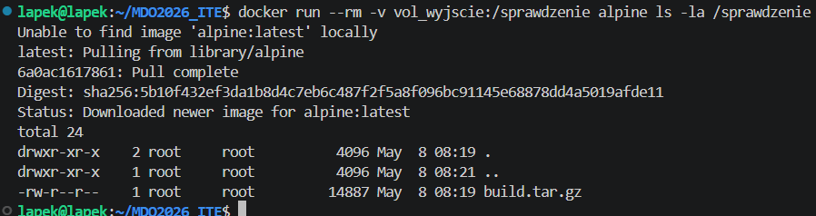

Operację powtórzono testując inne podejście: narzędzie `git` zostało zainstalowane bezpośrednio wewnątrz działającego kontenera, kod sklonowano na gorąco i od razu spakowano jako `build_v2.tar.gz` do wolumenu wyjściowego.

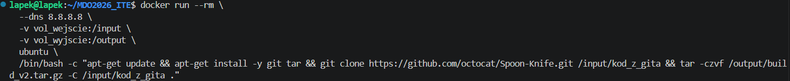

Ostateczna weryfikacja zawartości wolumenu udowadnia, że obie paczki zostały poprawnie zachowane na hoście po zakończeniu działania kontenerów.

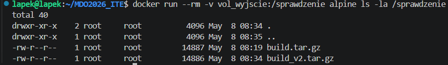

---

## 2. Eksponowanie portu i łączność między kontenerami

Do weryfikacji połączeń sieciowych użyto oprogramowania `iperf3`. Najpierw uruchomiono serwer w domyślnej sieci Dockera (bridge).

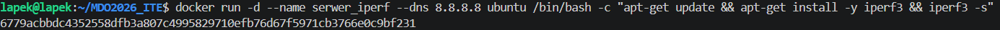

Używając polecenia `docker inspect`, sprawdzono przydzielony mu przez demona Dockera adres IP (172.17.0.2).

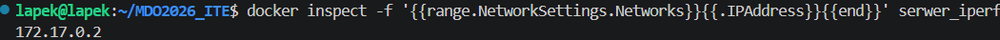

Uruchomiono kontener kliencki, podając odczytany adres IP. Transfer danych powiódł się, a zmierzona przepustowość komunikacji wewnątrz wirtualnego interfejsu sieciowego była bardzo wysoka.

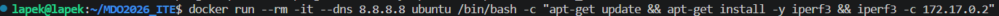
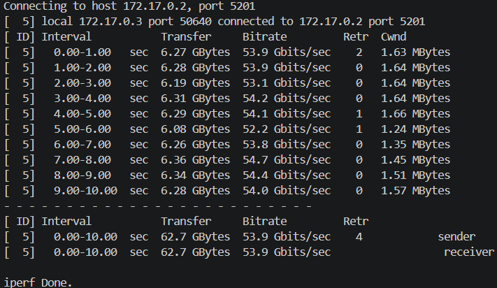

### Sieć definiowana przez użytkownika i rozwiązywanie nazw (DNS)
Aby uniezależnić się od zmiennych adresów IP, utworzono nową, dedykowaną sieć mostkową `moja_super_siec`.

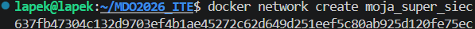

Uruchomiono na niej serwer o nazwie `serwer_iperf_dns`. 

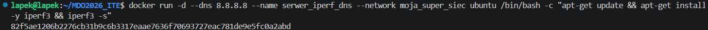

Zaletą własnej sieci jest wbudowany mechanizm DNS – klient mógł nawiązać poprawne połączenie odwołując się bezpośrednio do nazwy kontenera, co jest kluczowe w skalowalnych środowiskach.

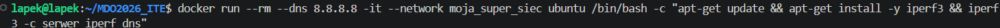
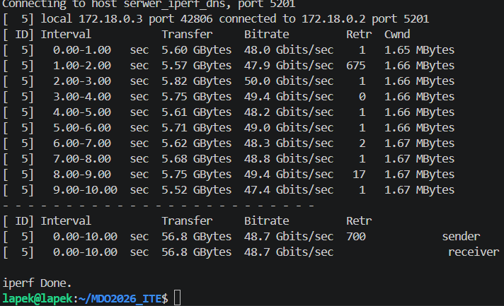

### Łączność ze środowiska hosta
Przetestowano również komunikację z zewnątrz kontenera. Serwer uruchomiono z flagą mapującą port aplikacji na port maszyny wirtualnej (`-p 5201:5201`).

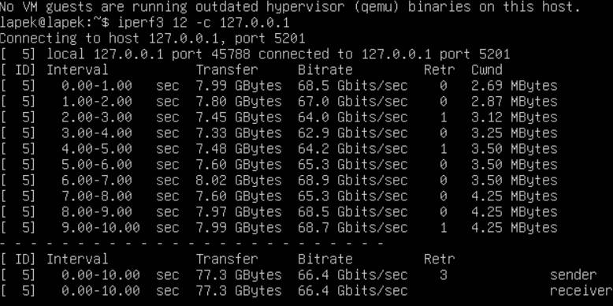

Dzięki temu możliwe było uruchomienie testu `iperf3` bezpośrednio z poziomu konsoli hosta (na adresie `127.0.0.1`), co zakończyło się pełnym sukcesem.

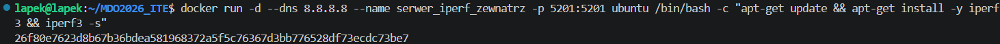

---

## 3. Usługi systemowe wewnątrz kontenera

Sprawdzono możliwość uruchamiania usług w tle, zestawiając w kontenerze Ubuntu serwer OpenSSH (`sshd`) i eksponując go na porcie 2222 hosta.

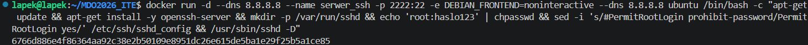

Nawiązano udane połączenie SSH z kontenerem z poziomu maszyny wirtualnej.
**Wnioski:** Choć uruchamianie SSH wewnątrz kontenera upodabnia go do maszyny wirtualnej i ułatwia korzystanie z niektórych narzędzi, uznawane jest to obecnie za antywzorzec. Rozbija to koncepcję izolacji pojedynczych procesów i niepotrzebnie obciąża obraz bazowy.

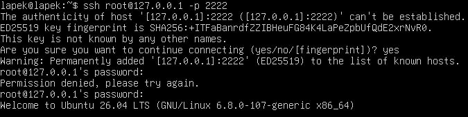
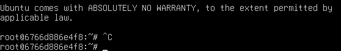

---

## 4. Przygotowanie instancji serwera Jenkins

Ostatnim etapem zajęć było zainicjowanie środowiska ciągłej integracji Jenkins. W pierwszej kolejności utworzono wymaganą sieć oraz wolumeny dla danych certyfikatów i konfiguracji serwera.

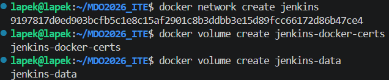

Zgodnie z dokumentacją, uruchomiono obraz Jenkinsa z włączoną obsługą Docker-in-Docker (DIND), co umożliwi mu budowanie własnych kontenerów w toku zadań CI.

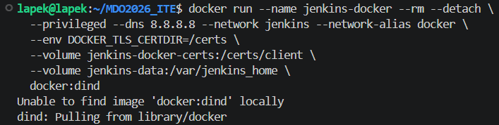

Weryfikacja procesu potwierdziła poprawne, równoległe działanie obu kontenerów infrastruktury Jenkinsa.

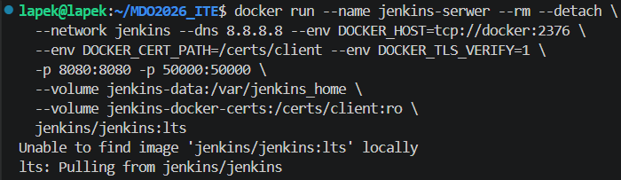

Hasło autoryzacyjne, niezbędne do wstępnej konfiguracji środowiska, wyciągnięto bezpośrednio z logów działającego serwera.

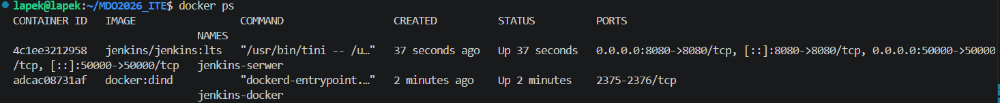

Logowanie do interfejsu webowego zakończyło się sukcesem, otwierając drogę do konfiguracji potoków w kolejnych laboratoriach.

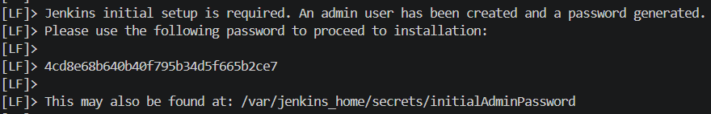