# Sprawozdanie: Zajęcia 05 - Pipeline, Jenkins, izolacja etapów

Celem niniejszego laboratorium było zapoznanie się ze środowiskiem Jenkins, skonfigurowanie środowiska zagnieżdżonego (Docker in Docker) oraz opracowanie koncepcji potoku CI/CD (kroki "build-test-deploy-publish"). Wszystkie zadania zostały zrealizowane pomyślnie.

---

## 1. Przygotowanie środowiska i instancji Jenkins

W pierwszej kolejności utworzono dedykowaną sieć dla Jenkinsa oraz uruchomiono obraz Dockera eksponujący środowisko zagnieżdżone (DIND). Jest to wymagane, aby Jenkins mógł wewnątrz swojego kontenera budować inne kontenery.

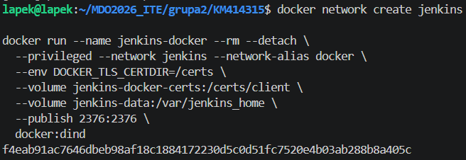

Następnie przygotowano własny plik `Dockerfile` celem zbudowania obrazu z interfejsem Blueocean. 
**Różnica względem standardowego obrazu:** Zmodyfikowany obraz instaluje klienta Docker CLI (aby Jenkins mógł komunikować się z kontenerem DIND) oraz pobiera zestaw wtyczek Blueocean, który dostarcza nowoczesny interfejs wizualny do obsługi potoków.

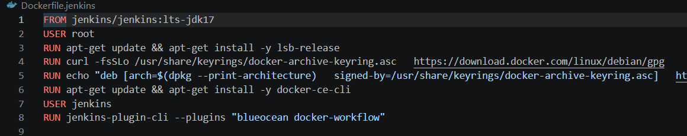

Obraz został pomyślnie zbudowany przy użyciu polecenia `docker build`.

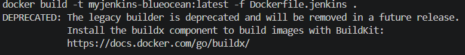

Kolejnym krokiem było uruchomienie właściwego kontenera `jenkins-blueocean` z odpowiednim mapowaniem portów, certyfikatów i wolumenów zapewniających archiwizację danych. Z logów kontenera wyciągnięto wygenerowane hasło administratora niezbędne do pierwszego logowania.

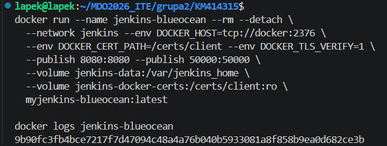
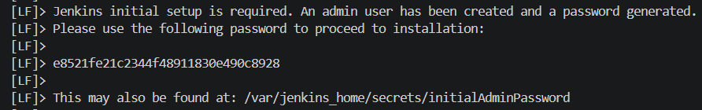

Dalsza konfiguracja odbyła się w przeglądarce. Po odblokowaniu Jenkinsa zainstalowano sugerowane wtyczki i utworzono konto administratora.

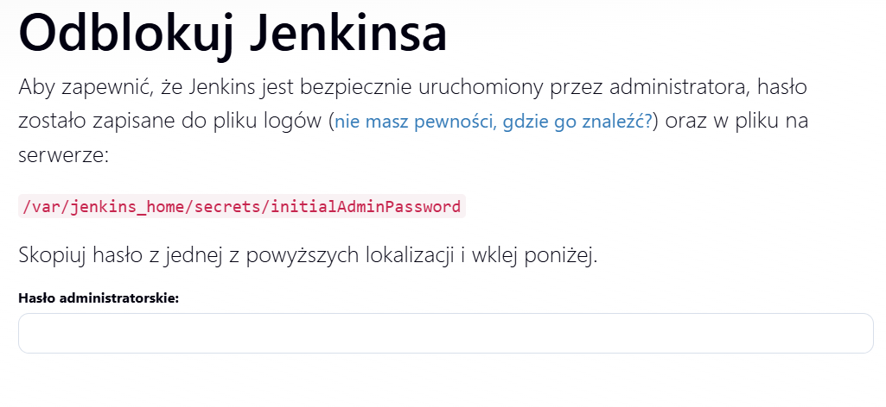
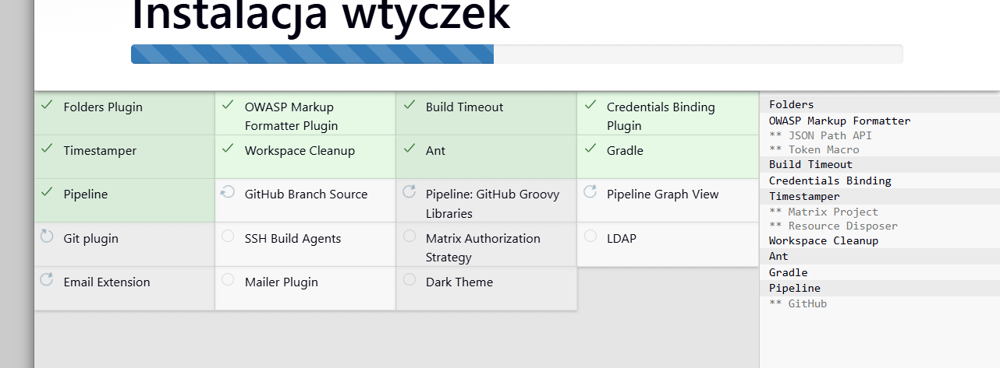
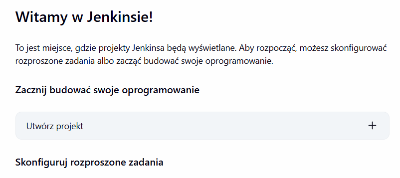

---

## 2. Zadania wstępne: pierwsze uruchomienia

Aby zweryfikować poprawność działania środowiska, wyklikano i uruchomiono trzy proste projekty testowe (Freestyle projects).

**1. Projekt wyświetlający informacje o systemie:**
Zadanie wykonało proste polecenie powłoki `uname -a`. Krok zakończył się sukcesem.

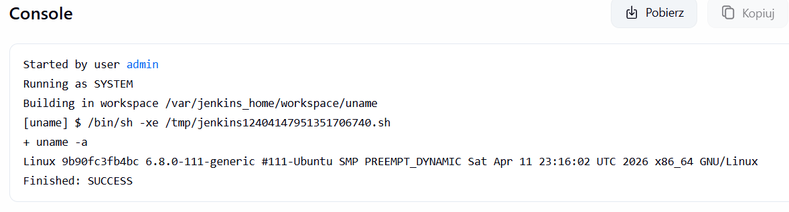

**2. Projekt weryfikujący parzystość godziny:**
Utworzono skrypt bashowy, który zwraca błąd, gdy godzina jest nieparzysta. Poniższy zrzut ekranu prezentuje udane wykonanie zadania (uruchomienie nastąpiło o godzinie parzystej, co poskutkowało poprawnym statusem wyjścia).

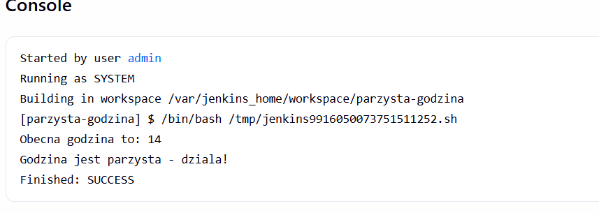

**3. Projekt pobierający obraz kontenera:**
Ostatnie zadanie wstępne miało na celu weryfikację komunikacji Jenkinsa z demonem Dockera. Użyto polecenia `docker pull ubuntu`, co pomyślnie pobrało obraz do środowiska.

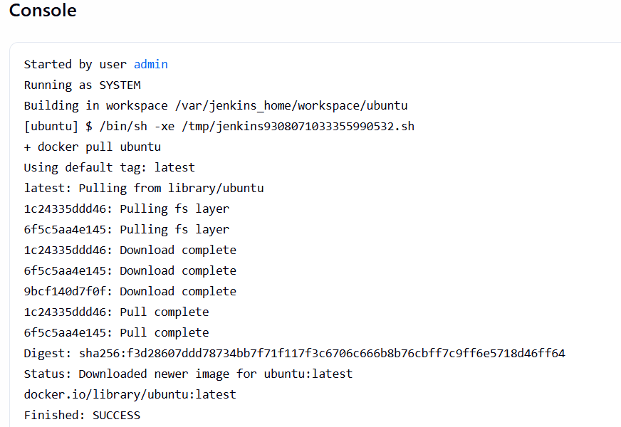
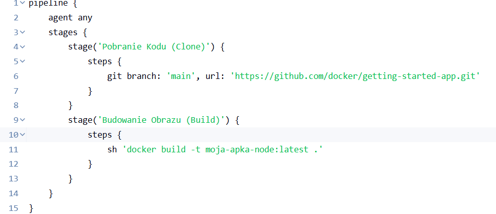

---

## 3. Obiekt typu Pipeline i definicja procesu

Po udanej weryfikacji środowiska, utworzono nowy obiekt typu `pipeline` w Jenkinsie. Zgodnie z instrukcją, treść potoku wpisano początkowo bezpośrednio do obiektu. 

Proces został zaprojektowany z myślą o lekkiej aplikacji opartej na Node.js. Opracowano architekturę potoku CI/CD, dokumentując ją za pomocą diagramów UML.

**Diagram Aktywności**
Diagram przedstawia kolejne etapy: od pobrania kodu (Clone), przez budowanie z zależnościami (Build), środowisko testowe (Test), aż po wdrożenie docelowe (Deploy) i publikację artefaktów (Publish).

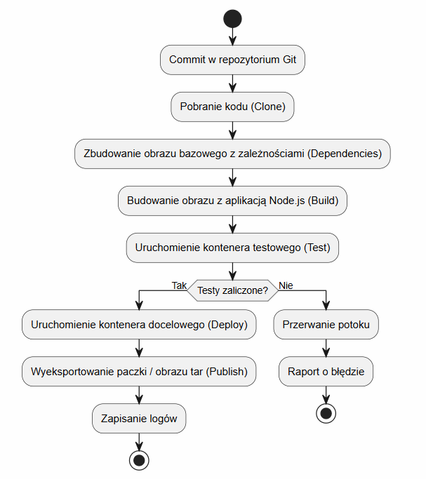

**Diagram Wdrożeniowy**
Diagram opisuje relacje między składnikami: repozytorium GitHub, serwerem Jenkins z wtyczką Blue Ocean, a serwerem DIND odpowiedzialnym za uruchamianie kontenerów testowych i wdrożeniowych. Zdefiniowany proces stanowi wzorzec do dalszych prac nad zautomatyzowanym wdrażaniem oprogramowania.

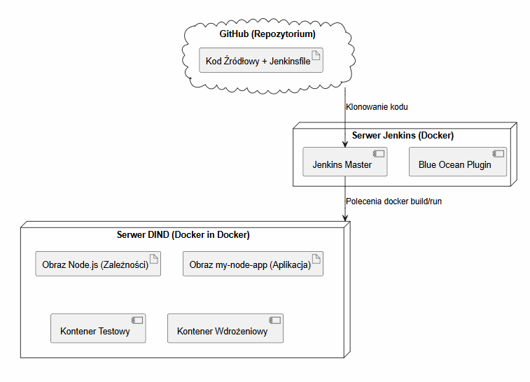