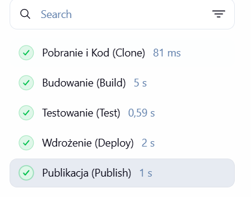
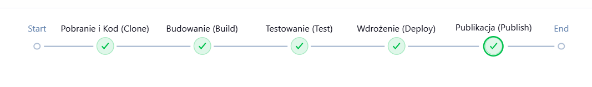
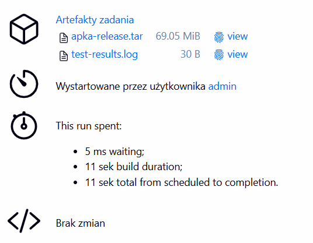

# Sprawozdanie: Zajęcia 06 - Pipeline: lista kontrolna

Celem niniejszego laboratorium było zdefiniowanie kompletnego potoku CI/CD obejmującego ścieżkę krytyczną: pobranie kodu, budowanie, testowanie, wdrożenie testowe oraz publikację. Proces został opisany w sposób deklaratywny z wykorzystaniem składni języka Groovy.

---

## 1. Implementacja Potoku (Ścieżka Krytyczna)

Poniżej znajduje się kod potoku realizujący wszystkie wymagane kroki zdefiniowane na zajęciach. Skrypt został przystosowany do ominięcia problemów z transferem plików (wyłączenie BuildKit) i samodzielnie generuje niezbędne pliki źródłowe.

```groovy
pipeline {
    agent any
    
    environment {
        DOCKER_BUILDKIT = '0'
    }
    
    stages {
        stage('Pobranie i Kod (Clone)') {
            steps {
                // Bezpieczne tworzenie plików natywną funkcją Jenkinsa
                writeFile file: 'index.js', text: 'console.log("Aplikacja produkcyjna dziala i wita uzytkownikow!");'
                writeFile file: 'test.js', text: 'console.log("Testy zaliczone: wszystko OK!");'
                
                writeFile file: 'Dockerfile', text: '''FROM node:18-slim
WORKDIR /app
COPY . .
CMD ["node", "index.js"]'''
            }
        }
        stage('Budowanie (Build)') {
            steps {
                // Tworzy obraz buildowy
                sh 'docker build -t apka-ci-cd:latest .'
            }
        }
        stage('Testowanie (Test)') {
            steps {
                // Testuje kod i zbiera logi
                sh 'docker run --rm apka-ci-cd:latest node test.js > test-results.log'
                archiveArtifacts artifacts: 'test-results.log', fingerprint: true
            }
        }
        stage('Wdrożenie (Deploy)') {
            steps {
                // Test w kontenerze docelowym
                sh 'docker run -d --name apka-testowa apka-ci-cd:latest'
                sleep 2
                sh 'docker logs apka-testowa > deploy.log'
                sh 'docker rm -f apka-testowa'
            }
        }
        stage('Publikacja (Publish)') {
            steps {
                // Zapisuje gotowy obraz do pliku TAR i publikuje w Jenkinsie
                sh 'docker save apka-ci-cd:latest > apka-release.tar'
                archiveArtifacts artifacts: 'apka-release.tar', fingerprint: true
            }
        }
    }
}
```
---

## 2. Decyzje Architektoniczne i Lista Kontrolna

Podczas projektowania potoku podjęto następujące decyzje technologiczne, spełniające wymagania listy kontrolnej z instrukcji:

* **Wybór aplikacji i licencja**: Wykorzystano prostą aplikację Node.js generowaną bezpośrednio w potoku, co symuluje operacje na kodzie i eliminuje problemy z licencjami zewnętrznych repozytoriów. Program pomyślnie buduje się i przechodzi testy.
* **Kontener bazowy**: Użyto obrazu `node:18-slim`, ponieważ jego niewielki rozmiar (brak zbędnych pakietów systemowych) optymalizuje czas pobierania i budowania, a sam obraz nadaje się bezpośrednio do środowiska produkcyjnego.
* **Wykonanie testów i logi**: Testy wykonywane są wewnątrz kontenera opartego o zbudowany wcześniej obraz. Wyniki testów są przekierowywane do pliku `.log` i odkładane w Jenkinsie jako trwale powiązany artefakt danego przejścia.
* **Krok Deploy (Wdrożenie)**: Wdrożenie realizowane jest jako integracyjny *smoke test* na instancji Dockera. Aplikacja zostaje uruchomiona w tle, system weryfikuje poprawne działanie (pobranie logów), po czym bezpiecznie usuwa kontener.
* **Artefakt redystrybucyjny (Publish)**: Zdecydowano się na redystrybucję w formie pliku `.tar` zawierającego pełny obraz Dockera. Wybór ten został podyktowany chęcią zachowania stuprocentowej przenośności – plik ten można uruchomić na dowolnym serwerze z Dockeream bez konieczności dostępu do sieci czy rejestru online.
* **Zgodność z UML**: Otrzymany proces w pełni pokrywa się z zaplanowanym w poprzednim laboratorium diagramem aktywności.

---

## 3. Wyniki Działania

Potok został uruchomiony pomyślnie. Poniższe zrzuty ekranu prezentują bezbłędne (zielone) przejście wszystkich zdefiniowanych etapów procesu CI/CD.




Funkcja `archiveArtifacts` poprawnie zebrała pliki wynikowe. Dołączono do nich również flagę `fingerprint: true`, która wylicza sumę kontrolną i pozwala na jednoznaczną weryfikację pochodzenia artefaktu. Opublikowane pliki (archiwum uruchomieniowe oraz logi z testów) są dostępne do pobrania bezpośrednio z poziomu interfejsu zadania w Jenkinsie.




