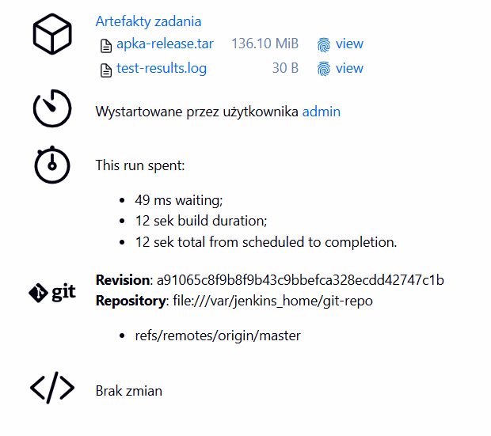
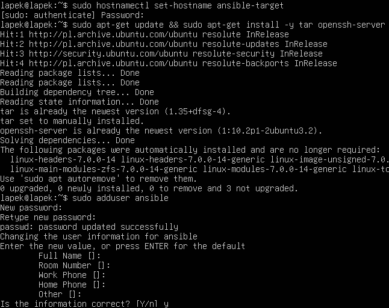
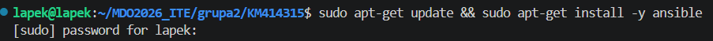
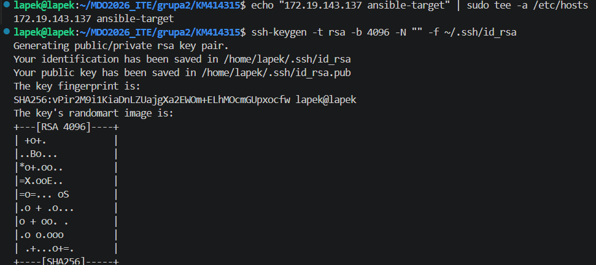
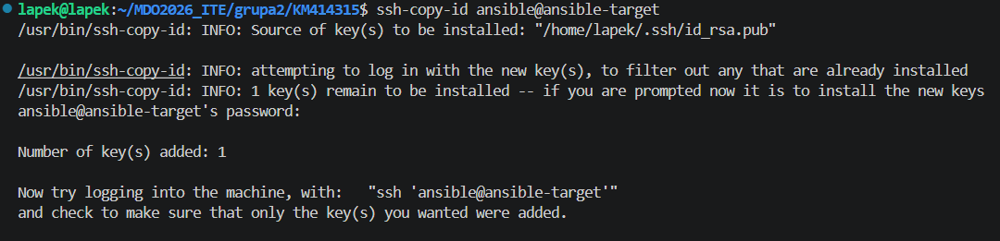

# Sprawozdanie: Zajęcia 07 - Jenkinsfile: lista kontrolna oraz środowisko Ansible

Celem niniejszego laboratorium było zaimplementowanie reguły "Infrastructure as Code" poprzez przeniesienie potoku CI/CD do pliku `Jenkinsfile` umieszczonego w repozytorium, a także przygotowanie środowiska pod przyszłe zajęcia z automatyzacji za pomocą Ansible. 

---

## 1. Jenkinsfile i dostarczanie z SCM

Zgodnie z wymogami listy kontrolnej, zrezygnowano z ręcznego wpisywania kodu potoku w ustawieniach Jenkinsa. Na maszynie hostującej utworzono lokalne repozytorium Git, w którym umieszczono plik `Jenkinsfile` definiujący sprawdzone w poprzednim zadaniu etapy budowania i testowania.

Projekt w Jenkinsie został przepięty na opcję "Pipeline script from SCM". Po rozwiązaniu kwestii uprawnień (dodanie folderu do tzw. *safe.directory* w konfiguracji Git oraz zezwolenie na lokalne repozytoria zmienną środowiskową serwera), potok został uruchomiony pomyślnie.

Poniższy zrzut ekranu udowadnia, że przepis został dostarczony z SCM – widoczna jest sekcja "git" z hashem commita oraz informacją o pobraniu z lokalnego repozytorium. Proces wygenerował poprawny artefakt wdrożeniowy, spełniając założenia "*Definition of done*".

---

## 2. Przygotowanie środowiska dla oprogramowania Ansible

W drugiej części laboratorium przygotowano infrastrukturę wymaganą do kolejnych zajęć. W środowisku Hyper-V utworzono drugą, możliwie najlżejszą maszynę wirtualną z systemem Ubuntu Server. 

Na nowej maszynie zrealizowano następujące kroki wstępne:
* Nadano nazwę hosta `ansible-target`.
* Zainstalowano niezbędne pakiety `tar` oraz `openssh-server`.
* Utworzono dedykowanego użytkownika `ansible`.
* Wykonano migawkę maszyny w środowisku wirtualizacyjnym celem zachowania jej czystego stanu.

Następnie, na głównej maszynie roboczej zainstalowano pakiet Ansible z repozytorium dystrybucji.

### Wymiana kluczy SSH

Aby zapewnić bezhasłową i zautomatyzowaną komunikację między maszynami, wygenerowano nową parę kluczy RSA na głównej maszynie. Dla ułatwienia pracy, dodano również adres IP nowej maszyny do pliku `/etc/hosts`.

Klucz publiczny został pomyślnie skopiowany na maszynę docelową `ansible-target` przy użyciu narzędzia `ssh-copy-id`.

### Weryfikacja środowiska

Ostatecznym testem poprawności konfiguracji była próba logowania z maszyny głównej na maszynę docelową. Zgodnie z wymaganiami, po wpisaniu komendy `ssh ansible@ansible-target`, nawiązano połączenie natychmiastowo, bez konieczności podawania hasła. Środowisko jest w pełni gotowe do pracy z automatyzacją konfiguracji.

