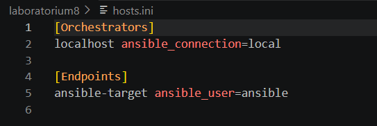
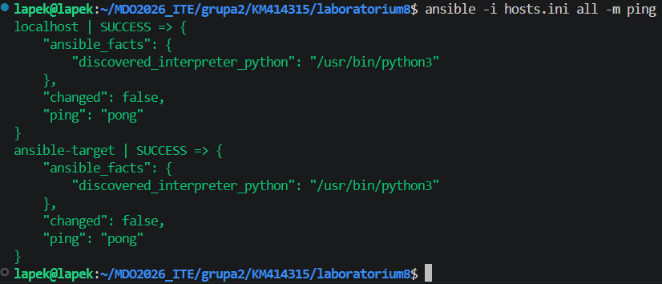
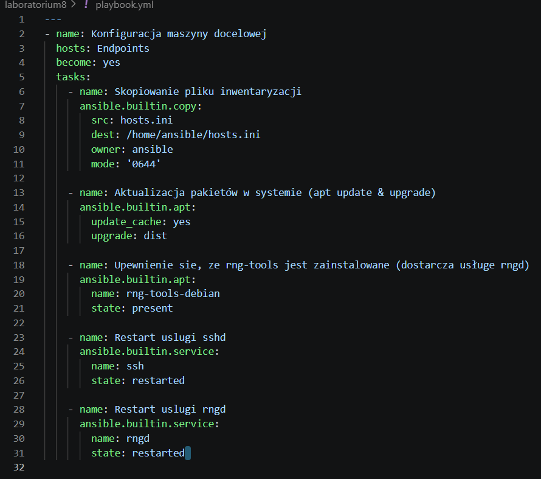
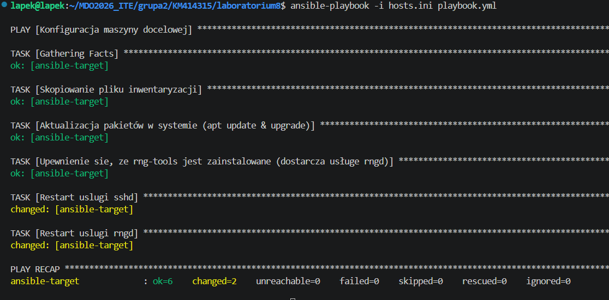
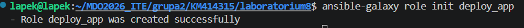
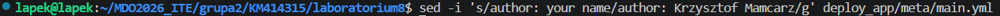
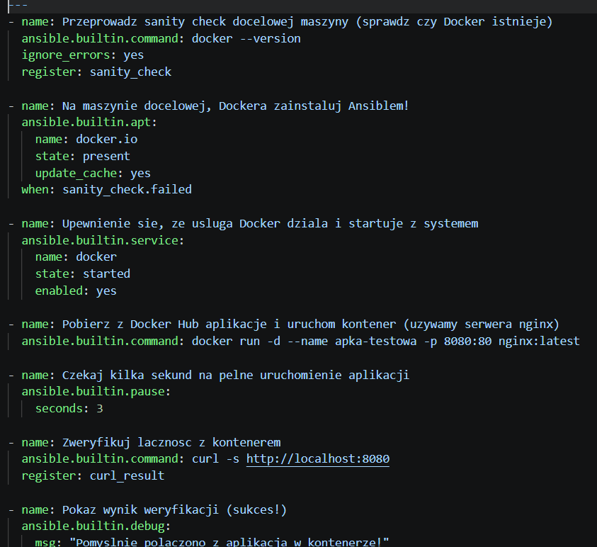
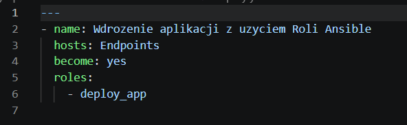
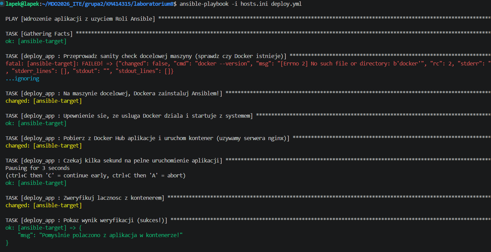
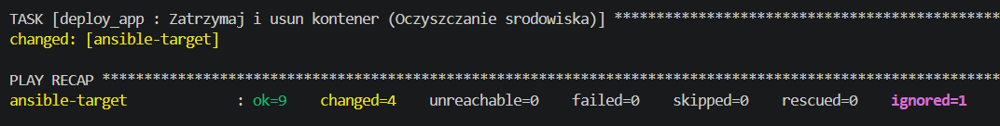

# Sprawozdanie z Laboratorium 08: Automatyzacja i zdalne wykonywanie poleceń za pomocą Ansible
**Autor:** Krzysztof Mamcarz (KM414315)

## 1. Inwentaryzacja systemów
Pierwszym krokiem było zdefiniowanie maszyn, którymi będzie zarządzał Ansible. W tym celu utworzono plik inwentaryzacji `hosts.ini`, w którym podzielono środowisko na maszynę sterującą (`Orchestrators`) oraz docelową (`Endpoints`).

Następnie zweryfikowano poprawność konfiguracji kluczy SSH oraz łączność z obydwoma węzłami, wykorzystując wbudowany moduł `ping` programu Ansible. Żądanie zakończyło się statusem `SUCCESS` dla obu maszyn.

## 2. Zdalne wywoływanie procedur za pomocą Playbooka
Aby zautomatyzować konfigurację maszyny docelowej, przygotowano plik YAML pełniący rolę Playbooka. Deklaruje on pożądany stan końcówki `ansible-target`: skopiowanie pliku inwentaryzacji, aktualizację pakietów systemowych narzędziem `apt` oraz restart usług `sshd` i `rngd` (w systemie Ubuntu jako pakiet `rng-tools-debian`).

Uruchomienie Playbooka zakończyło się pomyślnie. Część zadań otrzymała status `ok` (co dowodzi idempotentności Ansible'a – pakiety były już aktualne i plik istniał), a wymuszone restarty usług poprawnie zaraportowały zmianę stanu (`changed`).

## 3. Zarządzanie stworzonym artefaktem za pomocą Roli (Ansible Galaxy)
Zamiast budować jeden monolityczny skrypt, wdrożenie docelowej aplikacji ustrukturyzowano za pomocą narzędzia `ansible-galaxy`, tworząc szkielet profesjonalnej Roli o nazwie `deploy_app`.

Zgodnie z dobrymi praktykami, zaktualizowano metadane wygenerowanej roli, wpisując w pliku `meta/main.yml` odpowiedniego autora (używając narzędzia `sed`).

Kluczowym elementem Roli był plik zadań (`tasks/main.yml`). Skonfigurowano w nim pełen proces wdrożenia aplikacji:
* Wykonanie *sanity check* (sprawdzenie obecności Dockera), zignorowanie ewentualnego błędu w przypadku jego braku.
* Instalację i uruchomienie usługi Docker.
* Pobranie i uruchomienie kontenera z serwerem Nginx na porcie 8080.
* Weryfikację poprawności działania aplikacji (za pomocą `curl`).
* Posprzątanie po testach (zatrzymanie i usunięcie kontenera).

Rolę tę wywołano za pomocą zwięzłego, głównego pliku wdrożeniowego `deploy.yml`.

Wykonanie wdrożenia z użyciem Roli przeszło bezbłędnie. Zgodnie z założeniami, *sanity check* na świeżej maszynie zanotował brak Dockera, ignorując błąd (`...ignoring`), po czym Ansible samodzielnie zainstalował pakiety, postawił kontener z Nginxem i zwrócił pozytywny komunikat weryfikacyjny: `"Pomyslnie polaczono z aplikacja w kontenerze!"`.

Wdrożenie zakończyło się poprawnym usunięciem kontenera. Podsumowanie zadania (`PLAY RECAP`) potwierdziło wykonanie 9 operacji bez żadnych błądów krytycznych (`failed=0`).

