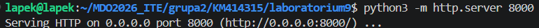
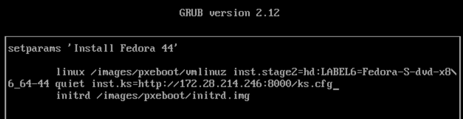
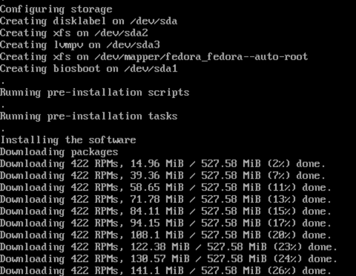
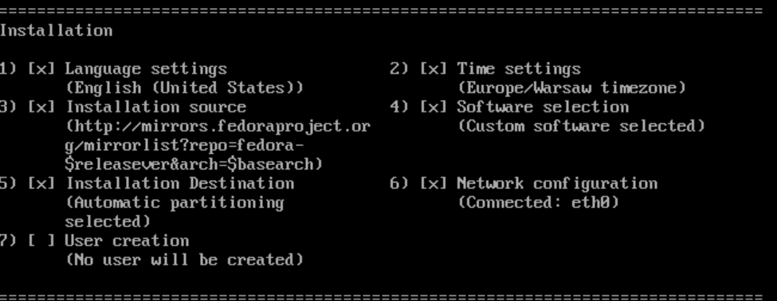
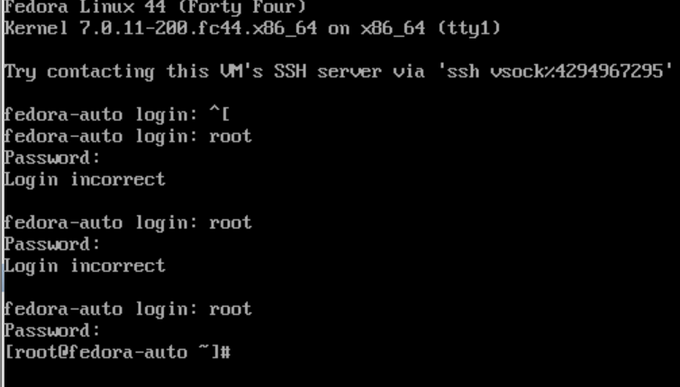
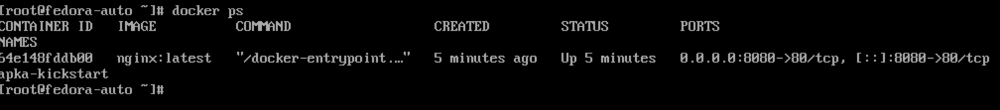
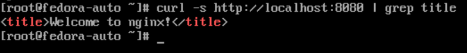

# Sprawozdanie z Laboratorium 09: Pliki odpowiedzi dla wdrożeń nienadzorowanych
**Autor:** Krzysztof Mamcarz (KM414315)

## 1. Przygotowanie pliku odpowiedzi (Kickstart)
Celem zadania było przeprowadzenie instalacji nienadzorowanej systemu Fedora. W tym celu przygotowano plik odpowiedzi `ks.cfg`. Zgodnie z instrukcją, plik zawiera dyrektywy formatujące cały dysk (`clearpart --all`), ustawiające niestandardową nazwę hosta (`fedora-auto`) oraz wskazujące sieciowe repozytoria instalacyjne w oparciu o zmienne wersji systemu.

W sekcji `%post` stworzono mechanizm pozwalający na automatyczne uruchomienie kontenera po instalacji. Ponieważ w trakcie działania instalatora usługa Docker nie może zostać jeszcze uruchomiona poprzez `systemctl start`, użyto `systemctl enable` i utworzono własną usługę systemd (`uruchom-apke.service`), która wykona polecenie wdrożenia Dockera tuż po pierwszym pełnym uruchomieniu maszyny.

Zawartość przygotowanego pliku `ks.cfg`:

```bash
text
lang en_US.UTF-8
keyboard pl
timezone Europe/Warsaw
reboot

network --bootproto=dhcp --hostname=fedora-auto --activate
rootpw --plaintext haslo123

url --mirrorlist=http://mirrors.fedoraproject.org/mirrorlist?repo=fedora-$releasever&arch=$basearch
repo --name=update --mirrorlist=http://mirrors.fedoraproject.org/mirrorlist?repo=updates-released-f$releasever&arch=$basearch

clearpart --all --initlabel
autopart

%packages
@core
moby-engine
nano
curl
%end

%post --log=/root/ks-post.log
systemctl enable docker

cat << 'SERVICE' > /etc/systemd/system/uruchom-apke.service
[Unit]
Description=Uruchomienie testowej aplikacji w Dockerze
After=docker.service
Requires=docker.service

[Service]
Type=oneshot
RemainAfterExit=yes
ExecStart=/usr/bin/docker run -d --name apka-kickstart -p 8080:80 nginx:latest

[Install]
WantedBy=multi-user.target
SERVICE

systemctl enable uruchom-apke.service
%end

```

## 2. Udostępnienie pliku w sieci
Aby instalator na nowej maszynie mógł pobrać plik odpowiedzi, udostępniono go w sieci lokalnej z poziomu maszyny sterującej, wykorzystując wbudowany serwer HTTP języka Python.



Poprawność działania usługi sieciowej i nasłuchiwanie na porcie 8000 zweryfikowano w logach środowiska deweloperskiego.


## 3. Instalacja nienadzorowana
Utworzono docelową maszynę wirtualną i uruchomiono ją z użyciem nośnika ISO. Zmodyfikowano parametry rozruchu (GRUB), dopisując dyrektywę `inst.ks=http://.../ks.cfg`, aby wskazać instalatorowi sieciową lokalizację pliku odpowiedzi.



Instalator pomyślnie zaciągnął plik `ks.cfg` i rozpoczął w pełni zautomatyzowane pobieranie pakietów operacyjnych bez ingerencji operatora.



Podsumowanie instalatora w trybie tekstowym (*Installation summary*) wykazało, że konfiguracja sieci, strefy czasowej, źródła oprogramowania oraz partycjonowanie zostały zaaplikowane ściśle według wytycznych z pliku Kickstart.



## 4. Weryfikacja środowiska po instalacji
Po zakończeniu procesu wdrażania maszyna wykonała zaplanowany w skrypcie automatyczny restart. Pomyślnie zalogowano się na konto w systemie z wykorzystaniem ustawionego hasła.



Aby wykazać, że oprogramowanie działa wewnątrz systemu, uruchomiono weryfikację. Polecenie `docker ps` udowodniło, że skrypt z sekcji `%post` zadziałał prawidłowo, a kontener z aplikacją został automatycznie postawiony od razu po starcie systemu.



Test łączności za pomocą programu `curl` na lokalnym porcie 8080 zwrócił kod HTML potwierdzający, że zaserwowana z kontenera Nginx aplikacja odpowiada na zapytania, co wieńczy pełen sukces wdrożenia nienadzorowanego.

