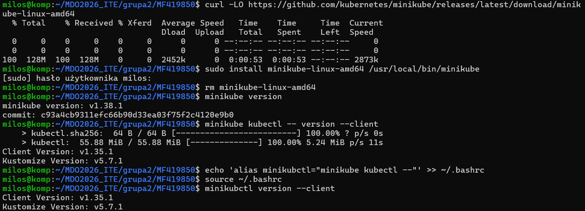
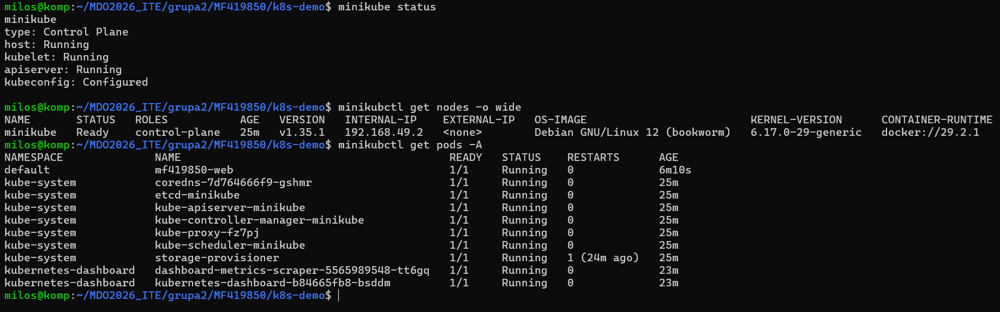
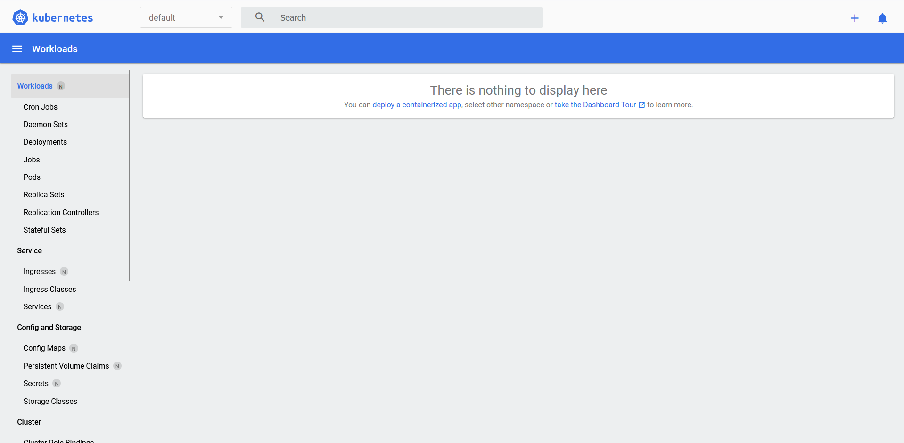
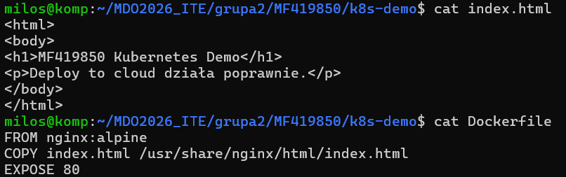
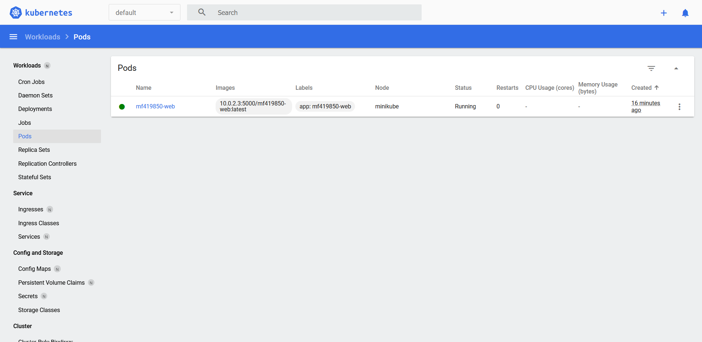
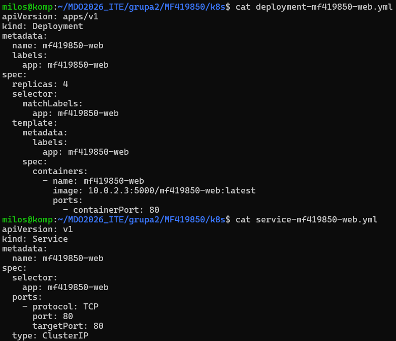
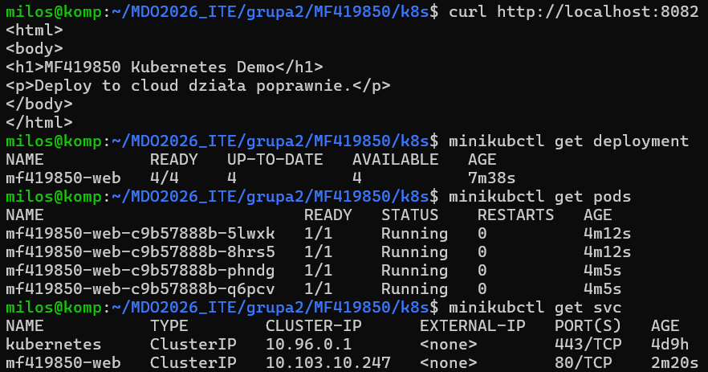
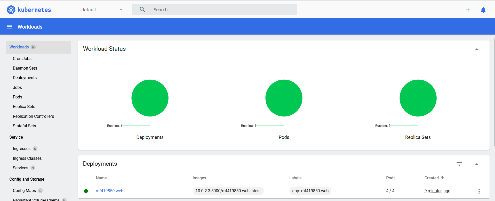
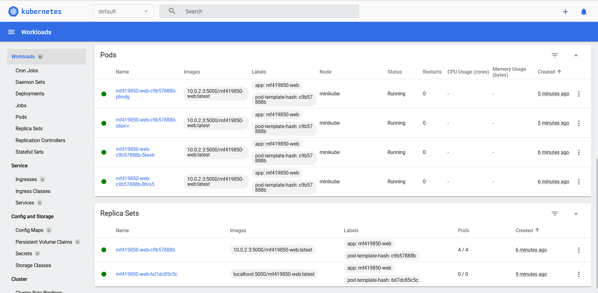

## Sprawozdanie

### Rozpocząłem pobierając minikube i sprawdzając poprawność instalacji

### Uruchomiłem klaster kubernetes następującym poleceniem, po czy sprawdziłem jego poprawność

minikube start \
  --driver=docker \
  --cpus=2 \
  --memory=2000 \
  --disk-size=4g \
  --insecure-registry="10.0.2.3:5000" \
  --force

### Umożliwiło to uruchomienie dashboarda, początkowo pustego

### Przygotowałem prostą aplikację z podanych plików. Umieściłem jej obraz w rejestrze docker oraz uruchomiłem pod.

### Utworzyłem deployment i service

### Uruchomiłem

minikubctl apply -f deployment-mf419850-web.yml
minikubctl rollout status deployment/mf419850-web

### Wdrożenie przebiegło poprawnie

