## Sprawozdanie

### Wdrożenia z liczbą replik 8, 1, 0 i ponownie 4:

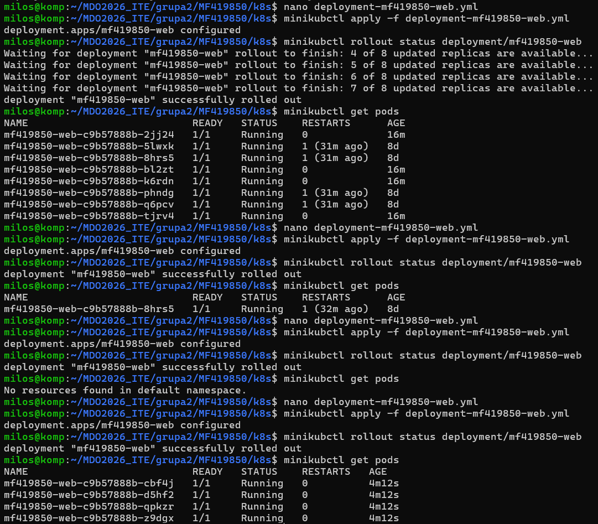

### Rollout history i undo:

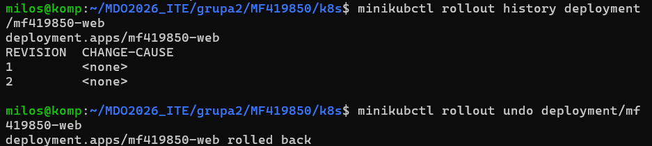

Polecenie rollout undo przywróciło wcześniejszą rewizję Deploymentu. Rewizja ta zawierała błędny adres obrazu localhost:5000/mf419850-web:latest. W środowisku Minikube adres localhost odnosił się do wnętrza noda Kubernetes, a nie do hosta Ubuntu, na którym działał lokalny rejestr Docker. W efekcie kubelet nie mógł pobrać obrazu i pody weszły w stan ImagePullBackOff. Problem rozwiązano przez ustawienie poprawnego obrazu z adresem rejestru 10.0.2.3:5000/mf419850-web:v1.

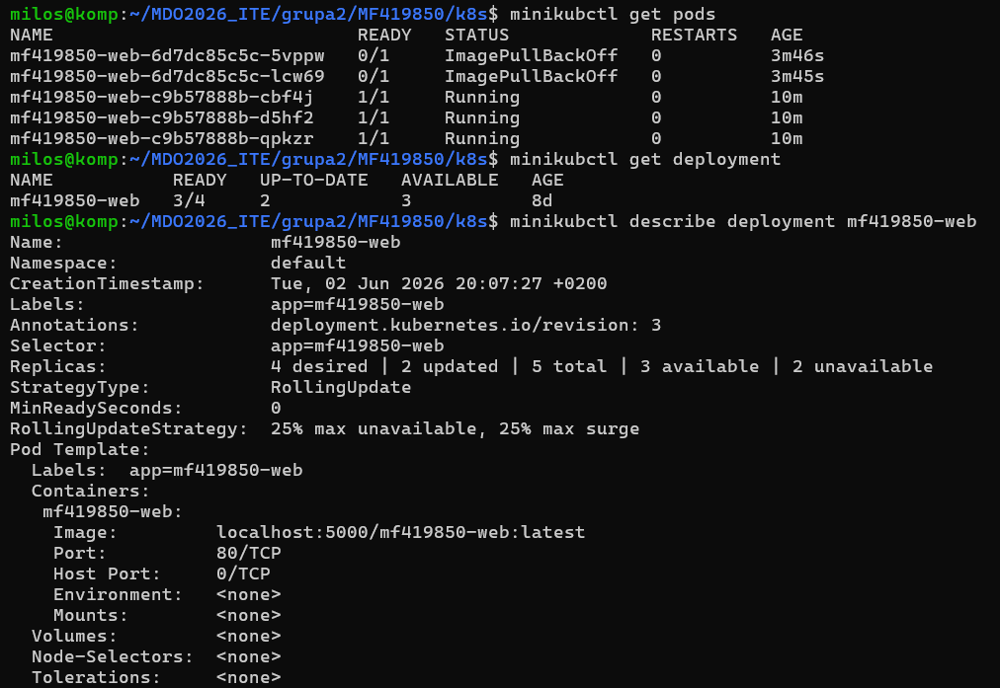
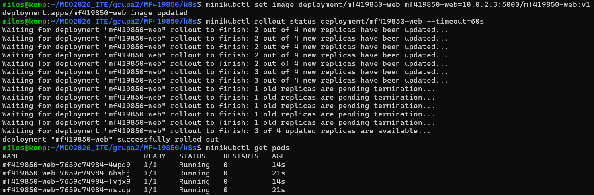

### aktualizacja wdrożenia do drugiej wersji obrazu aplikacji:

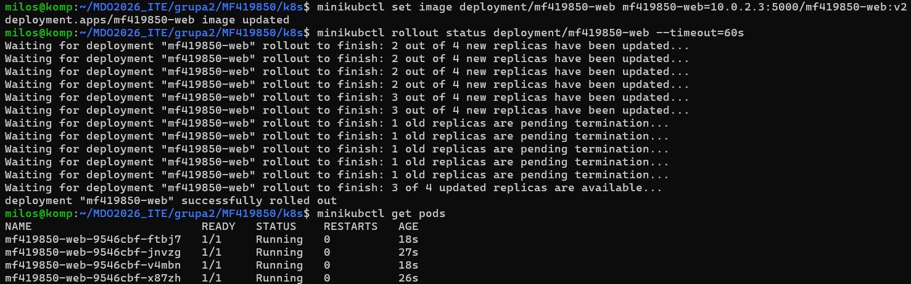

### Weryfikacja działania drugiej wersji:

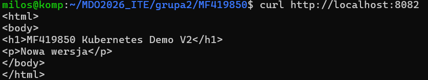

### Próba wdrożenia wadliwego obrazu:

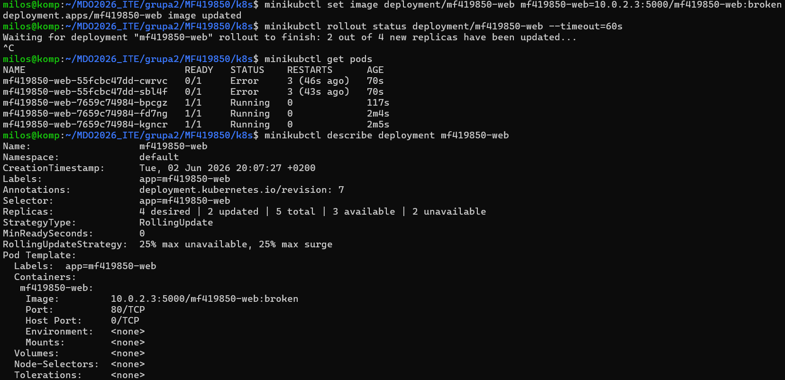

### Konfiguracja wdrożenia ze strategią recreate:

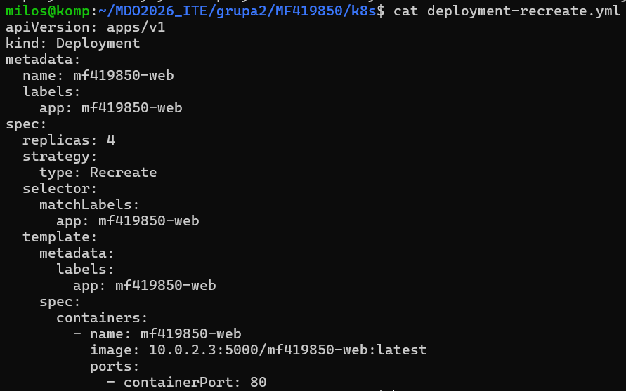

### Usuwanie wszystkich działających podów poprzedniej wersji aplikacji. Prez chwilę po zakończeniu procesu następuje niedostępność usługi.

### Utworzenie nowych podów:

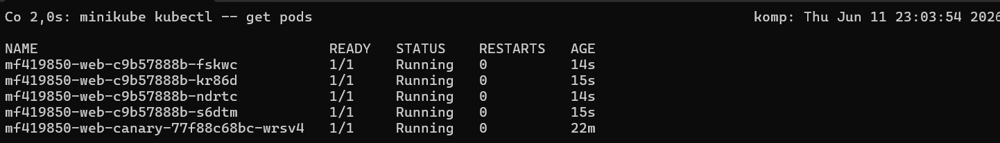

### Konfiguracja wdrożenia ze strategią Rolling Update:

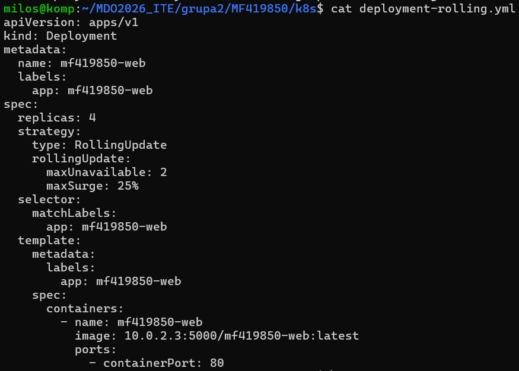

### Nowe pody są tworzone podczas usuwania starych:

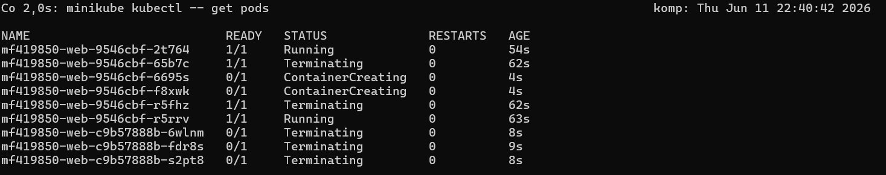

### Działanie wdrożenia canary, działająca równolegle z głównym wdrożeniem, dodaje doadatkowy pod.

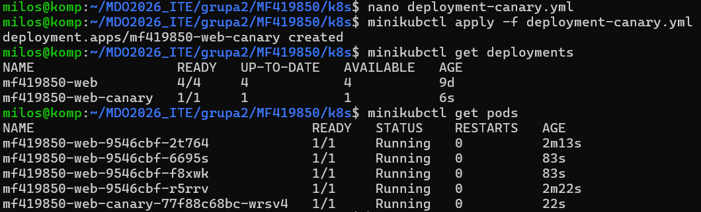

### Konfiguracja wdrożenia canary:

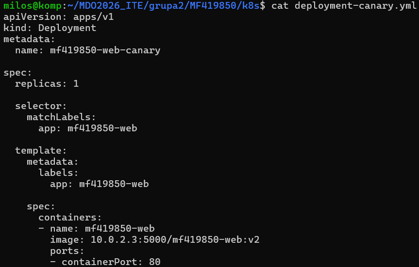

### Skrypt zweryfikował wykonanie wdrożenia w mniej niż 60 sekund.

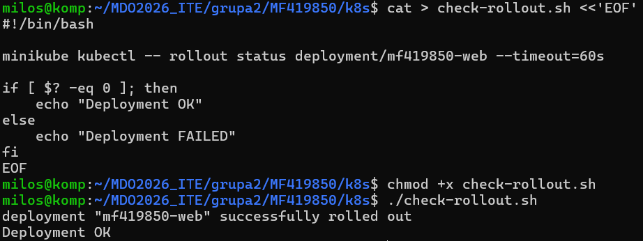