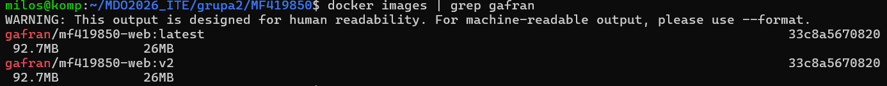
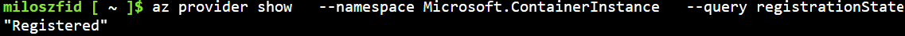
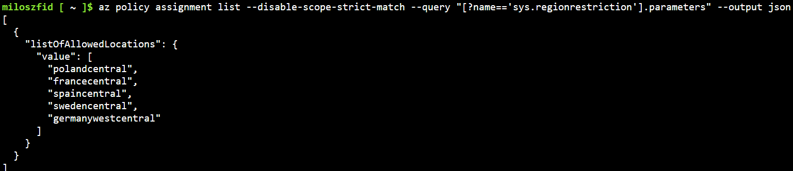
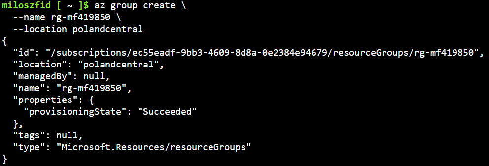
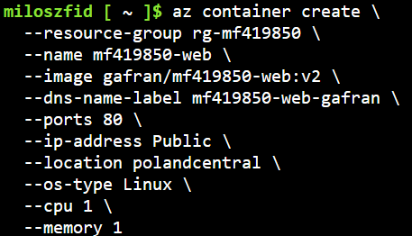
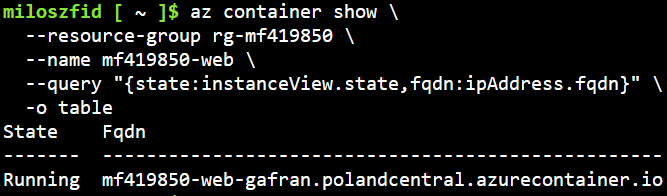
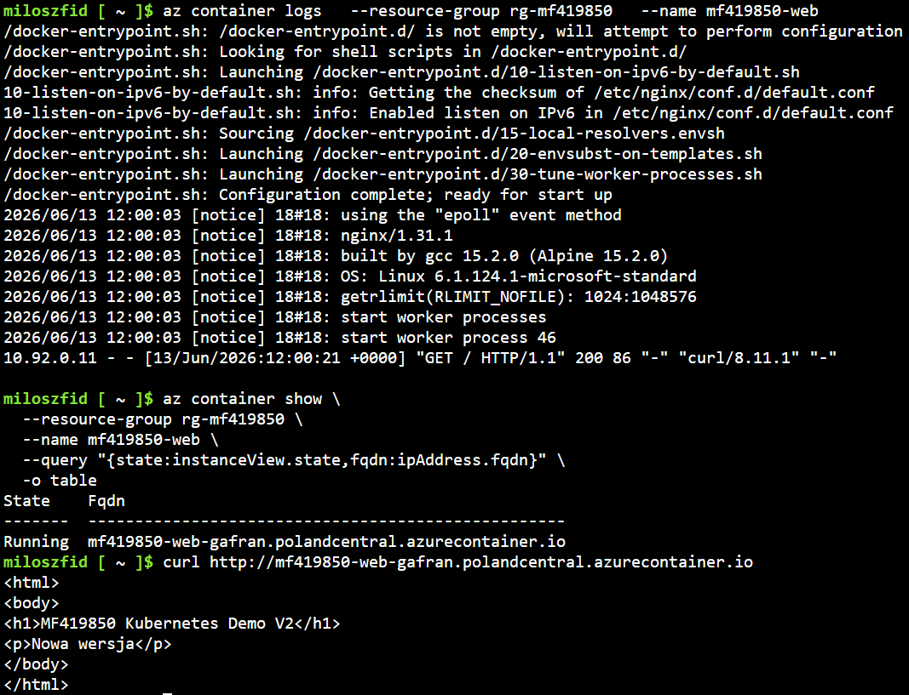
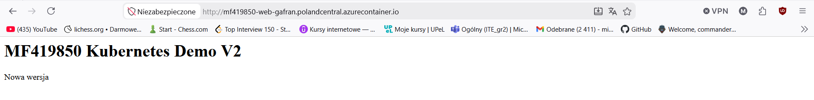
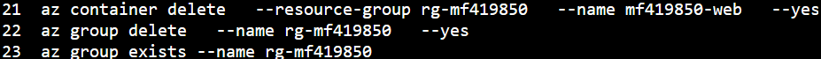

# Sprawozdanie

## Setup

Aktualna wesja kontenera na dockerhub:

Po zarejestrowaniu dostawcy komendą:

az provider register --namespace Microsoft.ContainerInstance

Status Registered potwierdza możliwość tworzenia instancji kontenerów Azure Container Instances.

Lista dostępnych lokacji do utworzenia grupy:

  

Utworzenie grupy zasobów rg-mf419850 w regionie polandcentral, dostępność regionu została potwierdzona w poprzednim kroku.

  

Utworzenie instancji kontenera z wykorzystaniem obrazu gafran/mf419850-web:v2 pobranego z Docker Hub.
Zawiera konfigurację publicznego adresu IP, nazwy DNS, parametrów zasobów (1 vCPU, 1 GB RAM) oraz systemu.

  

Potwierdzenie działania kontenera:

  

## Rezultat

Logi kontenera oraz adres strony:

Przeprowadzone kroki pozwoliły na wyświetlenie strony pod publicznym adresem, sukces.

## Czyszczenie zasobów zapobiegające wyczerpywaniu środków

