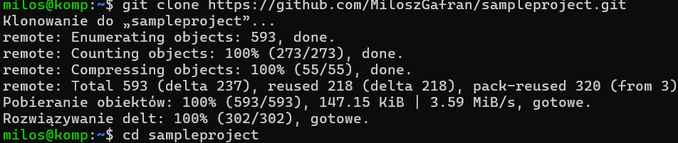
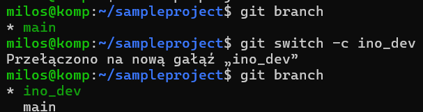
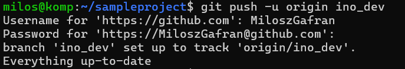
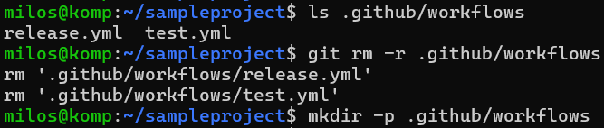
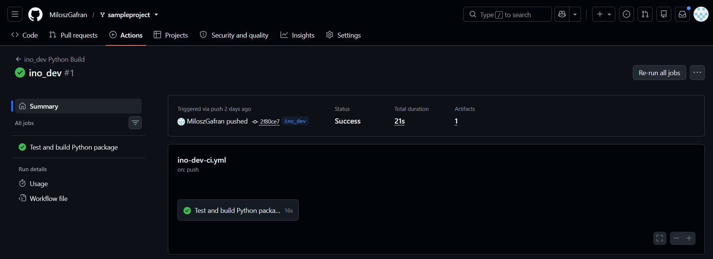

# Sprawozdanie

## Sforkowałem wybrane repozytorium na git po czym je sklonowałem.



## Utworzyłem brancha ino_dev i wypchałem go do sforkowanego repozytorium





## Usunąłem istniejące workflows



## Utworzyłem workflow w ścieżce repozytorium github/workflows/ino-dev-ci.yml, który przeprowadza build na podstawie kontrybucji do gałęzi ino_dev reagując na zmianę w niej:

```yaml
name: ino_dev Python Build

on:
  push:
    branches:
      - ino_dev
  workflow_dispatch:

permissions:
  contents: read

jobs:
  build:
    name: Test and build Python package
    runs-on: ubuntu-latest

    steps:
      - name: Checkout repository
        uses: actions/checkout@v4

      - name: Set up Python
        uses: actions/setup-python@v6
        with:
          python-version: "3.12"

      - name: Install dependencies
        run: |
          python -m pip install --upgrade pip
          python -m pip install build pytest
          python -m pip install -e .

      - name: Run tests
        run: pytest

      - name: Build package
        run: python -m build

      - name: Upload built package
        uses: actions/upload-artifact@v7
        with:
          name: sampleproject-dist
          path: dist/
          retention-days: 3
```

## Rezultat po zacommitowaniu na branch ino_dev


