## Sprawozdanie

### 1. Woluminy

**Utworzenie woluminów**

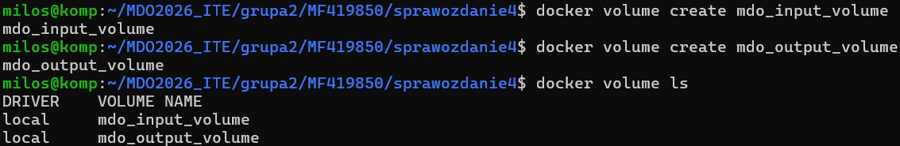

**Uruchomienie kontenera bez Gita**

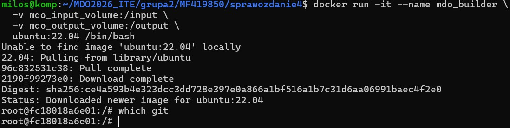

**Klonowanie repozytorium na wolumin poprzez skopiowanie plików z hosta**

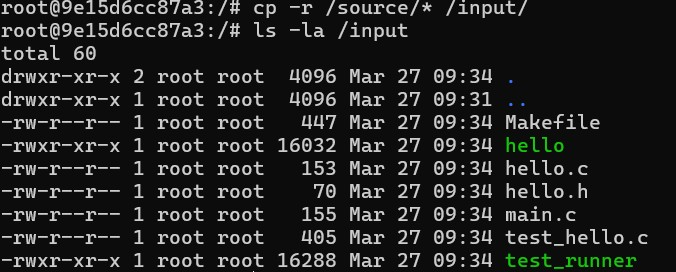

Skopiowałem w ten sposób ponieważ był on zwyczajnie najprostszy bez użycia Gita.

**Uruchomienie build w kontenerze**

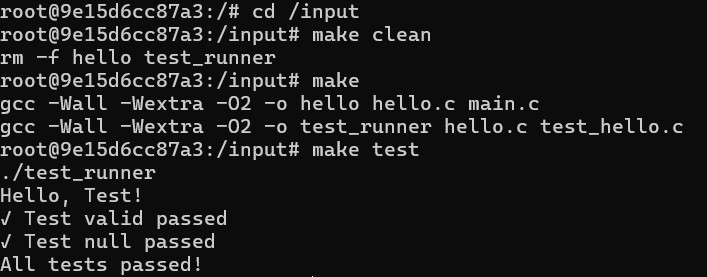

**Kopiowanie plików na wolumin wyjściowy**

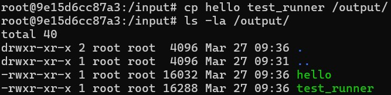

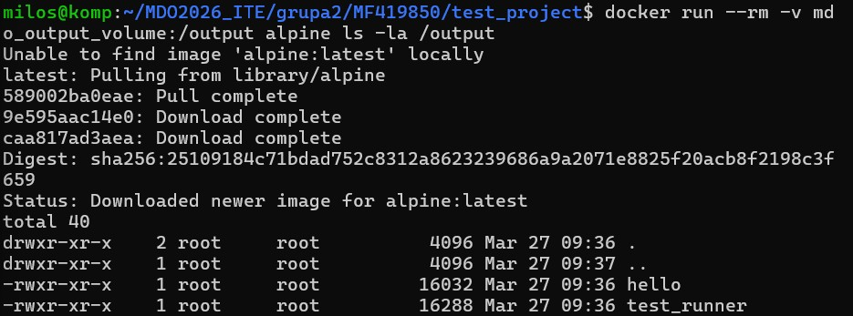

**Uruchomienie kontenera z Git**

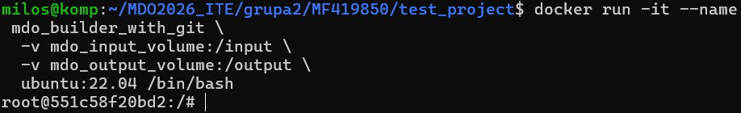

**Klonowanie repo przez Git w kontenerze**

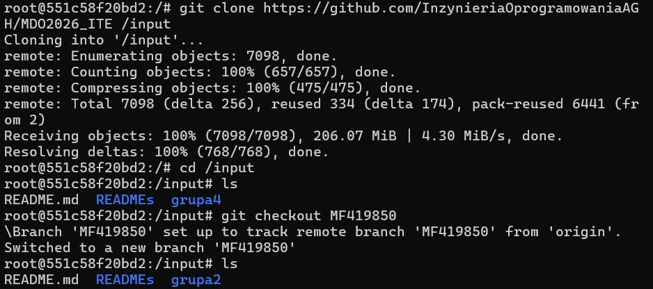

Wyżej wymienione kroki można wykonać przez docker build z plikiem Dockerfile. Dzięki RUN --mount można dodawać zasoby podczas budowania. Jest to dobre podejście do automatyzacji procesów, jednak przy jednokrotnym wykonaniu standardowa metoda jest równie dobra.

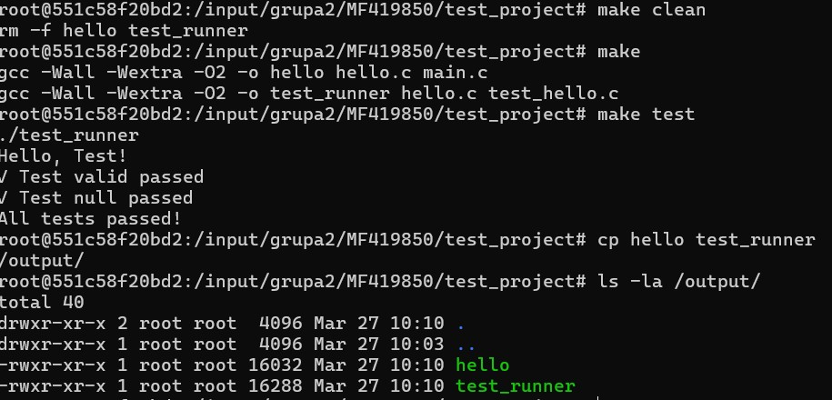
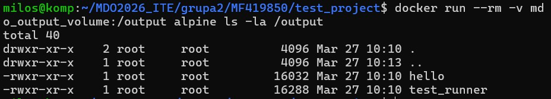

### 2. IPerf

**Uruchomienie kontenerów serwera i klienta IPerf**

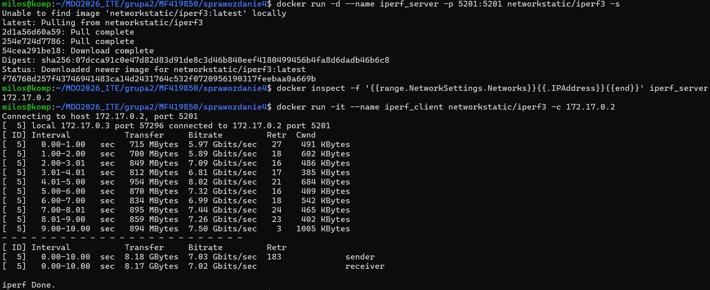

**Sieć mostkowa**

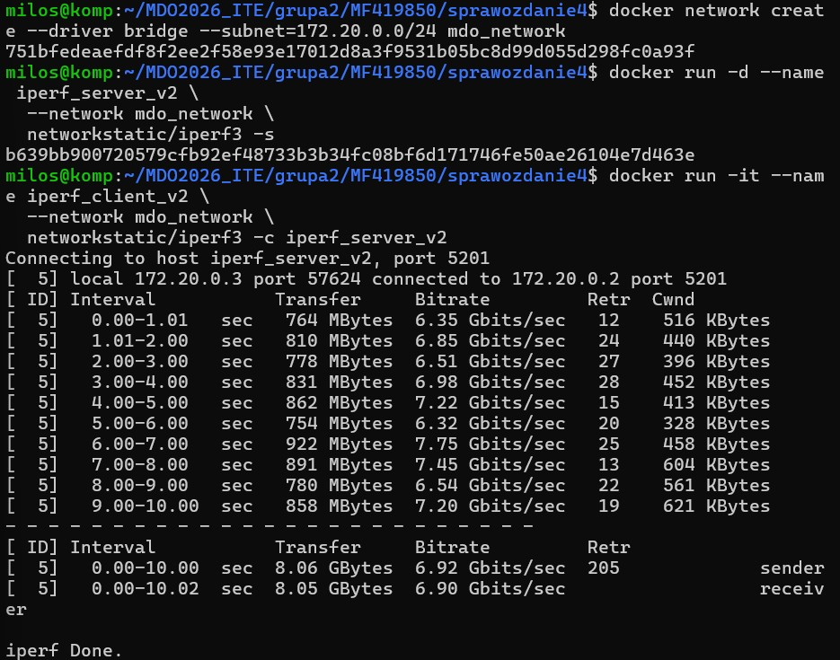

**Łączenie się z IPerf przez hosta**

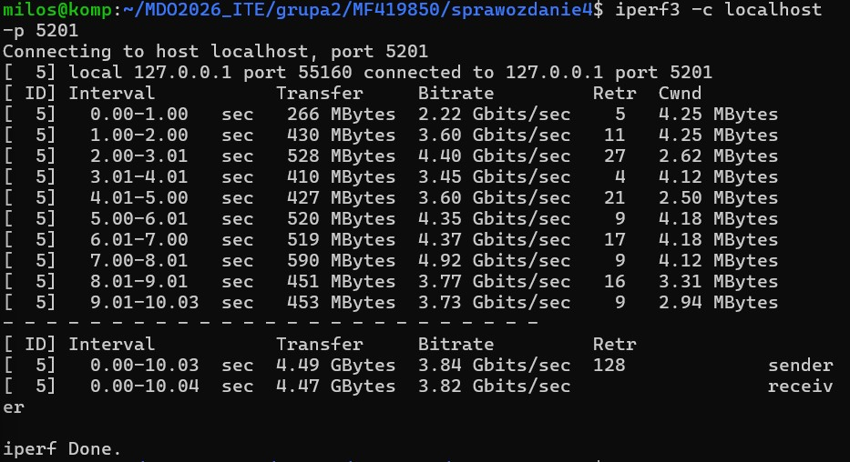

**Logi z iperf**

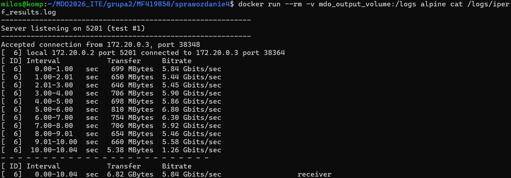

### 3. SSHD

**Utworzenie pliku do instalacji SSHD**

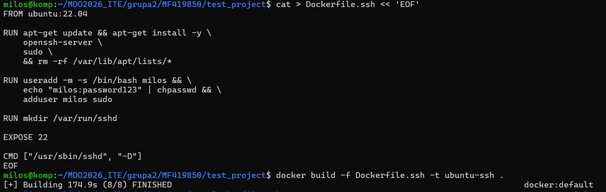

**Połączenie z SSHD**

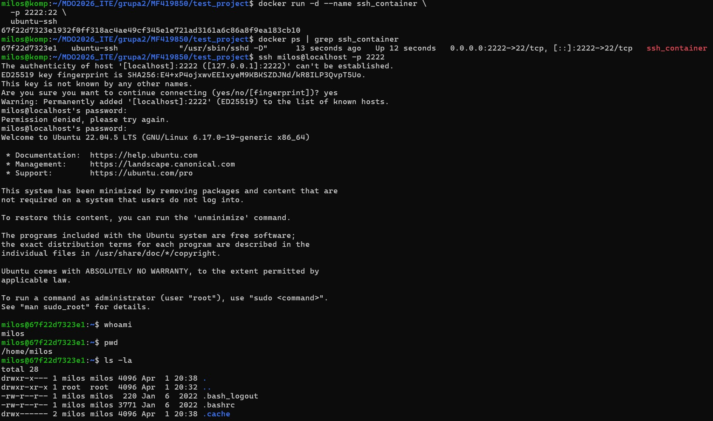

Zalety SSH - popularność, bezpieczeństwo przez szyfrowanie i kontrola dostępu do kontenera.  
Wady - Powiększenie kontenera i skomplikowanie przez zarządzanie kluczami.

### 4. Jenkins

**Utworzenie sieci Docker dla Jenkins i uruchomienie kontenera docker:dind**

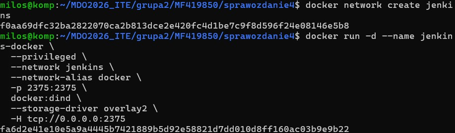

**Uruchomienie kontenera Jenkinsa**

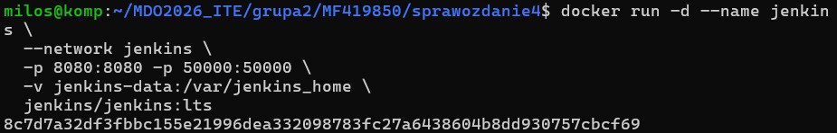

**Działający Jenkins**

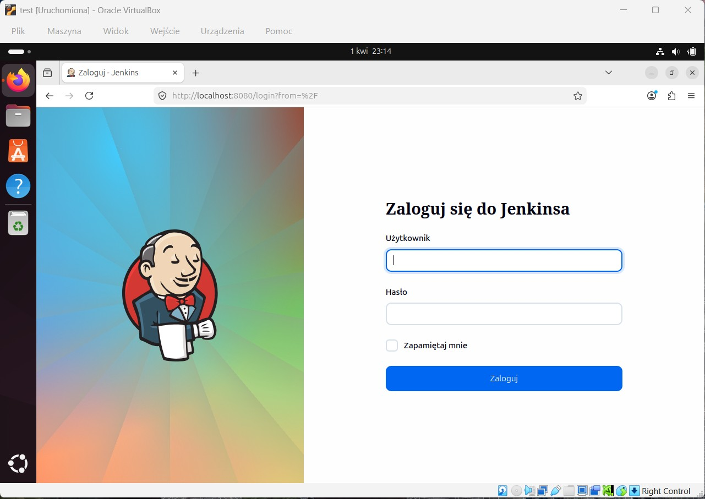
