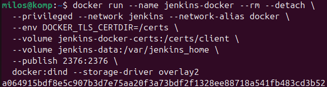
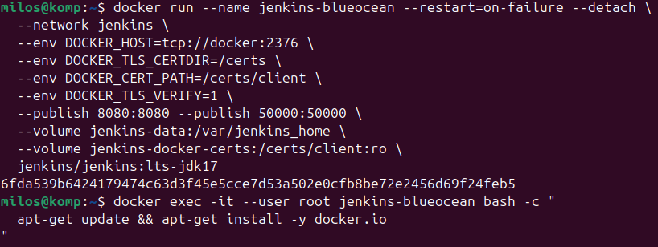
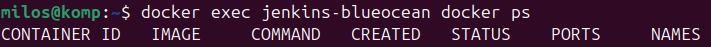
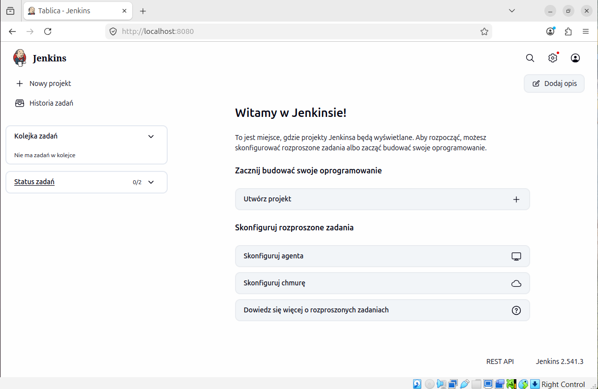
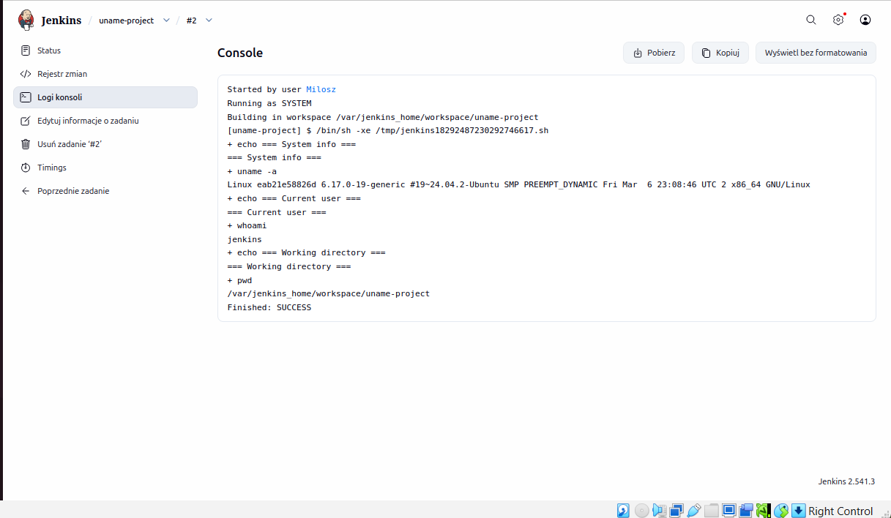
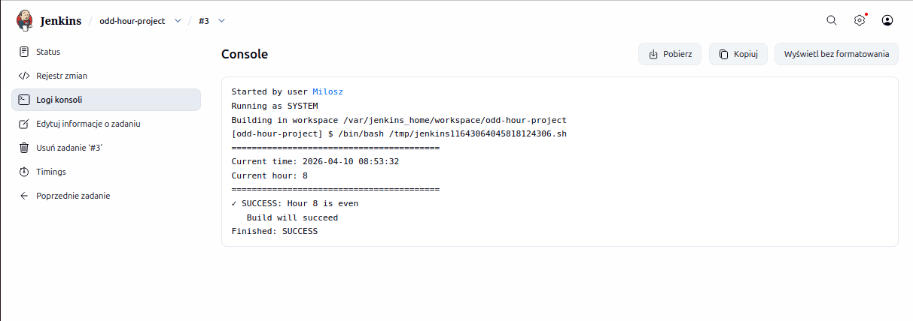
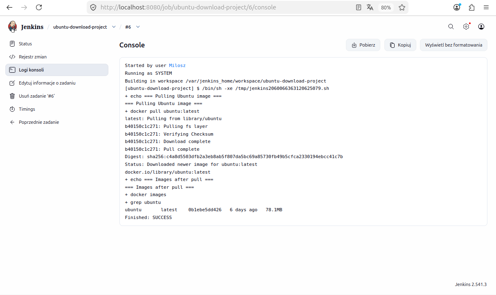
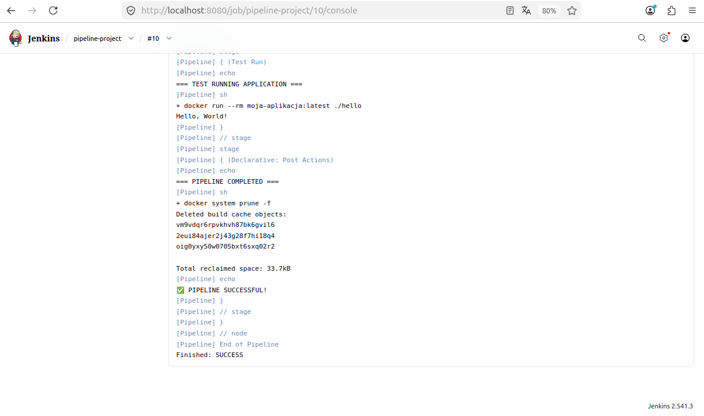
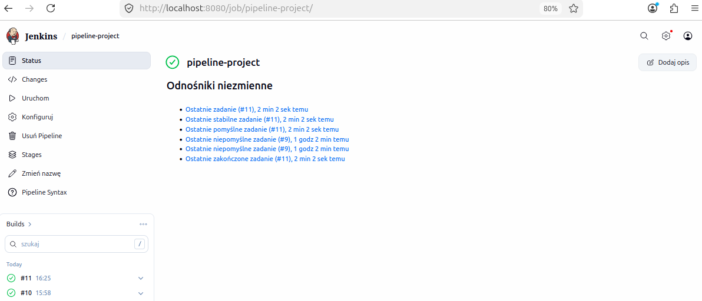

## Sprawozdanie

Ponownie utworzyłem kontenery tak aby mieć pewność że jenkins będzię mieć połączenie z dockerem.

Uruchomiłem Jenkins.

Następnie zacząłem tworzyć nowe projekty wraz ze skryptami.

wyświetlanie uname:

echo "=== System info ==="
uname -a
echo "=== Current user ==="
whoami
echo "=== Working directory ==="
pwd

Zwracanie błędu przy nieparzystej godzinie:

HOUR_RAW=$(date +%H)

HOUR=$((10#$HOUR_RAW))

echo "========================================="
echo "Current time: $(date '+%Y-%m-%d %H:%M:%S')"
echo "Current hour: $HOUR"
echo "========================================="

# Sprawdź czy godzina jest parzysta (modulo 2)
if [ $((HOUR % 2)) -eq 0 ]; then
    echo "✓ SUCCESS: Hour $HOUR is even"
    echo "   Build will succeed"
    exit 0
else
    echo "✗ FAILURE: Hour $HOUR is odd"
    echo "   Build will fail as required"
    exit 1
fi

pobieranie obrazu kontenera ubuntu:

echo "=== Pulling Ubuntu image ==="
docker pull ubuntu:latest
echo "=== Images after pull ==="
docker images | grep ubuntu

Następnie stworzyłem projekt typu pipeline, który:
-pobiera przedmiotowe repo
-przechodzi na moją gałąź
-Buduje Dockerfile z testowego projektu

pipeline {
    agent any
    
    stages {
        stage('Checkout') {
            steps {
                echo '=== CLONING REPOSITORY ==='
                git url: 'https://github.com/InzynieriaOprogramowaniaAGH/MDO2026_ITE', branch: 'main'
            }
        }
        
        stage('Checkout Branch') {
            steps {
                echo '=== CHECKOUT YOUR BRANCH ==='
                sh 'git fetch origin'
                sh 'git checkout MF419850'
                // DODAJ TĘ LINIĘ - wymusza pobranie najnowszych zmian
                sh 'git pull origin MF419850'
                echo '=== LISTING PROJECT DIRECTORY ==='
                sh 'ls -la grupa2/MF419850/test_project/'
            }
        }
        
        stage('Build Docker Image') {
            steps {
                echo '=== BUILDING DOCKER IMAGE ==='
                sh 'docker build -t moja-aplikacja:latest grupa2/MF419850/test_project/'
            }
        }
        
        stage('Verify') {
            steps {
                echo '=== VERIFY IMAGE ==='
                sh 'docker images | grep moja-aplikacja'
            }
        }
        
        stage('Test Run') {
            steps {
                echo '=== TEST RUNNING APPLICATION ==='
                sh 'docker run --rm moja-aplikacja:latest ./hello'
            }
        }
    }
    
    post {
        always {
            echo '=== PIPELINE COMPLETED ==='
            sh 'docker system prune -f 2>/dev/null || true'
        }
        success {
            echo 'PIPELINE SUCCESSFUL!'
        }
        failure {
            echo 'PIPELINE FAILED!'
        }
    }
}

Projekt buduje się w sposób powtarzalny.

