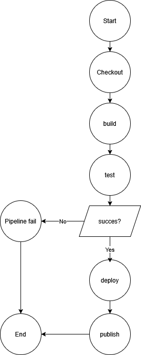
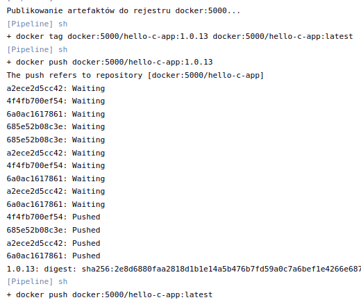

## Sprawozdanie

### Uruchamiany projekt

Do wykonania uruchomienia w pipeline ponownie wykorzystałem aplikacje testową wypisującą Hello znajdująco się już na moim branchu. Jest to program wygenerowany na potrzeby własne więc nie ma problemu z jego obracaniem i nie potrzebuje własnego forka, wykorzystywanie na poprzednich laboratoriach potwierdza że program działa i testy przechodzą.

- [X] Aplikacja została wybrana
- [X] Licencja potwierdza możliwość swobodnego obrotu kodem na potrzeby zadania
- [X] Wybrany program buduje się
- [X] Przechodzą dołączone do niego testy
- [X] Zdecydowano, czy jest potrzebny fork własnej kopii repozytorium

### diagram UML pipeline'u

- [X] Stworzono diagram UML zawierający planowany pomysł na proces CI/CD

### Kontener

W pliku Dockerfile zamieściłem kod wybierający kontener bazowy

FROM gcc:latest
WORKDIR /app
COPY . .
RUN make clean && make
CMD ["./hello"]

### Jenkins

Projekt Pipeline uruchamiał poniższy plik Jenkinsfile

pipeline {
    agent any
    
    environment {
        APP_VERSION = "1.0.${env.BUILD_NUMBER}"
        DOCKER_REGISTRY = "docker:5000"
        IMAGE_NAME = "${DOCKER_REGISTRY}/hello-c-app"
        GIT_COMMIT_SHORT = ""
    }

    stages {
        stage('Checkout') {
            steps {
                checkout scm
                script {
                    env.GIT_COMMIT_SHORT = sh(returnStdout: true, script: 'git rev-parse --short HEAD').trim()
                }
                echo "Budowanie commita: ${env.GIT_COMMIT_SHORT}"
            }
        }

        stage('Build and Test') {
            steps {
                dir('grupa2/MF419850/test_project') {
                    script {
                        echo 'Budowanie obrazu build...'
                        def buildImage = docker.build('hello-build', '.')
                        
                        buildImage.inside {
                            sh 'make clean'
                            sh 'make'
                            sh 'make test'
                        }
                        
                        stash includes: 'hello', name: 'hello-binary'
                    }
                }
            }
            post {
                success { echo 'Build i testy zakończone sukcesem!' }
                failure { echo 'Build lub testy zakończone niepowodzeniem.' }
            }
        }

        stage('Deploy & Smoke Test') {
            steps {
                unstash 'hello-binary'
                
                script {
                    echo "Budowanie lekkiego obrazu deploy (Alpine + hello)..."
                    
                    writeFile file: 'Dockerfile.deploy', text: """FROM alpine:latest
COPY hello /app/hello
RUN chmod +x /app/hello
LABEL maintainer="MF419850"
LABEL git-commit="${env.GIT_COMMIT_SHORT}"
LABEL jenkins-build="${env.BUILD_URL}"
LABEL version="${APP_VERSION}"
CMD ["/app/hello"]"""
                    
                    sh "docker build -f Dockerfile.deploy -t ${IMAGE_NAME}:${APP_VERSION} ."
                    echo "Obraz zbudowany: ${IMAGE_NAME}:${APP_VERSION}"
                    
                    echo "Uruchamianie smoke testu..."
                    sh "docker run --rm ${IMAGE_NAME}:${APP_VERSION} > output.log"
                    
                    def logContent = readFile 'output.log'
                    if (!logContent.contains('Hello')) {
                        error("Smoke test failed! Output: ${logContent}")
                    }
                    echo "Smoke test passed! Output: ${logContent}"
                }
            }
        }

        stage('Publish') {
            steps {
                script {
                    echo "Publikowanie artefaktów do rejestru ${DOCKER_REGISTRY}..."
                    
                    sh "docker tag ${IMAGE_NAME}:${APP_VERSION} ${IMAGE_NAME}:latest"
                    sh "docker push ${IMAGE_NAME}:${APP_VERSION}"
                    sh "docker push ${IMAGE_NAME}:latest"
                    
                    echo "Obraz dostępny w rejestrze:"
                    echo "  ${IMAGE_NAME}:${APP_VERSION}"
                    echo "  ${IMAGE_NAME}:latest"
                    
                    archiveArtifacts artifacts: 'hello', fingerprint: true
                    echo "Plik binarny zarchiwizowany."
                }
            }
        }
    }
    
    post {
        always {
            echo 'Pipeline zakończony.'
            cleanWs()
        }
        success {
            echo "SUKCES! Wersja: ${APP_VERSION}"
        }
        failure {
            echo "BŁĄD! Sprawdź logi powyżej."
        }
    }
}

### Checkout

env.GIT_COMMIT_SHORT = sh(returnStdout: true, script: 'git rev-parse --short HEAD').trim()

Powyższy fragment pobiera SHA commita do późniejszego oznaczenia obrazu.

- [X] Przedstawiono sposób na zidentyfikowanie pochodzenia artefaktu

### Build and Test

def buildImage = docker.build('hello-build', '.')
                        
                        buildImage.inside {
                            sh 'make clean'
                            sh 'make'
                            sh 'make test'
                        }

make i make build wykonują się w kolejnych instach kontenera z tego samego obrazu.

- [X] *Build* został wykonany wewnątrz kontenera
- [X] Testy zostały wykonane wewnątrz kontenera (kolejnego)
- [X] Kontener testowy jest oparty o kontener build

### Deploy & Smoke Test

writeFile file: 'Dockerfile.deploy', text: """FROM alpine:latest
COPY hello /app/hello
RUN chmod +x /app/hello
LABEL maintainer="MF419850"
LABEL git-commit="${env.GIT_COMMIT_SHORT}"
LABEL jenkins-build="${env.BUILD_URL}"
LABEL version="${APP_VERSION}"

Definiowanie kontenera opartego na alpine:latest waży on około 5MB w przeciwieństwie do gcc:latest ważącego blisko 1,2GB.

- [X] Zdefiniowano kontener typu 'deploy' pełniący rolę kontenera, w którym zostanie uruchomiona aplikacja (niekoniecznie docelowo - może być tylko integracyjnie)
- [X] Uzasadniono czy kontener buildowy nadaje się do tej roli/opisano proces stworzenia nowego, specjalnie do tego przeznaczenia

sh "docker build -f Dockerfile.deploy -t ${IMAGE_NAME}:${APP_VERSION} ."
                    
sh "docker run --rm ${IMAGE_NAME}:${APP_VERSION} > output.log"

oraz w publish

sh "docker tag ${IMAGE_NAME}:${APP_VERSION} ${IMAGE_NAME}:latest"
sh "docker push ${IMAGE_NAME}:${APP_VERSION}"
sh "docker push ${IMAGE_NAME}:latest"

- [X] Wersjonowany kontener 'deploy' ze zbudowaną aplikacją jest wdrażany na instancję Dockera

sh "docker run --rm ${IMAGE_NAME}:${APP_VERSION} > output.log"
                    
def logContent = readFile 'output.log'
if (!logContent.contains('Hello')) {
    error("Smoke test failed! Output: ${logContent}")
}
echo "Smoke test passed! Output: ${logContent}"

- [X] Logi z procesu są odkładane jako numerowany artefakt, niekoniecznie jawnie
- [X] Następuje weryfikacja, że aplikacja pracuje poprawnie (*smoke test*) poprzez uruchomienie kontenera 'deploy'

### Publish

z environment

APP_VERSION = "1.0.${env.BUILD_NUMBER}"
DOCKER_REGISTRY = "docker:5000"
IMAGE_NAME = "${DOCKER_REGISTRY}/hello-c-app"

z deploy

sh "docker build -f Dockerfile.deploy -t ${IMAGE_NAME}:${APP_VERSION} ."

oraz

sh "docker tag ${IMAGE_NAME}:${APP_VERSION} ${IMAGE_NAME}:latest"
sh "docker push ${IMAGE_NAME}:${APP_VERSION}"
sh "docker push ${IMAGE_NAME}:latest"

- [X] Zdefiniowano, jaki element ma być publikowany jako artefakt

Jako główny artefakt został wybrany obraz Docker (hello-c-app), ponieważ zapewnia pełną izolację środowiska uruchomieniowego, powtarzalność wdrożeń i zgodność z nowoczesnymi praktykami CI/CD.

- [X] Uzasadniono wybór: kontener z programem, plik binarny, flatpak, archiwum tar.gz, pakiet RPM/DEB

z environment

APP_VERSION = "1.0.${env.BUILD_NUMBER}"

Każdy build otrzymuje unikalny numer wersji 1.0.${BUILD_NUMBER} (np. 1.0.13), który jest automatycznie inkrementowany przez Jenkins. Dodatkowo obraz jest tagowany jako latest, wskazując na najnowszą stabilną wersję aplikacji.

- [X] Opisano proces wersjonowania artefaktu (można użyć *semantic versioning*)

Artefakt został opublikowany do rejestru lokalnego a nie online w celu uproszczenia wykonania.

- [X] Dostępność artefaktu: publikacja do Rejestru online, artefakt załączony jako rezultat builda w Jenkinsie

Zamieszczony kod pomyślnie wykonał się w Jenkinsie.

