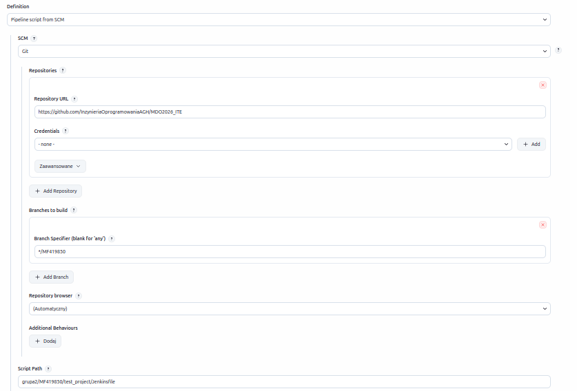
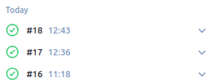
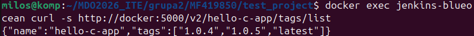

## Sprawozdanie

Celem sprawozdania jest upewnienie się że skonstruowany na poprzednich laboratoriach projekt pipeline spełnia określone wymagania.

### 1.

Przepis pipeline'u już wcześniej był dostarczany z repozytorium git a nie poprzez wklejenie kodu w konfigurację więc:

- [X] Przepis dostarczany z SCM, a nie wklejony w Jenkinsa lub sprawozdanie (co załatwia nam `clone` )

### 2.

Ten fragment z Checkout:

checkout scm
script {
    env.GIT_COMMIT_SHORT = sh(returnStdout: true, script: 'git rev-parse --short HEAD').trim()
}

Gwarantuje że pobierana jest aktualna wersja kodu.

W Post:

always {
    echo 'Pipeline zakończony.'
    cleanWs()
}

Sprzątamy przestrzeń roboczą.

Te operacje gwarantują nam że wykonywany kod jest z wersji aktualnej a nie starszej, zcachowanej.

- [X] Posprzątaliśmy i wiemy, że odbyło się to skutecznie - mamy pewność, że pracujemy na najnowszym (a nie *cache'owanym* kodzie)

### 3.

W Build and Test:

dir('grupa2/MF419850/test_project') {
    script {
        echo 'Budowanie obrazu build...'
        def buildImage = docker.build('hello-build', '.')
                    
        ....
    }
}

Przechodzimy do miejsca w repo gdzie znajdują się pliki programu w tym Dockerfile, który jest następnie wykorzystywany.

- [X] Etap `Build` dysponuje repozytorium i plikami `Dockerfile`

### 4 - 6.

W Build and Test:

def buildImage = docker.build('hello-build', '.')
                
buildImage.inside {
    sh 'make clean'
    sh 'make'
    sh 'make test'
}

stash includes: 'hello', name: 'hello-binary'

Tworzony jest obraz buildowy z Dockerfile z podanego katalogu i bazując na gcc:latest.
Następnie uruchamia kontener z obrazu hello-build.

W kolejnej linii zapamiętywany jest skompilowany artefakt pod nazwą hello-binary.

Wewnątrz kontenera uruchamiane jest 'make test', jeśli test nie przejdzie etap zakończy się niepowodzeniem.

- [X] Etap `Build` tworzy obraz buildowy, np. `BLDR`
- [X] Etap `Build` (krok w tym etapie) lub oddzielny etap (o innej nazwie), przygotowuje artefakt - **jeżeli docelowy kontener ma być odmienny**, tj. nie wywodzimy `Deploy` z obrazu `BLDR`
- [X] Etap `Test` przeprowadza testy

### 7.

W Deploy & Smoke test:

writeFile file: 'Dockerfile.deploy', text: """FROM alpine:latest
COPY hello /app/hello
RUN chmod +x /app/hello
LABEL maintainer="MF419850"
LABEL git-commit="${env.GIT_COMMIT_SHORT}"
LABEL jenkins-build="${env.BUILD_URL}"
LABEL version="${APP_VERSION}"
CMD ["/app/hello"]"""

Buduje obraz i ustawia jego wersję na latest. Daje nam to poprawny obraz wdrożeniowy, który zadziała na dowolnym środowkisku Docker.

- [X] Etap `Deploy` przygotowuje **obraz lub artefakt** pod wdrożenie

### 8.

W Deploy & Smoke test:

sh "docker run --rm ${IMAGE_NAME}:${APP_VERSION} > output.log"
def logContent = readFile 'output.log'
if (!logContent.contains('Hello')) { error(...) }

Kontener jest uruchamiany, a jego wyjście sprawdzane, zatem następuje wdrożenie potwierdzające że obraz działa.

- [X] Etap `Deploy` przeprowadza wdrożenie

### 9.

W Publish:

sh "docker tag ${IMAGE_NAME}:${APP_VERSION} ${IMAGE_NAME}:latest"
sh "docker push ${IMAGE_NAME}:${APP_VERSION}"
sh "docker push ${IMAGE_NAME}:latest"
                    
echo "  ${IMAGE_NAME}:latest"

W kolejnych linijkach obraz jest tagowany i publikowany z  konkretną wersją do rejestru Docker:5000 i ponownie z tagiem latest.
Artefakt w formie pliku binarnego jest zapisywany na serwerze Jenkins.

- [X] Etap `Publish` wysyła obraz docelowy do Rejestru i/lub dodaje artefakt do historii builda

### 10.

Etapy 1 i 2 gwarantują że każde uruchomienie jest na aktualnym kodzie.

 [X] Ponowne uruchomienie naszego *pipeline'u* powinno zapewniać, że pracujemy na najnowszym (a nie *cache'owanym*) kodzie. Innymi słowy, *pipeline* musi zadziałać więcej niż jeden raz 😎

### Zakończenie

Zainstalowaniu klienta dockera w kontenerze jenkins-blueocean oraz dodaniu konfiguracji insecure-registry, dodatkowo musiałem zastąpić docker.image.inside{} bezpośrednimi komendami docker run ze względu na nagle pojawiające się bugi. Wszystkie zmiany Nie wpłynęły na zmianę powyższych wymagań, jednak pozwoliły poprawnie wykonać komendę:

docker exec jenkins-blueocean curl -s http://docker:5000/v2/hello-c-app/tags/list

Która pokazała że obraz został wypchnięty do rejestru.

