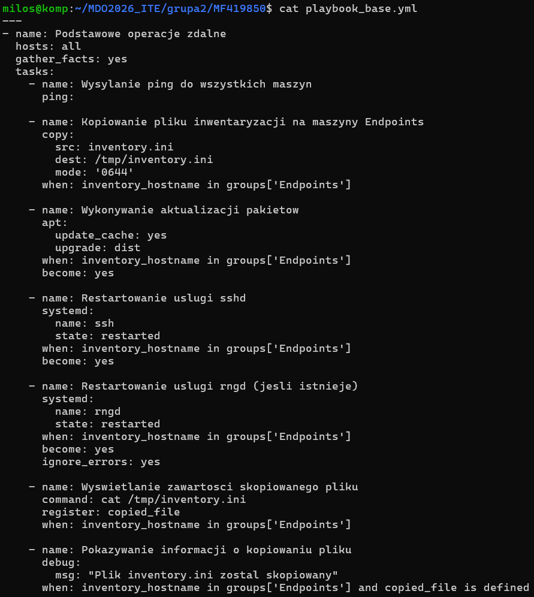
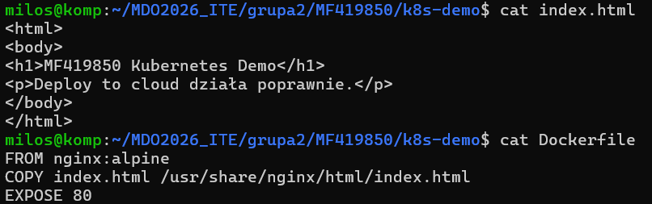
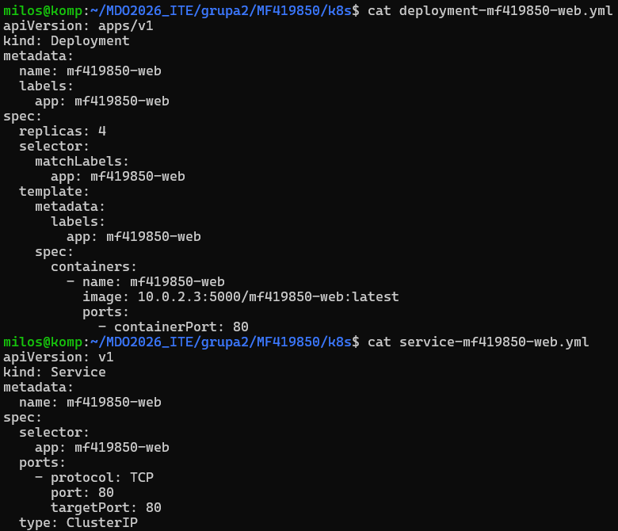
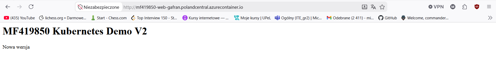

# Sprawozdanie

## lab 8

Ansible jest narzędziem automatyzującym konfigurację i wdrożenie aplikacji. Nie wykorzystuje agentów, tylko łączy się ze zdalnymi systemami przez ssh by wykonywać pliki yaml czyli playbooki.

W ramach ćwiczenia utworzyłem nową maszynę Ubuntu, na której zainstalowałem ansible i połączyłem ją za pomocą ssh z moją maszyną główną.
Następnie utworzyłem i uruchomiłem dwa playbooki, które realizowały podaną listę zadań.

1. 
- Ping do wszyskich maszyn  
- Skopiowanie plików inwentaryzacji na maszyny endpoints  
- Aktualizacja pakietów  
- Restartowanie usługi ssh  
- Wyświetlanie zawartości skopiowanego pliku  
- Pokazanie informacji o kopiowanym pliku  

2. 
- Wyświetlenie informacji o systemie  
- Zaprawdzenie czy docker jest zainstalowany i jego instalacja jeśli nie  
- Dodanie klucza GPG i repozytorium Dockera  
- Instalacja Docker CE
- Uruchomienie i wlaczenie Dockera
- Dodanie użytkownika do grupy docker
- Pobranie obrazu z rejestru lokalnego
- Uruchomienie kontenera
- Pobranie i wyświetlenie logów kontenera
- Weryfikacja działanie aplikacji
- Zatrzymanie i usunięcie kontenera

***- name: Zarzadzanie kontenerem na ansible-target***
  hosts: ansible-target
  become: yes
  vars:
    container_name: "hello-app"
    image_full_name: "10.0.2.3:5000/hello-c-app:latest"

  tasks:
    - name: Sanity check - sprawdzenie systemu
      setup:
      register: system_info

    - name: Wyswietlenie informacji o systemie
      debug:
        msg: "System: {{ ansible_distribution }} {{ ansible_distribution_version }}"

    - name: Sprawdzenie czy Docker jest zainstalowany
      command: docker --version
      register: docker_check
      ignore_errors: yes

    - name: Instalacja Dockera (jesli nie ma)
      block:
        - name: Instalacja pakietow wymaganych
          apt:
            name:
              - ca-certificates
              - curl
            state: present
            update_cache: yes

        - name: Dodanie klucza GPG Dockera
          apt_key:
            url: https://download.docker.com/linux/ubuntu/gpg
            state: present

        - name: Dodanie repozytorium Dockera
          apt_repository:
            repo: "deb [arch=amd64] https://download.docker.com/linux/ubuntu {{ ansible_distribution_release }} stable"
            state: present

        - name: Instalacja Docker CE
          apt:
            name:
              - docker-ce
              - docker-ce-cli
              - containerd.io
            state: present

        - name: Uruchomienie i wlaczenie Dockera
          systemd:
            name: docker
            state: started
            enabled: yes

        - name: Dodanie uzytkownika do grupy docker
          user:
            name: ansible
            groups: docker
            append: yes
      when: docker_check is failed

    - name: Pobranie obrazu z rejestru lokalnego
      docker_image:
        name: "{{ image_full_name }}"
        source: pull
      register: pull_result

    - name: Uruchomienie kontenera
      docker_container:
        name: "{{ container_name }}"
        image: "{{ image_full_name }}"
        state: started
        detach: yes

    - name: Pobranie logow kontenera
      command: docker logs --tail 20 {{ container_name }}
      register: container_logs

    - name: Wyswietlenie logow
      debug:
        msg: "{{ container_logs.stdout_lines }}"

    - name: Weryfikacja dzialania aplikacji
      assert:
        that:
          - "'Hello' in container_logs.stdout"
        fail_msg: "Aplikacja nie wypisala 'Hello'"

    - name: Zatrzymanie i usuniecie kontenera
      docker_container:
        name: "{{ container_name }}"
        state: absent

    - name: Informacja koncowa
      debug:
        msg: "Wdrozenie zakonczone - kontener zostal uruchomiony, przetestowany i usuniety"

Utworzyłem rolę czyli schemat pozwalący na stworzenie uporządkowanej struktóry dla playbooka. Ponownie uruchomiłem drugi z zestawów poleceń.

## lab 9

Fedora jest darmową open-sourceową dystrybucją systemu operacyjnego linux. Do jej instalacji można wykorzystać kickstarter czyli mechanizm automatycznej instalacji, pozwalący na utworzenie pliku z ustawieniami instalacji, dzięki czemu użytkownik nie przechodzi przez instalację ręczną.

W ramach laboratorium utworzyłem plik kickstarter ks.cfg zawierający konfigurację języka, klawiatury, strefy czasowej, użytkowników, sieci, partycjonowania oraz listy pakietów.
Następnie podczas setupu fedory na przeznaczonej do tego maszynie wskazałem adres pliku kickstart, która go wykonała realizując instalację automatyczną.

***# Fedora 44 unattended install***

*text*   
***eula --agreed***  
firstboot --disable  

lang en_US.UTF-8  
keyboard us  
timezone Europe/Warsaw --utc  

rootpw --plaintext root  
user --name=milos --password=milos --plaintext --groups=wheel  

network --bootproto=dhcp --device=link --activate --hostname=fedora-auto  

url --mirrorlist=https://mirrors.fedoraproject.org/mirrorlist?repo=fedora-44&arch=x86_64  
repo --name=updates --mirrorlist=https://mirrors.fedoraproject.org/mirrorlist?repo=updates-released-f44&arch=x86_64  

bootloader --location=mbr --append="rhgb quiet"  

zerombr  
clearpart --all --initlabel  
autopart --type=lvm  

firewall --enabled --service=ssh  
selinux --permissive  

reboot  

%packages  
@^server-product-environment  
curl  
wget  
git  
dnf-plugins-core  
%end  

%post --log=/root/ks-post.log  

dnf -y install dnf-plugins-core  
 
dnf config-manager --add-repo https://download.docker.com/linux/fedora/docker-ce.repo  

dnf -y install docker-ce docker-ce-cli containerd.io  

mkdir -p /etc/docker  

cat > /etc/docker/daemon.json <<'EOF'  
{  
  "insecure-registries": ["10.0.2.3:5000"]  
}  
EOF  

cat > /etc/systemd/system/hello-c-app.service <<'EOF'  
[Unit]  
Description=Run hello-c-app container once after boot  
After=docker.service network-online.target  
Wants=network-online.target  
Requires=docker.service  

[Service]  
Type=oneshot  
RemainAfterExit=yes  
ExecStartPre=-/usr/bin/docker rm -f hello-c-app  
ExecStart=/usr/bin/docker run --name hello-c-app 10.0.2.3:5000/hello-c-app:latest  

[Install]  
WantedBy=multi-user.target  
EOF  

systemctl enable docker  
systemctl enable hello-c-app.service  

%end  

Następnie pobrałem obraz wcześniej przygotowanej aplikacji i uruchomiłem kontener.

## lab 10 i 11

Kubernetes, to system open source do automatyzacji wdrażania, skalowania i zarządzania aplikacjami kontenerowymi.
Minikube to narzędzie pozwalące na lokalną instalację klastra Kubernetes.

W trakcie ćwiczeń pobrałem minikube i uruchomiłem klaster kubernetes. Następnie przygotowałem aplikację, którą wypchnąłem do rejestru docker oraz przygotowałem deployment i service.
Po jej wdrożeniu mogłem ją uruchomić poprzez witrynę kubernetes.

Drugie z laboratoriów polegało na testowanie zarządzania i działania aplikacji poprzez:
- Zmianę ilości replik wdrożenia z 4 na kolejno 8, 1 i 0
- Aktualizację wersji aplikacji
- Wdrożenie błędnego obrazu i sprawdzenie rezultatu.
- Porównanie strategii
    - Recreate - strategia najpierw usuwała stare pody i dopiero potem otwierała nowe
    - Rolling Update - nowe pody tworzone równolegle z usuwaniem starych.
    - Canary - Dodanie nowego podu działającego równolegle z głównym wdrożeniem.
- Uruchomienie skryptu rollout status potwierdzającego działanie wdrożenia i wykonanie w czasie poniżej minuty.

## lab 12

Azure to platforma chmurowa do tworzenia, wdrażania i zarządzania aplikacjami.

Laboratorium polegało na setupie Azure, utworzeniu grupy zasobów i instancji kontenera oraz wdrożeniu swojej aplikacji.\

Wykonanie laboratorium doprowadziło do utworzenia działającej witryny internetowej:

Jednak po zakończeniu usunąłem zasoby co doprowadziło do zatrzymania jej działania.

