## Sprawozdanie

### Setup

Utworzyłem nową maszynę wirtualną z systemem Ubuntu 24.04, takim samym jak domyślna maszyna. Nadałem jej nowy dysk aby nie posiadała zbędnego oprogramowania, utworzyłem migawkę.

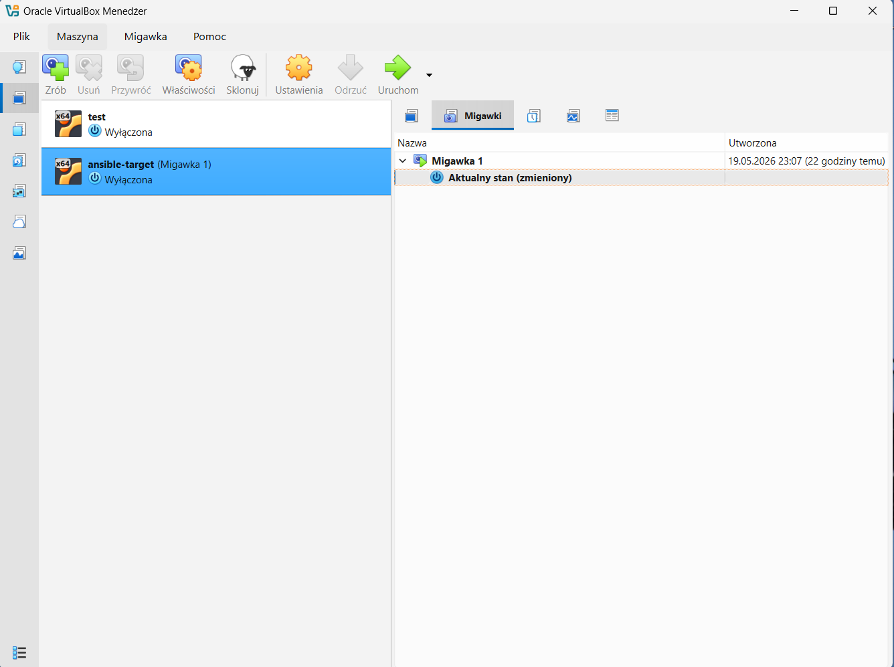

Dodałem klucz ssh do maszyny ansible i umożliwiłem logowanie za jego pomocą pozbywając się konieczności podawania hasła.

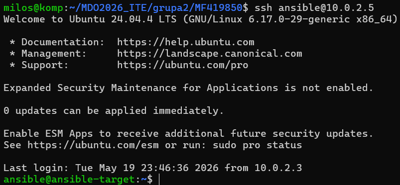

Dodałem plik inventory.ini 

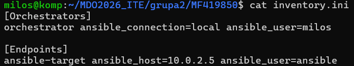

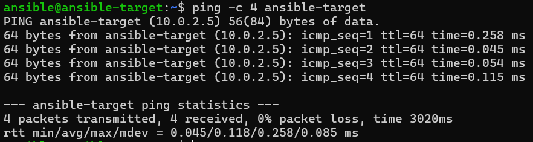

### Wykonywanie procedur

Utworzyłem plik playbook_base.yml o następującej treści

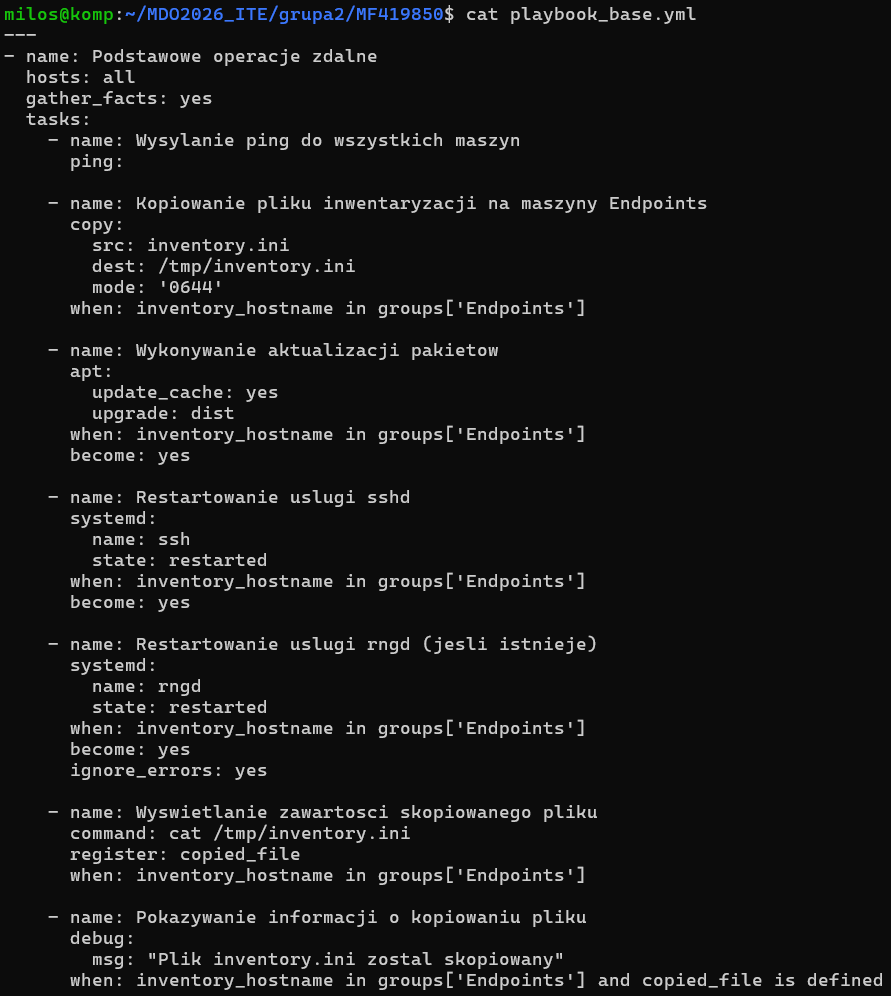

Uruchomiłem playbook z wyłączoym ssh na maszyie ansible:

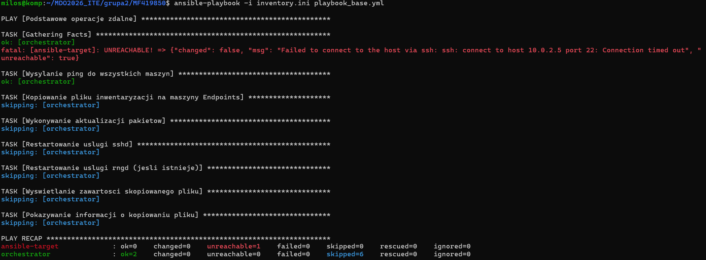

Następnie ponownie z włączonym:

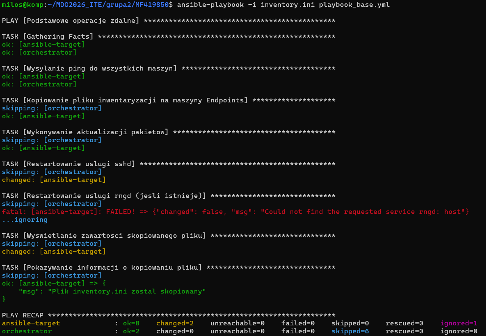

Restartowanie usługi rngd nie zadziałało ponieważ nie została ona aktywowana.

### Praca z artefaktem

Dodałem plik playbook_deploy.yml o treści:

---
***- name: Zarzadzanie kontenerem na ansible-target***
  hosts: ansible-target
  become: yes
  vars:
    container_name: "hello-app"
    image_full_name: "10.0.2.3:5000/hello-c-app:latest"

  tasks:
    - name: Sanity check - sprawdzenie systemu
      setup:
      register: system_info

    - name: Wyswietlenie informacji o systemie
      debug:
        msg: "System: {{ ansible_distribution }} {{ ansible_distribution_version }}"

    - name: Sprawdzenie czy Docker jest zainstalowany
      command: docker --version
      register: docker_check
      ignore_errors: yes

    - name: Instalacja Dockera (jesli nie ma)
      block:
        - name: Instalacja pakietow wymaganych
          apt:
            name:
              - ca-certificates
              - curl
            state: present
            update_cache: yes

        - name: Dodanie klucza GPG Dockera
          apt_key:
            url: https://download.docker.com/linux/ubuntu/gpg
            state: present

        - name: Dodanie repozytorium Dockera
          apt_repository:
            repo: "deb [arch=amd64] https://download.docker.com/linux/ubuntu {{ ansible_distribution_release }} stable"
            state: present

        - name: Instalacja Docker CE
          apt:
            name:
              - docker-ce
              - docker-ce-cli
              - containerd.io
            state: present

        - name: Uruchomienie i wlaczenie Dockera
          systemd:
            name: docker
            state: started
            enabled: yes

        - name: Dodanie uzytkownika do grupy docker
          user:
            name: ansible
            groups: docker
            append: yes
      when: docker_check is failed

    - name: Pobranie obrazu z rejestru lokalnego
      docker_image:
        name: "{{ image_full_name }}"
        source: pull
      register: pull_result

    - name: Uruchomienie kontenera
      docker_container:
        name: "{{ container_name }}"
        image: "{{ image_full_name }}"
        state: started
        detach: yes

    - name: Pobranie logow kontenera
      command: docker logs --tail 20 {{ container_name }}
      register: container_logs

    - name: Wyswietlenie logow
      debug:
        msg: "{{ container_logs.stdout_lines }}"

    - name: Weryfikacja dzialania aplikacji
      assert:
        that:
          - "'Hello' in container_logs.stdout"
        fail_msg: "Aplikacja nie wypisala 'Hello'"

    - name: Zatrzymanie i usuniecie kontenera
      docker_container:
        name: "{{ container_name }}"
        state: absent

    - name: Informacja koncowa
      debug:
        msg: "Wdrozenie zakonczone - kontener zostal uruchomiony, przetestowany i usuniety"
    

Rezultat uruchomienia:

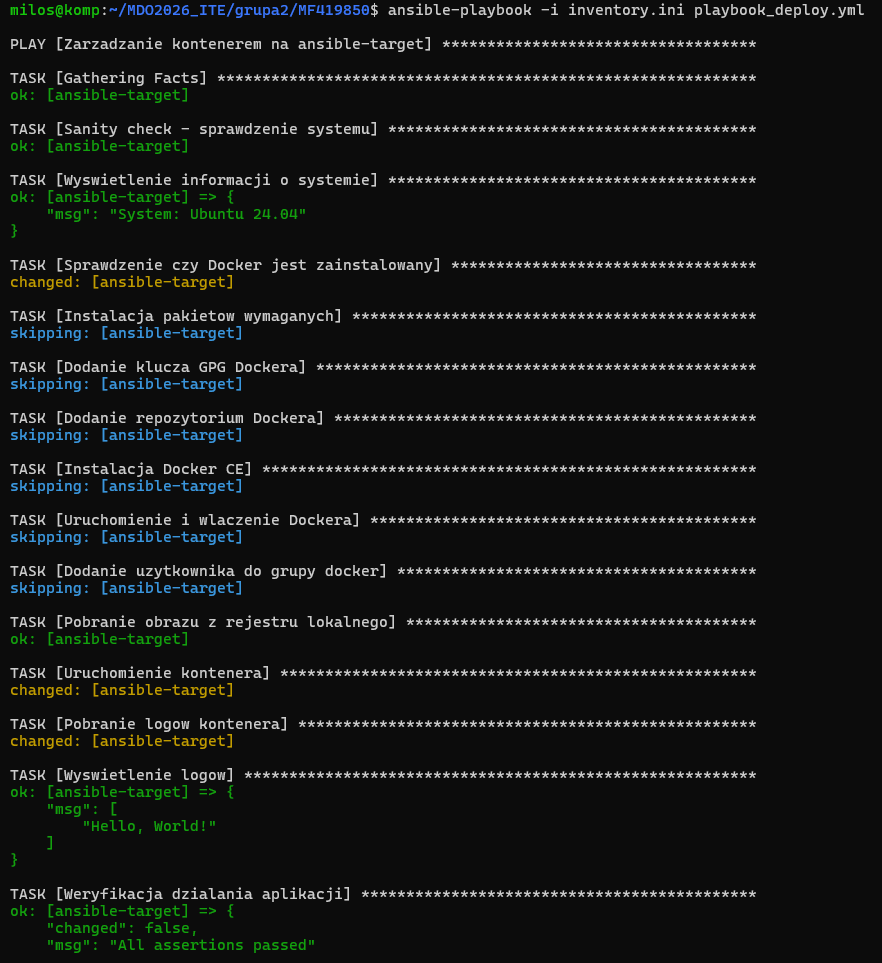

Jak widać obecność artefaktu została potwierdzona

### Dodanie roli

Uzywając ansible role init utworzyłem odpowiednie pliki:

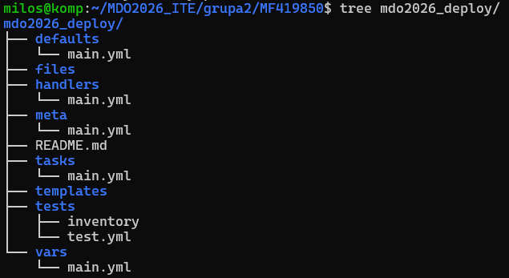

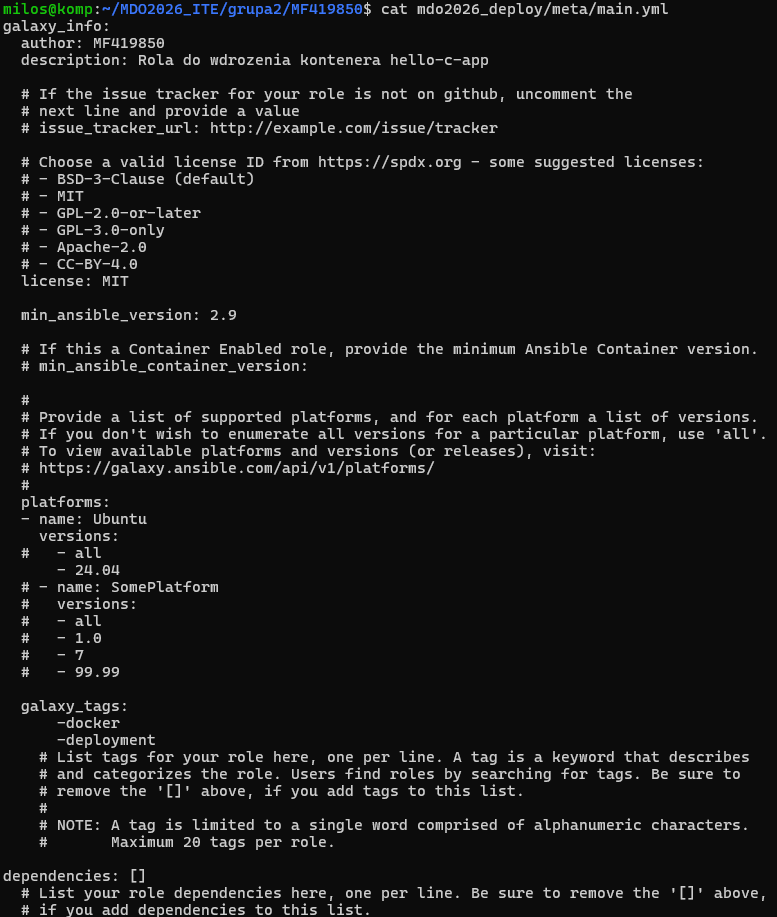

Uruchomienie z rolą:

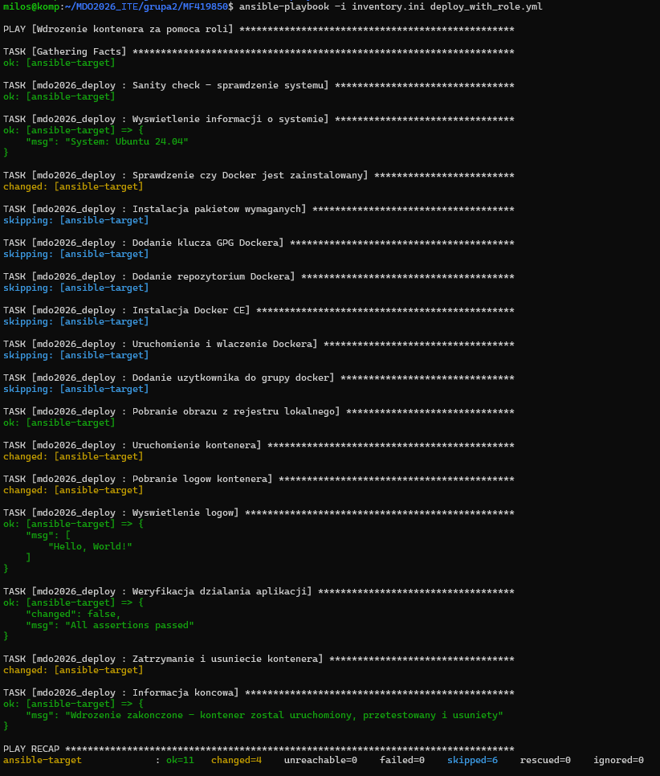