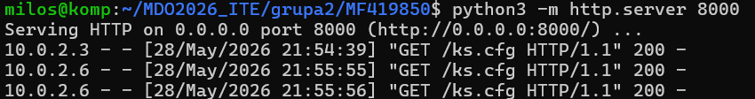
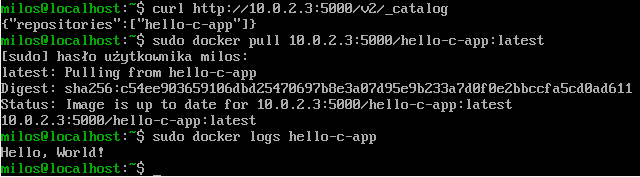

## Sprawozdanie

### Cel zadania

Celem zadania było przygotowanie instalacji nienadzorowanej systemu Fedora Server z wykorzystaniem pliku odpowiedzi Kickstart oraz automatyczne uruchomienie aplikacji dostarczonej w postaci kontenera Docker po pierwszym uruchomieniu systemu.

### Maszyna

#### Utworzyłem nową maszynę wirtualną z obrazem Fedora-Server-dvd-x86_64-44-1.7.iso.

### Instalacja systemu

#### Na głównej maszynie przygotował plik kickstarter ks.cfg:

***# Fedora 44 unattended install***

*text*   
***eula --agreed***  
firstboot --disable  

lang en_US.UTF-8  
keyboard us  
timezone Europe/Warsaw --utc  

rootpw --plaintext root  
user --name=milos --password=milos --plaintext --groups=wheel  

network --bootproto=dhcp --device=link --activate --hostname=fedora-auto  

url --mirrorlist=https://mirrors.fedoraproject.org/mirrorlist?repo=fedora-44&arch=x86_64  
repo --name=updates --mirrorlist=https://mirrors.fedoraproject.org/mirrorlist?repo=updates-released-f44&arch=x86_64  

bootloader --location=mbr --append="rhgb quiet"  

zerombr  
clearpart --all --initlabel  
autopart --type=lvm  

firewall --enabled --service=ssh  
selinux --permissive  

reboot  

%packages  
@^server-product-environment  
curl  
wget  
git  
dnf-plugins-core  
%end  

%post --log=/root/ks-post.log  

dnf -y install dnf-plugins-core  
 
dnf config-manager --add-repo https://download.docker.com/linux/fedora/docker-ce.repo  

dnf -y install docker-ce docker-ce-cli containerd.io  

mkdir -p /etc/docker  

cat > /etc/docker/daemon.json <<'EOF'  
{  
  "insecure-registries": ["10.0.2.3:5000"]  
}  
EOF  

cat > /etc/systemd/system/hello-c-app.service <<'EOF'  
[Unit]  
Description=Run hello-c-app container once after boot  
After=docker.service network-online.target  
Wants=network-online.target  
Requires=docker.service  

[Service]  
Type=oneshot  
RemainAfterExit=yes  
ExecStartPre=-/usr/bin/docker rm -f hello-c-app  
ExecStart=/usr/bin/docker run --name hello-c-app 10.0.2.3:5000/hello-c-app:latest  

[Install]  
WantedBy=multi-user.target  
EOF  

systemctl enable docker  
systemctl enable hello-c-app.service  

%end  

#### ----------------------------------------

Następnie udostępniłem go za pomocą:  

python3 -m http.server 8000

Gdzie był dostępny pod adresem:

http://10.0.2.3:8000/ks.cfg

Podczas startu instalatora Fedora zmodyfikowałem wpis GRUB dodając:

inst.ks=http://10.0.2.3:8000/ks.cfg

Instalator pobrał plik Kickstart z serwera HTTP i rozpoczął automatyczną konfigurację.

Niestety sekcja %post nie wykonała się poprawnie, Po instalacji brakowało:

docker
docker.service
hello-c-app.service

Więc doinstalowałem je ręcznie wewnątrz maszyny fedora.

### Konfiguracja

Utworzyłem plik:

/etc/docker/daemon.json

o zawartości:

{
  "insecure-registries": ["10.0.2.3:5000"]
}

### Rezultat

Po pobraniu obrazu i uruchomieniu kontenera:

