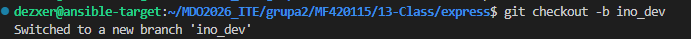
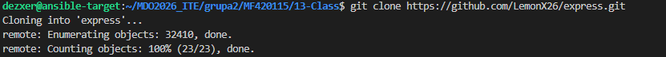
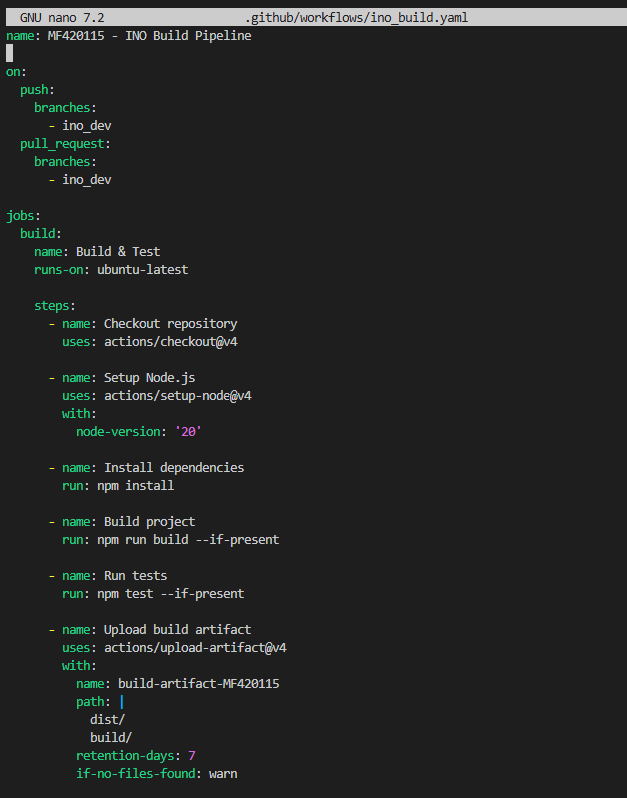
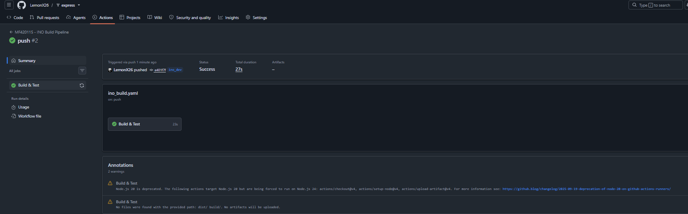

Autor: Maciej Fraś 

Data: 20 Czerwca 2026 r.

Środowisko: Ubuntu 24.04.4 LTS (Virtual Machine / Hyper-V), Visual Studio Code (VSC)

1. Cel zajęć
Wdrożenie koncepcji Shift-left w cyklu wytwórczym oprogramowania. 

2. Przygotowanie repozytorium i środowiska pracy
Zforkowanie repozytorium frameworka Express, utworzenie osobnej galezi ino_dev.Nastepnie zainicjializowano wymagana strukture ppod Github Actions.

3. Konfiguracja potoku CI 
Wewnątrz katalogu utworzono plik konfiguracyjny. Został skonfigurowany z dedykowanym triggerem, który reaguje wyłącznie na zmiany wypychane (Push/Pull) na gałąź ino_dev.

Skrypt realizuje:
- pobranie kodu, 
- inicjalizację środowiska Node.js
- instalację pakietów
- buudowę kodu oraz uruchomienie testów jednostkowych

4. Weryfikacja działania w GitHub Actions
Po zapisaniu konfiguracji wykonano polecenie git push origin ino_dev.Główny proces "Build & Test" zakończył się pełnym sukcesem 

5. Wnioski końcowe
GitHub Actions pozwala natychmiastowe uruchomienie kontroli jakości kodu na wczesnym etapie, co jest kwintesencją podejścia Shift-left.
