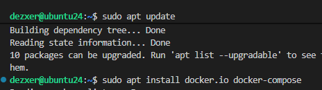
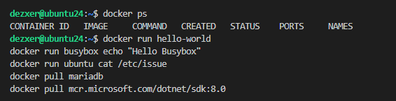
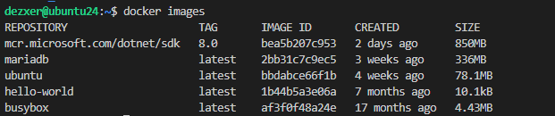
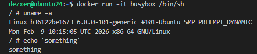
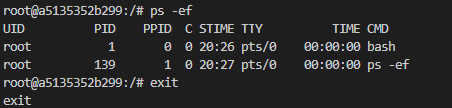
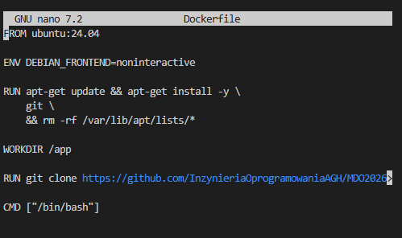
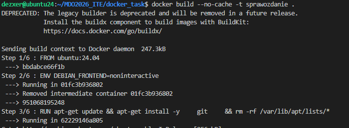
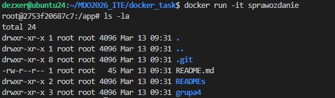
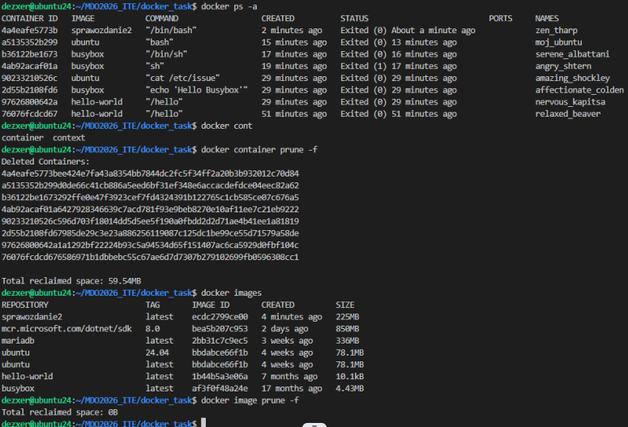

# Sprawozdanie: Docker i Konteneryzacja
Autor: Maciej Fraś 

Data: 13 marca 2026 r.

Środowisko: Ubuntu 24.04.4 LTS (Virtual Machine / Hyper-V), Visual Studio Code (VSC)
1. Cel zajęć
Celem zajęć jest zestawienie środowiska skonteneryzowanego do pracy nad CI i potwierdzenie łączności/możliwośi utrzymywania kodu w repozytorium GitHub

2. Instalacja i konfiguracja środowiska
Zgodnie z zaleceniami, zainstalowano pakiet docker.io

![[Dodanie użytkownika do grupy docker]](Screenshots/helloworld_docker.png)

3. Eksploracja obrazów Docker Hub

4. Interaktywny busybox

5. Izolacja procesów (PID 1)

6. Własny obraz (Dockerfile)

7. Czyszczenie

