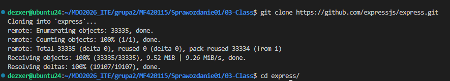
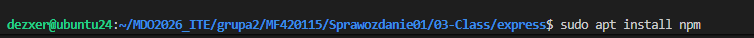
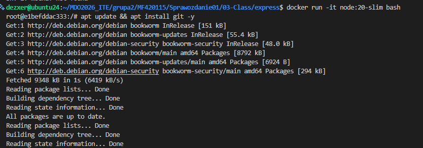
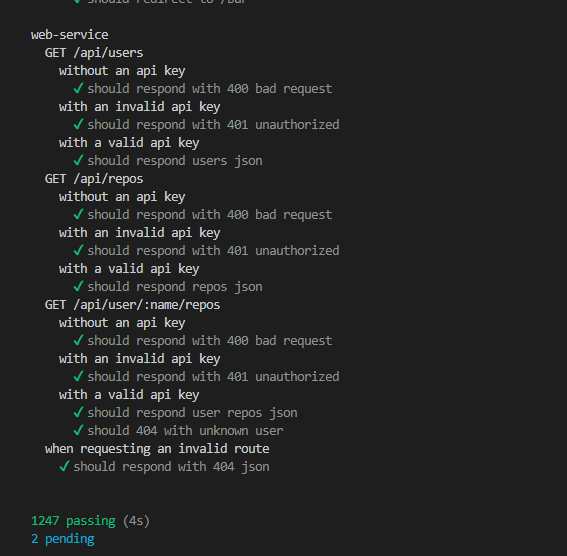
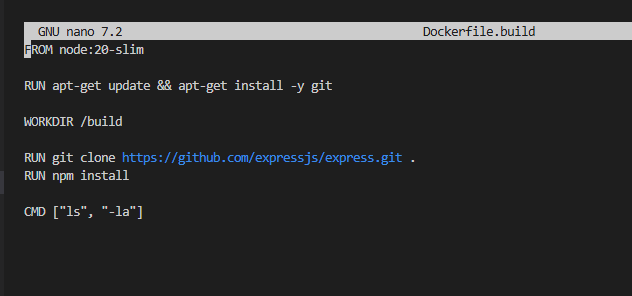
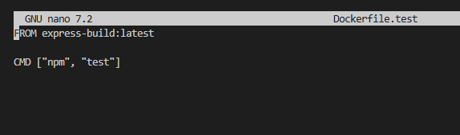
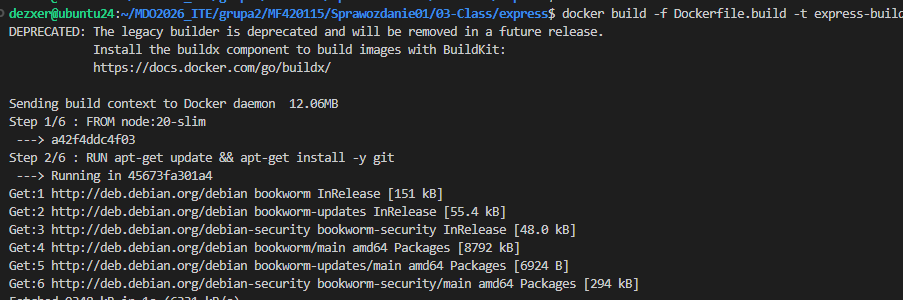
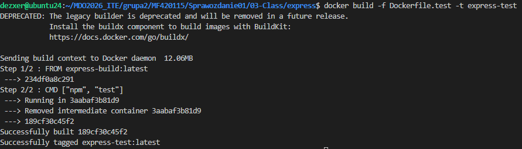
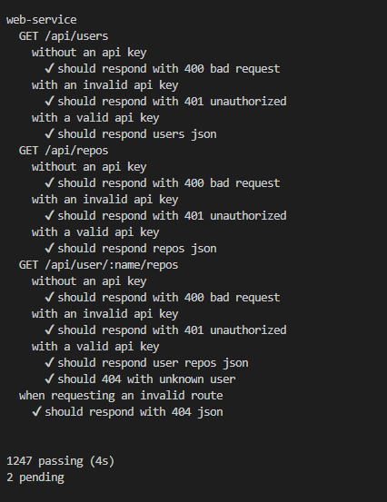
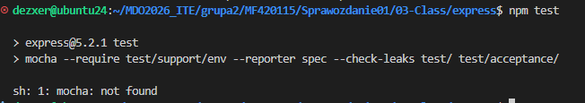

# Sprawozdanie: Dockerfiles, kontener jako definicja etapu
Autor: Maciej Fraś 

Data: 20 marca 2026 r.

Środowisko: Ubuntu 24.04.4 LTS (Virtual Machine / Hyper-V), Visual Studio Code (VSC)

1. Cel zajęć
Celem zajęć jest zbudowanie oprogramowania w powtarzalnym środowisku CI tak, aby proces był przenośny między ustrojami.

2. Wybór oprogramowania i test

3. Izolacja i budowanie interaktywne

4. Tworzenie plików Dockerfile

5. Weryfikacja i uruchomienie

6. Wnioski i analiza
W kontenerze testowym pracuje proces npm test  Jest to proces krótkotrwały, który kończy życie kontenera po zwróceniu raportu. Użycie Dockera sprawia, że proces budowania jest niezależny od konfiguracji systemu. Wyeliminowano błędy typu mocha: not found, które występowały przy próbie uruchomienia testów bezpośrednio na maszynie bez  konfiguracji środowiska.

