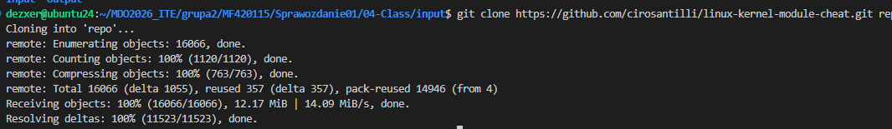
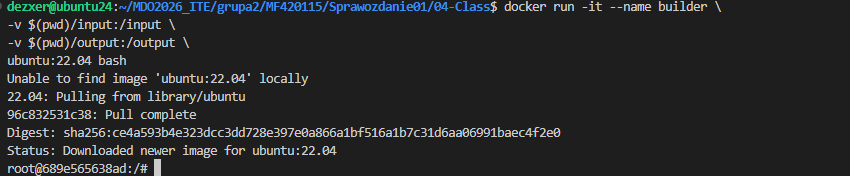
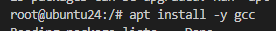
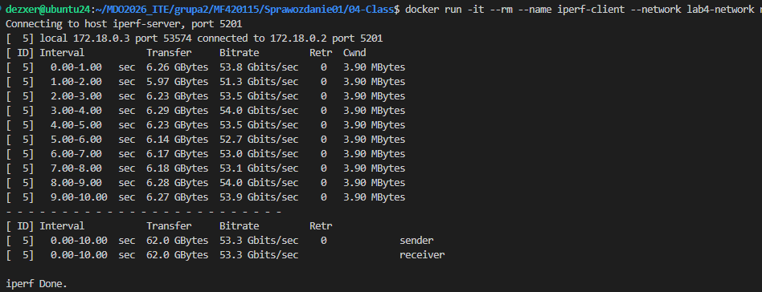
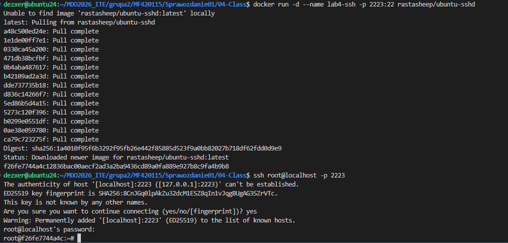
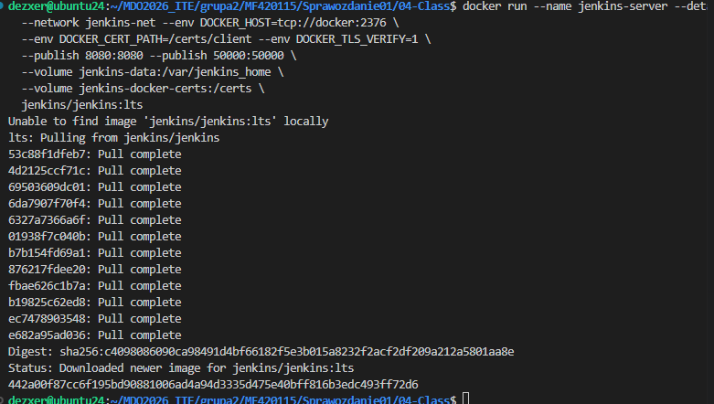
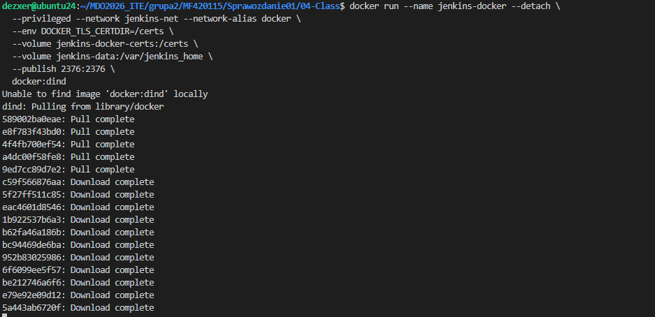

# Sprawozdanie: Dodatkowa terminologia w konteneryzacji, instancja Jenkins
Autor: Maciej Fraś 

Data: 27 marca 2026 r.

Środowisko: Ubuntu 24.04.4 LTS (Virtual Machine / Hyper-V), Visual Studio Code (VSC)

1. Cel zajęć
Celem zajęć jest uruchomienie instancji Jenkins w środowisku skonteneryzowanym. Potrzebna jest do tego dodatkowa wiedza dotycząca kontenerów.

2. Pobranie repo i build w kontenerze

3. Łączność między kontenerami - IPerf3

4. Usługa SSH w kontenerze

5. Instalacja serwera Jenkins 

6. Weryfikacja

7. Podsumowanie i wnioski
Konteneryzacja pozwoliła na pełną izolację środowiska budowania od systemu operacyjnego hosta.