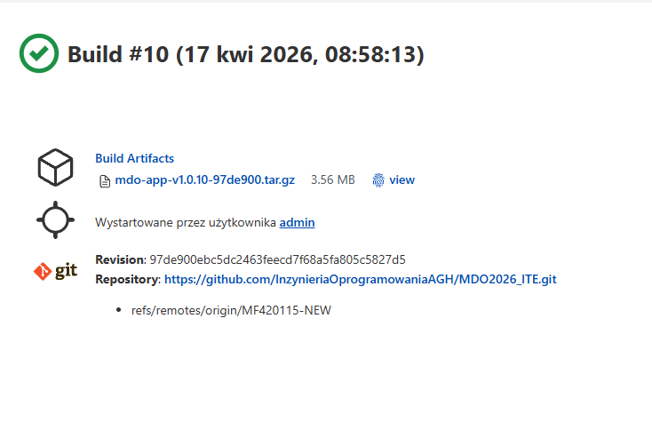

# Sprawozdanie: Pipeline: lista kontrolna
Autor: Maciej Fraś 

Data: 17 kwietnia 2026 r.

Środowisko: Ubuntu 24.04.4 LTS (Virtual Machine / Hyper-V), Visual Studio Code (VSC)

1. Cel zajęć
Celem zajęć było scharakteryzowanie planu na pipeline i przedstawieni postępu prac.
2. Modyfikacja Dockerfile 
Etap: Builder Budowa i testowanie 

Etap: Deploy Tworzenie gotowego produktu 

3. Charakterystyka Pipeline
Zrealizowano pełną ścieżkę krytyczną automatyzacji dla aplikacji libcalc:

Clone: Pobieranie kodu z repozytorium GitHub (branch MF420115-NEW).

Build & Test: Wykorzystanie Multi-stage build w celu optymalizacji rozmiaru obrazu i bezpieczeństwa.

Deploy: Uruchomienie docelowego kontenera i weryfikacja poprawności działania aplikacji.

Publish: Generowanie wersjonowanego artefaktu w formacie .tar.gz orazz archiwziacja w Jenkinsie.

Aplikacja: Wybrano program kalkulatora w C++ (libcalc).

Konteneryzacja: Zastosowano obraz bazowy alpine:latest ze względu na minimalny rozmiar.

Izolacja: Etap budowania (kompilator g++) jest oddzielony od etapu uruchomieniowego dzięki technice Multi-stage.

Artefakt: Wybrano archiwum obrazu Docker, ponieważ pozwala na natychmiastowe uruchomienie aplikacji w dowolnym środowisku z zainstalowanym Dockerem.

