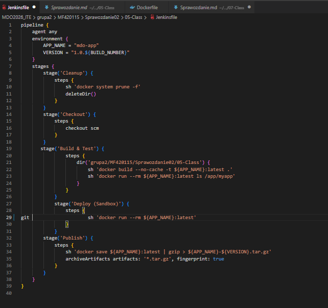
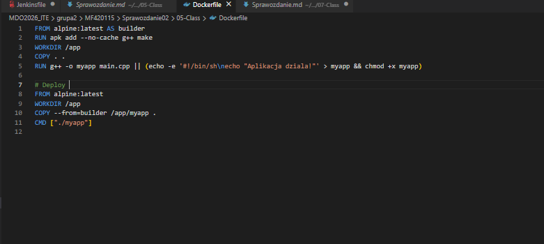
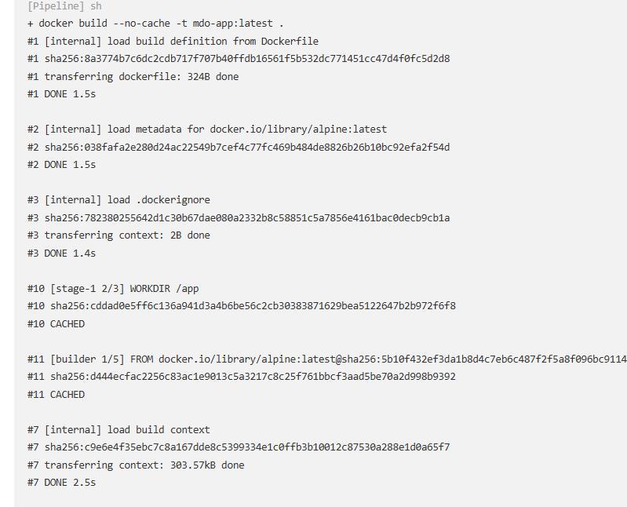
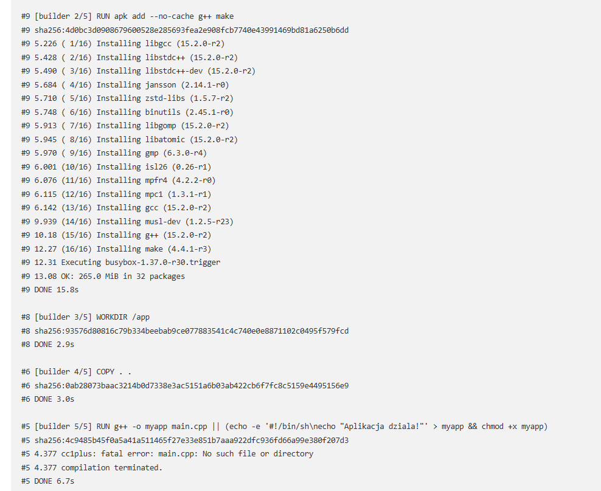
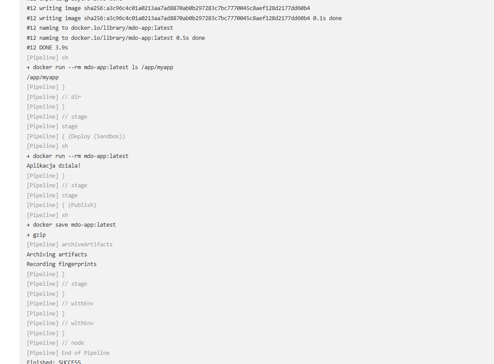

# Sprawozdanie: Pipeline: lista kontrolna
Autor: Maciej Fraś 

Data: 24 kwietnia 2026 r.

Środowisko: Ubuntu 24.04.4 LTS (Virtual Machine / Hyper-V), Visual Studio Code (VSC)

1. Cel zajęć
Celem zajęć jest przeniesienie definicji procesu CI/CD do repozytoriumm w formie pliku Jenkinsfile.

2. Weryfikacja Jenkinsfile (SCM)
Zadanie 1: Przepis dostarczany z SCM
Zrezygnowano z ręcznego wklejania skryptu w ustawieniach Jenkinsa na rzecz opcji Pipeline script from SCM. Jenkins automatycznie pobiera plik Jenkinsfile z repozytorium GitHub przy każdym uruchomieniu, co zapewnia wersjonowanie samej procedury budowania.

3. Multi-stage Build i Artefakty
Zaimplementowano wieloetapowy plik Dockerfile. Pierwszy etap (builder) kompiluje aplikację, a drugi (deploy) tworzy minimalny obraz produkcyjny. 

4. Weryfikacja kroków Jenkinsa

