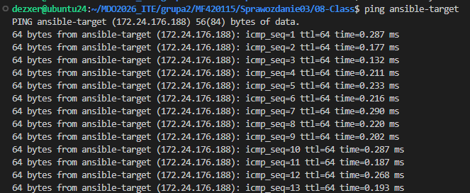
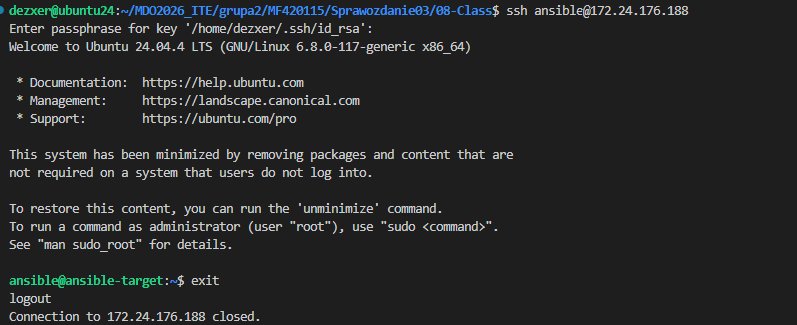
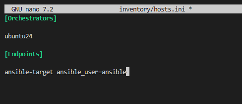
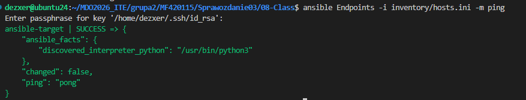
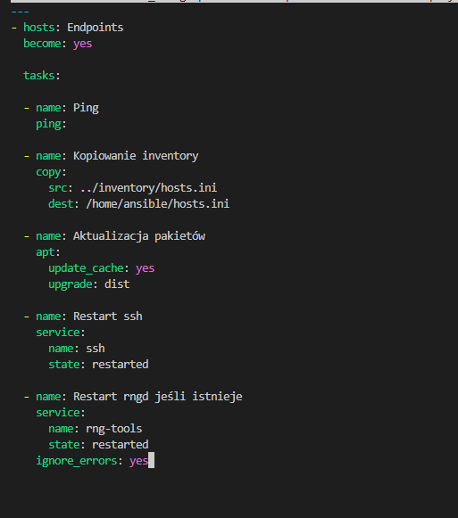
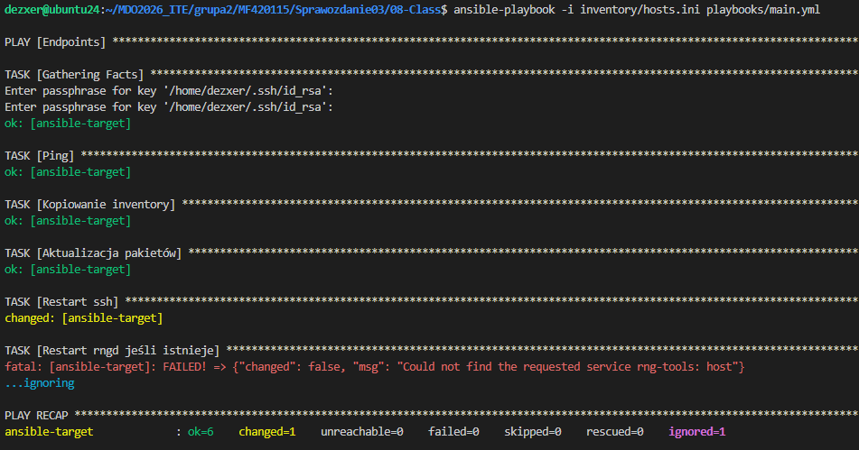
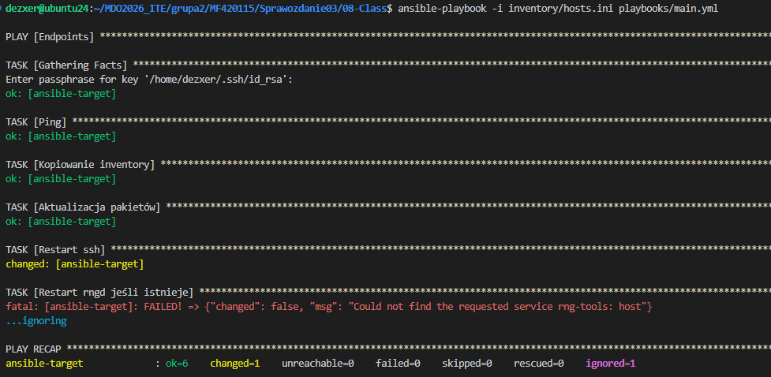
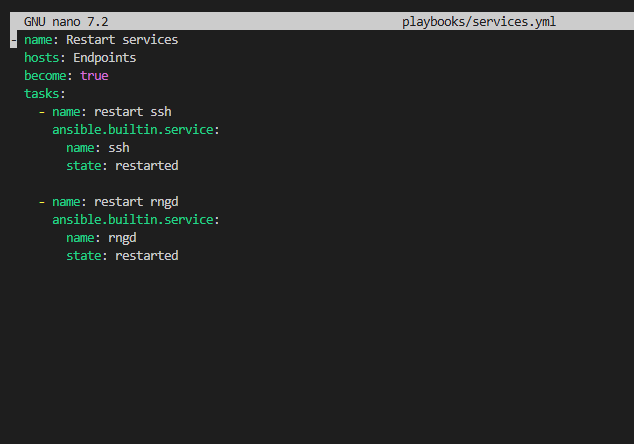
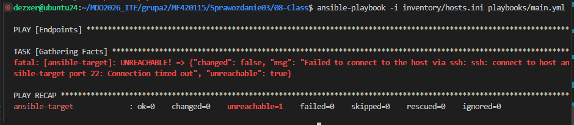

# Sprawozdanie: Pipeline: lista kontrolna
Autor: Maciej Fraś 

Data: 11 maja 2026 r.

Środowisko: Ubuntu 24.04.4 LTS (Virtual Machine / Hyper-V), Visual Studio Code (VSC)

*1. Cel zajęć*
Celem zajęć była automatyzacja i zdalne wykonywanie poleceń za pomocą Ansible.

*2. Przygotowanie środowiska i Inwentaryzacja*
W celu realizacji zadań laboratoryjnych skonfigurowano komunikację sieciową pomiędzy maszyną główną, a nowym systemem docelowym. 

Sprawdzenie poprawnego mapowania nazw DNS oraz routingu sieciowego za pomocą standardowego polecenia ping.

Test wykazuje pełną łączność sieciową. Nazwa hosta jest prawidłowo rozwiązywana na adres IP 172.24.176.188.

Połączenie SSH z maszyną końcową przebiega pomyślnie. Pootwierdza to logowanie użytkownika ansible na systemie ansible-target.

Zgodnie z wymaganiami, struktura infrastruktury została opisana w dedykowanym pliku inwentarza z podziałem na wymagane sekcje. Plik definiuje dwie grupy maszyn: Orchestrators (ubuntu24) oraz Endpoints (ansible-target).

 Ansible pomyślnie nawiązał bezpieczną sesję z maszyną końcową. Status SUCCESS  oznaczają mozliwosc wykonywania playbooków.

*3. Zdalne wywoływanie procedur i testy odporności*
Tworzenie playbooka administracyjnego (playbooks/main.yml)
Przygotowano zestaw zadań (w płeni zestrukturyzowanych) realizujących podstawowe operacje utrzymaniowe na serwerach docelowych.

Playbook realizuje 
-test modułu ping
-przesłanie kopii bezpieczeństwa inwentarza
-aktualizację repozytoriów apt
-oraz restarty usług ssh i rng z uwzględnieniem ignorowania błędów.

Zadania zakończyły się sukcesem. Usługa rng-tools zgodnie z przewidywaniami nie została odnaleziona na systemie minimalistycznym, jednak parametr ignore_errors: yes pozwolił na pomyślne dokończenie playbooka (failed=0).

Ponowne wywołanie nic nie zmieniło ponieważ ansible jest idempotentny, tzn. bierze pod uwagę aktualny stan faktyczny i w przypadku gdyu nie jest konieczne przeprowadzenie danej operacji to jej nie przeprowadza.

Symulacja warunków awaryjnych 
Zgodnie z wytycznymi, na maszynie docelowej wstrzymano działanie serwera SSH wraz z jego gniazdami aktywującymi w systemd, aby sprawdzić zachowanie orkiestratora.

Usługa SSH nie zostanie wzbudzona przy próbie nawiązania połączenia sieciowego. Ponowne uruchomienie playbooka w tym stanie skutkuje natychmiastowym przerwaniem potoku ze statusem błędu UNREACHABLE, co jest efektem poprawnego zabezpieczenia automatyzacji.

*4. Zarządzanie stworzonym artefaktem i wdrożenie roli*
Do realizacji wdrożenia skonteneryzowanego artefaktu użyto szkieletowania ansible-galaxy role init deploy_app. Kroki obejmowały sanity check dostępnej pamięci RAM, instalację pakietu docker.io, transfer zbudowanej paczki .tar.gz z poprzednich zajęć, załadowanie obrazu oraz jego uruchomienie.

Wywołanie głównego playbooka sterującego rolą wdrożeniową. PLAY RECAP wskazuje stan failed=0, co oznacza pomyślne przejście wszystkich zasobów, instalację silnika Docker oraz prawidłowe uruchomienie kontenera aplikacji na porcie produkcyjnym.

Weryfikacja działania kontenera na maszynie docelowej

Potwierdzenie faktycznego statusu uruchomionego procesu bezpośrednio w środowisku runtime na hoście końcowym. Polecenie mapuje aktywne kontenery. 

Wedle dobrych praktyk, czyszczenia środowiska po przeprowadzonych testach wdrożeniowych, kontener został usunięty z systemu docelowego.

*5. Wnioski*
Zastosowanie systemu Ansible pozwoliło w pełni uniezależnić proces wdrożeniowy od konfiguracji sprzętowej maszyn końcowych. Mechanizmy takie jak deklaratywne role ansible-galaxy, testy łączności ping oraz instrukcje sprawdzające assert pozwalają na bezpieczną orkiestrację procesów Deploymentu w potokach CI/CD, gwarantując przewidywalność zachowania środowiska w przypadku awarii sieciowych lub braku zasobów sprzętowych.