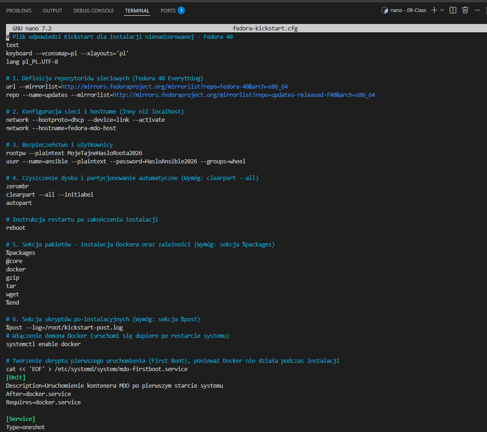
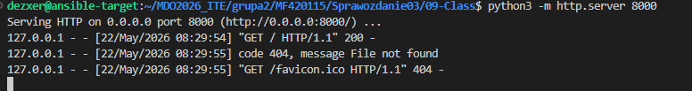

Autor: Maciej Fraś 

Data: 22 Maja 2026 r.

Środowisko: Ubuntu 24.04.4 LTS (Virtual Machine / Hyper-V), Visual Studio Code (VSC)

1. Cel zajęć
Przygotowaniu źródła instalacyjnego systemu dla maszyny wirtualnej/fizycznego serwera/środowiska IoT.

2. Inicjalizacja instalacji nienadzorowanej
Do automatyzacji instalacji systemu Fedora wykorzystano plik odpowiedzi Kickstart.

3. Udostępnienie źródła instalacyjnego przez serwer HTTP

4. Weryfikacja po-instalacyjna i uruchomienie usług

Po zakończeniu instalacji systemu operacyjnego i  restarcie maszyny, zalogowano się do środowiska docelowego za pomocą protokołu SSH w terminalu Visual Studio Code. Przeprowadzono aktywację oraz konfigurację startową demona systemowego Docker.

5. Wdrożenie i uruchomienie skonteneryzowanego artefaktu
Ostatnim etapem było pobranie   obrazu i uruchomienie kontenera aplikacyjnego na hoście produkcyjnym, a następnie sprawdzenie statusu procesu za pomocą instrukcji docker ps

