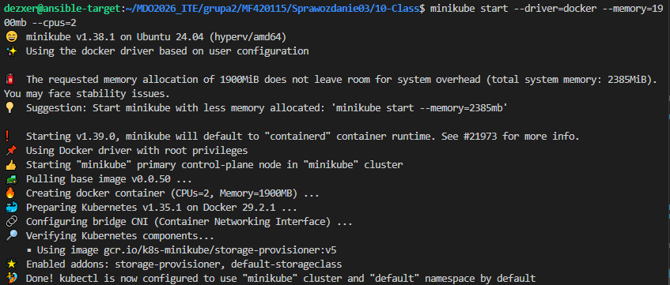
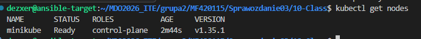
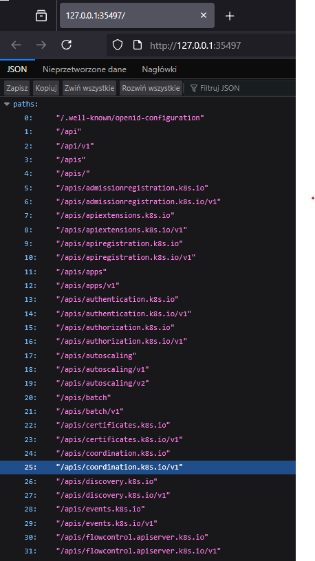
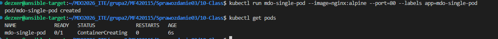
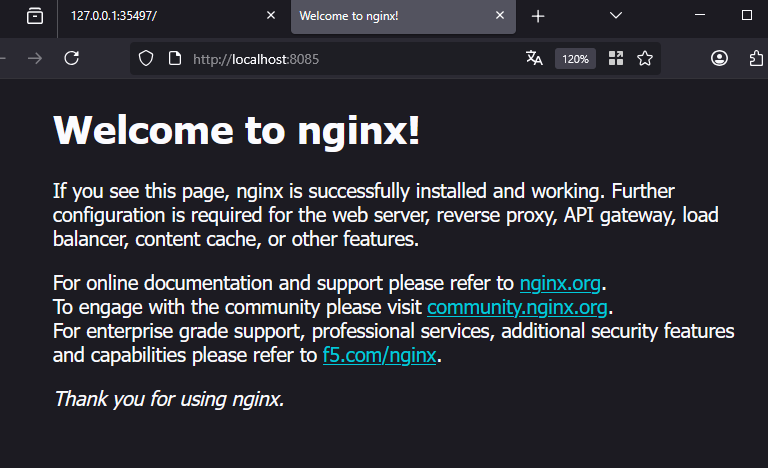
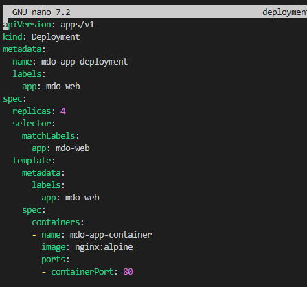
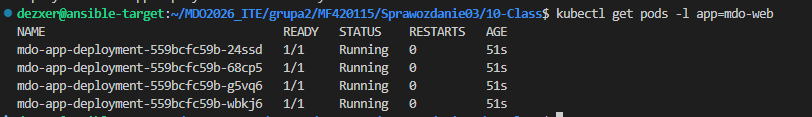
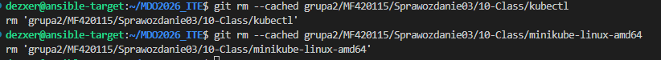

Autor: Maciej Fraś 

Data: 29 Maja 2026 r.

Środowisko: Ubuntu 24.04.4 LTS (Virtual Machine / Hyper-V), Visual Studio Code (VSC)

1. Cel zajęć
Wdrażanie na zarządzalne kontenery: Kubernetes

2. Instalacja klastra i mitygacja ograniczeń sprzętowych
W celu optymalizacji ograniczeń pamięciowych maszyny wirtualnej, klaster minikube został pomyślnie zainicjalizowany z jawnym przydziałem 1900 MiB RAM oraz 2 rdzeni procesora.

3. Interfejs komunikacyjny (API SERVER)
Wywołano usługę panelu zarządzania, przekierowania portów oraz łączności z punktami końcowymi API serwera klastra za pośrednictwem  proxy.

4. Wdrażanie aplikacji w architekturze jednopodowej
Wdrożono pojedynczy kontener aplikacji sieciowej opartej na obrazie nginx:alpine na porcie 80. Sprawdzono status procesu tworzenia izolowanej jednostki Pod.

Ruch sieciowy przekierowano na wolny port hosta 8085. Test komunikacji zrealizowano z poziomu przeglądarki, uzyskując bezpośredni dostęp do funkcjonalności serwera:

5. Deployment
Stworzono aautomatyczny plik deployment w formacie yaml.Architekturę aplikacji wyskalowano do 4 niezależnych replik.

6. Oczyszczenie środowiska
Usunięcie zasobów testowych w celu zwolnienia pamięci:

