Autor: Maciej Fraś 

Data: 4 Czerwca 2026 r.

Środowisko: Ubuntu 24.04.4 LTS (Virtual Machine / Hyper-V), Visual Studio Code (VSC)

1. Cel zajęć
Wdrażanie na zarządzalne kontenery: Kubernetes (Strategie i Rollout)

2. Przygotowanie obrazów aplikacji DOcker Hub
W Docker Hub przygotowano trzy niezależne wersje obrazów oparte na dystrybucji nginx:alpine.

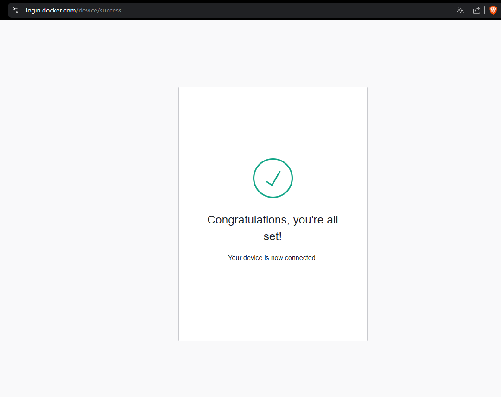

Następnie zbudowano i przesłano wymagane wersje oprogramowania:

Starsza wersja serwera aplikacji.

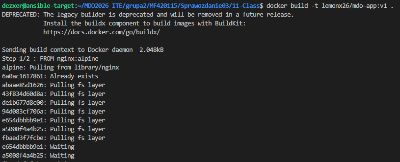
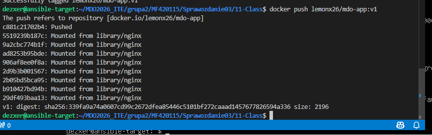

Nowa wersja zawierająca zmodyfikowany plik statyczny

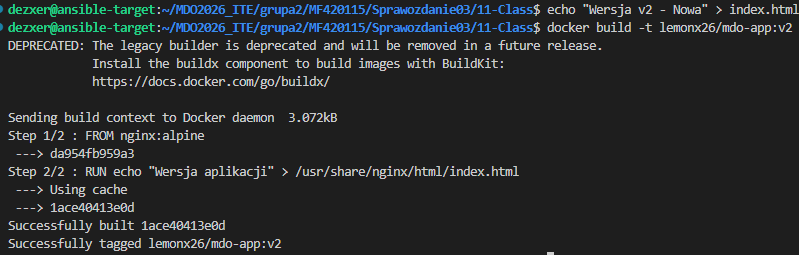
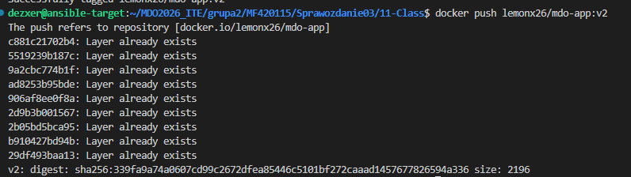

Wersja broken - uzszkodzony punkt wejścia (CMD), wymuszający awarię kontenera przy starcie

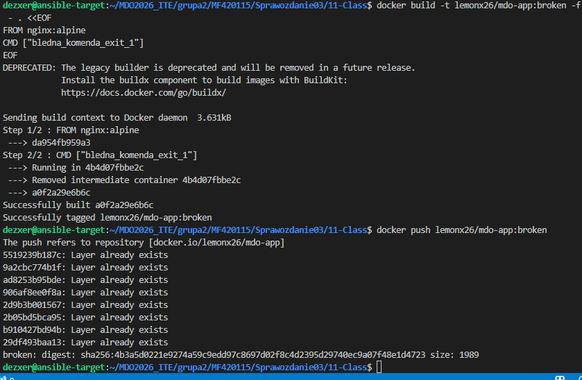

3. Skalowanie oraz zarządzanie historią wdrożeń (Rollout)
Dynamiczne skalowania wielkości klastra za pomocą mechanizmu kubectl scale.

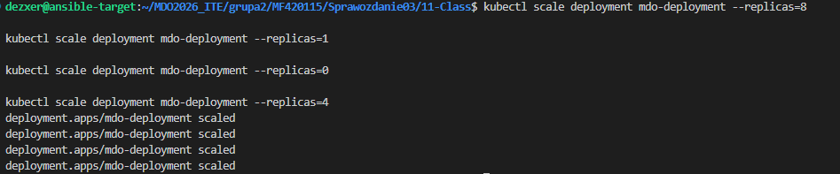

Przetestowanie mechanizmu aktualizacji oprogramowania w locie oraz kontroli awarii - Rollout. Po wdrożeniu obrazu :broken, pody weszły w stan awaryjny. Stan wdrożenia zweryfikowano poleceniem:

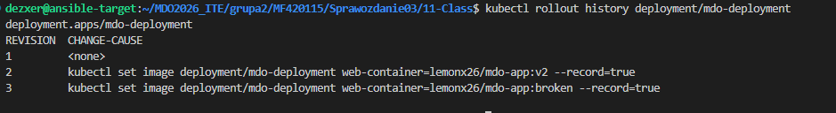

W celu natychmiastowego przywrócenia sprawności operacyjnej środowiska, uzyto komendy, która cofnęła ostatnie zmiany (rollout undo), która automatycznie wygasiła uszkodzone pody i ustawiła stabilną wersję oprogramowania.

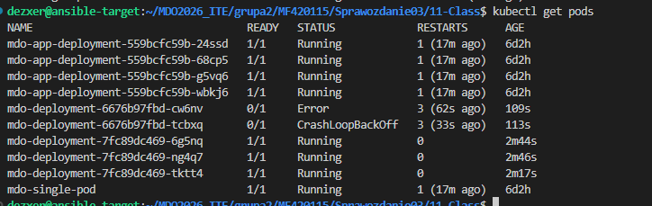

Stan przejściowy klastra – widoczna koegzystencja podów ze stanem błędu CrashLoopBackOff oraz nowo generowanych zdrowych instancji

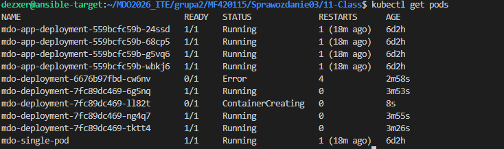

4. Implementacja skryptu weryfikacyjnego
Napisano skrypt automatyzujący proces kontroli jakości wdrożeń w systemach CI/CD. Skrypt przez 60 sekund weryfikuje dostępność replik:

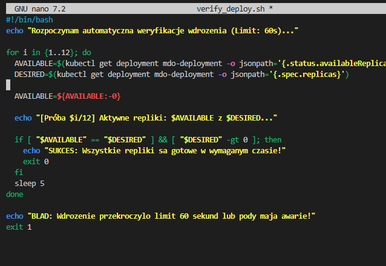

5. Zaawansowane strategie wdrażania

Strategia A: Recreate
Strategia ta całkowicie czyści środowisko ze starych kontenerów przed uruchomieniem nowych instancji.

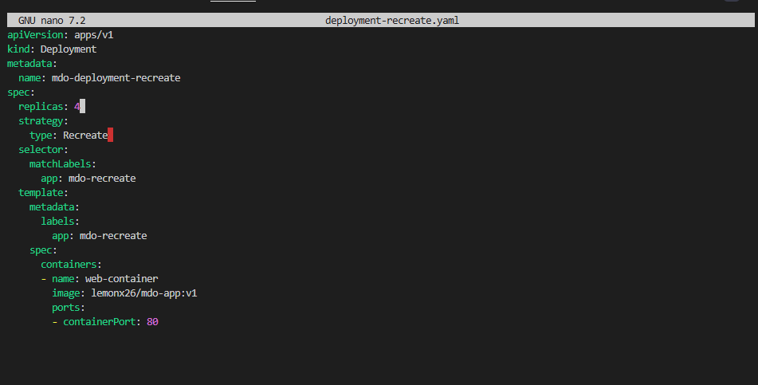

Strategia B: Rolling Update
Strategia zapewniająca brak przestoju usługi poprzez stopniową, przyrostową wymianę kontenerów z zachowaniem rygorystycznych limitów niedostępności.

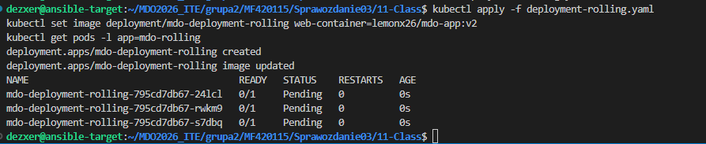

Strategia C: Canary Deployment
Canary zrealizowano przez równoległe wdrożania srodowiska produkcyjnego (v1 - 3 repliki) oraz testowego (v2 - 1 replika), połączonych wspólnym elementem sieciowym Service.

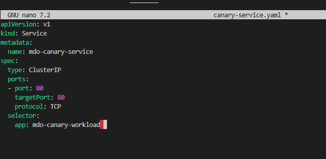

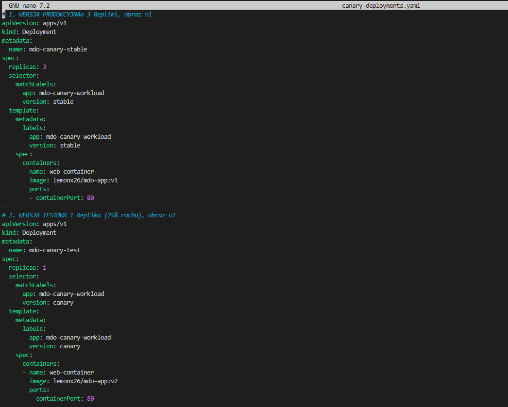

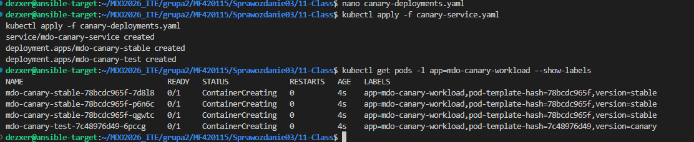

6. Wnioski
Recreate generuje krótkie okno przestoju , ale zapobiega problemom kompatybilności wstecznej.

Rolling Update gwarantuje ciągłość działania aplikacji internetowych, będąc standardem w nowoczesnych architekturach mikroserwisowych.

Strategia Canary pozwala na bezpieczną weryfikację kodu bezpośrednio na produkcji przy minimalnym ryzyku biznesowym (błędy dotykają tylko wydzielonego odsetka procesów lub userów).
