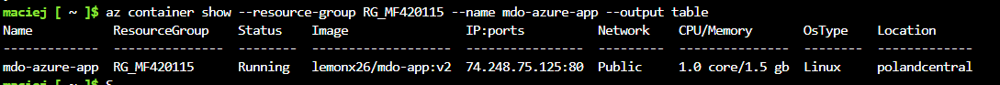

Autor: Maciej Fraś 

Data: 16 Czerwca 2026 r.

Środowisko: Ubuntu 24.04.4 LTS (Virtual Machine / Hyper-V), Visual Studio Code (VSC)

1. Cel zajęć
Wdrażanie na zarządzalne kontenery w chmurze (Azure)

2. Przygotowanie kontenera aplikacyjnego
Do realizacji wdrożenia chmurowego wykorzystano obraz kontenera aplikacyjnego użyty w poprzednich laboratoriach: lemonx26/mdo-app:v2, który jest publicznie dostępny w rejestrze Docker Hub. Pominięto proces tworzenia wewnętrznej usługi Azure Container Registry, decydując się na bezpośrednie pobieranie warstw obrazu z zewnętrznego repozytorium.

3. Konfiguracja środowiska i alokacja zasobów 
Prace zostały przeprowadzone za pomocą powłoki chmurowej Azure Cloud Shell w trybie Bash. Po zarejestrowaniu odpowiedniego dostawcy     (Microsoft.ContainerInstance), powołano grupę zasobów w dedykowanym przez polityke subskrypcji akademickiej regionie  polandcentral:

4. Bezserwerowe wdrożenie w usłudze ACI
Wdrożono obraz z Docker Hub'a jako kontener bezserwerowy za pomocą az container create. 

Po zakończeniu pobrano status wdrożenia w formie  tabeli strukturalnej:

5. Weryfikacja działania i kontrola operacyjna usługi HTTP

6. Czyszczenie środowiska

