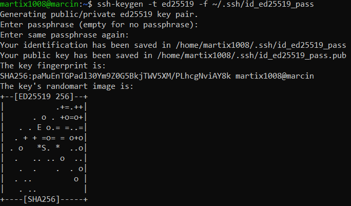
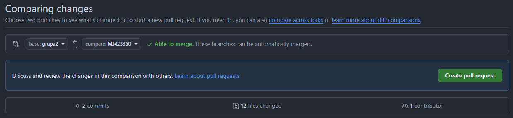
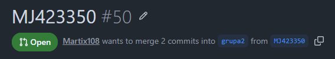
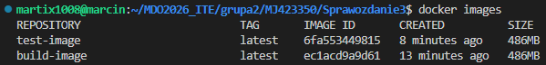
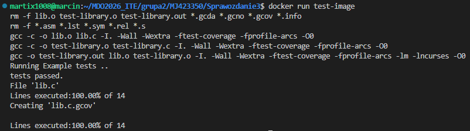
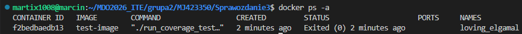

# Sprawozdanie zbiorcze:

## Laboratorium 1:

### System kontroli wersji - Git:
Git jest podstawowym narzędziem wykorzystywanym w pracy programisty. Umożliwia śledzenie zmian w kodzie oraz współpracę wielu osób nad jednym projektem.

Repozytorium może być klonowane przy użyciu:
- protokołu HTTPS (z wykorzystaniem Personal Access Token),
- protokołu SSH (bez konieczności podawania hasła).

### Bezpieczeństwo:
Współczesne systemy odchodzą od uwierzytelniania opartego wyłącznie na haśle na rzecz bardziej bezpiecznych metod. Jednym z takich przykładów są klucze SSH:
- Wykorzystują kryptografię asymetryczną:
  - klucz publiczny dodawany jest do systemu (np. GitHub),
  - klucz prywatny pozostaje na komputerze użytkownika.
- Ich zastosowaniem są:
  - brak konieczności wpisywania hasła,
  - bezpieczna komunikacja z repozytorium.

Coraz częściej stosuje się klucze typu Ed25519, które są bezpieczniejsze i wydajniejsze niż starsze rozwiązania.

Poniżej można zobaczyć generowanie takiego klucza:

<div align="center">
    
</div>

Innym sposobem jest wykorzystanie uwierzytelniania dwuskładnikowego (2FA). Stanowi ono bowiem dodatkową warstwę zabezpieczeń, wymagając drugiego składnika (np. kodu z aplikacji).

### Środowisko pracy:
Środowisko deweloperskie często składa się z:
- systemu lokalnego (np. z interfejsem graficznym),
- środowiska uniksowego (np. maszyna wirtualna).

Do pracy wykorzystywane są narzędzia:
- Visual Studio Code – edytor z integracją Git,
- FileZilla – transfer plików między systemami.

### Gałęzie:
Gałęzie w systemie Git pozwalają na równoległą pracę nad różnymi zmianami w projekcie.

Typowy workflow słada się z utworzenia gałęzi, wprowadzenia zmian, przesłania zmian na repozytorium oraz utworzenia Pull Request'a. Dzięki gałęziom izolujemy zmiany, zapewniamy bezpieczną pracę zespołową i mamy możliwość łatwego cofania błędów.

Poniżej można zobaczyć polecenia do utworzenia nowej gałęzi i przełączenia się na nią:

```bash
git checkout main
git checkout grupa2
git checkout -b MJ423350
```

### Git Hooks:
Git hooks to mechanizm pozwalający na automatyczne wykonywanie skryptów podczas operacji Git.

Dobrym przykładem jest `commit-msg`, który:
- sprawdza poprawność komunikatu commita,
- może zablokować zapis zmian, jeśli warunki nie są spełnione.

Wymusza to na nas trzymanie się nałożonych standardów w projekcie, jak i automatyczną kontrolę jakości. Poniżej można zobaczyć przykładowy hook:

```bash
#!/bin/bash

PREFIX="MJ423350"

MESSAGE=$(head -n 1 "$1")

if [[ "$MESSAGE" != "$PREFIX"* ]]; then
  echo "Błąd: commit message musi zaczynać się od '$PREFIX'"
  exit 1
fi

exit 0
```

### Pull Request:
Pull Request jest mechanizmem umożliwiającym włączenie zmian z jednej gałęzi do drugiej.

Pozwala na przeglądanie kodu, wykrycie błędów przed integracją oraz kontrolę procesu wprowadzania zmian. Poniżej można zobaczyć utworzony pull request:

<div align="center">
    
    
</div>

---
## Laboratorium 2:

### Konteneryzacja i Docker:
Docker jest narzędziem umożliwiającym uruchamianie aplikacji w izolowanych środowiskach zwanych kontenerami. Kontenery zawierają wszystkie niezbędne zależności, dzięki czemu aplikacja działa w identyczny sposób niezależnie od środowiska.

Jest on używany do zapewnienia powtarzalności środowiska, uproszczenia procesu wdrażania oraz izolacji aplikacji i zależności.

Docker korzysta z obrazów (images), które stanowią szablony do uruchamiania kontenerów.

### Przygotowanie środowiska Docker:
Docker instaluje się bezpośrednio w systemie, najczęściej korzystając z repozytoriów danej dystrybucji.

```bash
sudo apt update
sudo apt install docker.io
sudo usermod -aG docker $USER
newgrp docker
```

### Obrazy i Docker Hub:
Docker Hub pełni rolę centralnego repozytorium obrazów kontenerów. Obrazy są szablonami zawierającymi system plików oraz konfigurację potrzebną do uruchomienia aplikacji. Obrazy różnią się rozmiarem, czy przeznaczeniem.

Przykładowe obrazy:
- hello-world – test poprawności działania Dockera
- busybox – bardzo lekki system z podstawowymi narzędziami
- ubuntu / fedora – pełne środowiska systemowe
- mariadb – baza danych
- .NET runtime / aspnet / sdk – środowiska uruchomieniowe i developerskie

Poniżej można zobaczyć uruchomienie przykładowego obrazu:

```bash
docker pull busybox
docker run busybox echo "Hello World"
```

### Tworzenie obrazów - Dockerfile:
Dockerfile jest plikiem definiującym sposób budowy obrazu. Umożliwia automatyzację tworzenia środowiska. Pozwala na tworzenie w pełni odtwarzalnych środowisk.

Podstawowe instrukcje:
- `FROM` – określenie obrazu bazowego,
- `RUN` – wykonywanie poleceń,
- `WORKDIR` – ustawienie katalogu roboczego,
- `CMD` – domyślna komenda uruchomieniowa.

Poniżej można zobaczyć przykład Dockerfile oraz jego uruchomienie:

```dockerfile
FROM ubuntu:24.04

RUN apt-get update \
    && apt-get install -y git \
    && rm -rf /var/lib/apt/lists/*

WORKDIR /devops

RUN git clone https://github.com/InzynieriaOprogramowaniaAGH/MDO2026_ITE.git

CMD ["bash"]
```

```bash
docker build --no-cache -t devops .
docker run -it devops bash
```

### Zarządzanie zasobami Dockera:
Podczas pracy z Dockerem powstaje duża liczba kontenerów i obrazów, które mogą zajmować znaczną ilość miejsca.

Podstawowe operacje:
- wyświetlanie kontenerów (aktywnych i zakończonych) oraz obrazów - `docker ps -a`, `docker images`
- usuwanie zatrzymanych kontenerów - `docker container prune`
- czyszczenie nieużywanych obrazów - `docker image prune`

---
## Laboratorium 3:

### Powtarzalność środowiska budowania:
Jednym z kluczowych założeń DevOps jest zapewnienie powtarzalności procesu budowania i testowania oprogramowania. Oznacza to, że ten sam kod powinien dawać identyczny wynik niezależnie od środowiska, w którym jest uruchamiany.

Problemem w praktyce są różnice między systemami (np. brak bibliotek, różne wersje narzędzi), dlatego stosuje się konteneryzację jako sposób izolacji środowiska.

### Proces budowania i testowania oprogramowania:
Proces budowania oprogramowania opiera się na repozytorium open source zawierającym kod źródłowy, narzędzia budujące (np. Makefile) oraz zdefiniowane testy jednostkowe.

Proces ten może być realizowany zarówno w środowisku lokalnym, jak i w kontenerze. W pierwszym przypadku obejmuje instalację wymaganych zależności, kompilację programu oraz uruchomienie testów, co pozwala na wstępne sprawdzenie poprawności konfiguracji. Następnie proces przenoszony jest do kontenera, gdzie wykonywany jest w odizolowanym środowisku z wykorzystaniem odpowiedniego obrazu bazowego. Zapewnia to niezależność od systemu hosta oraz możliwość łatwego odtworzenia identycznego środowiska w przyszłości.

Użyte polecenia do skonfigurowania środowiska w kontenerze:

```bash
docker run -it ubuntu bash
apt update
apt install ...
git clone ...
```

### Automatyzacja procesu - Dockerfile:
Ręczne wykonywanie kroków zostaje zastąpione przez automatyzację przy użyciu Dockerfile.
Proces dzielony jest na etapy:
- Build
  - instalacja zależności,
  - pobranie kodu źródłowego,
  - kompilacja programu.

  ```dockerfile
  FROM ubuntu:24.04

  RUN apt-get update \
      && apt-get install -y gcc make cmake lcov libncurses-dev git \
      && rm -rf /var/lib/apt/lists/*

  WORKDIR /app

  RUN git clone https://github.com/deftio/C-and-Cpp-Tests-with-CI-CD-Example.git

  WORKDIR /app/C-and-Cpp-Tests-with-CI-CD-Example

  RUN make

  CMD ["bash"]
  ```

- Test:
  - bazuje na obrazie zbudowanym wcześniej,
  - uruchamia testy,

  ```dockerfile
  FROM build-image

  WORKDIR /app/C-and-Cpp-Tests-with-CI-CD-Example

  CMD ["./run_coverage_test.sh"]
  ```

Poniżej można zobaczyć budowanie obrazów oraz uruchomienie testów:
```bash
docker build -f Dockerfile.build -t build-image .
docker build -f Dockerfile.test -t test-image .
docker run test-image
```

<div align="center">
    
    
    
</div>

### Docker Compose:
Zarządzanie wieloma kontenerami może być zautomatyzowane przy użyciu Docker Compose.

Plik `docker-compose.yml` pozwala na:
- zdefiniowanie wielu usług (kontenerów),
- określenie zależności między nimi,
- uruchomienie całego środowiska jednym poleceniem.

Poniżej można zobaczyć przykładowy docker-compose:

```yaml
services:
  build:
    build:
      context: .
      dockerfile: Dockerfile.build
    image: build-image
    container_name: build-container

  test:
    build:
      context: .
      dockerfile: Dockerfile.test
    image: test-image
    container_name: test-container
    depends_on:
      - build
```

Tworzenie kontenerów wraz z wymuszeniem ponownego zbudowania obrazów wykonuje się za pomocą polecenia `docker compose up --build`

### Dyskusja na temat przygotowania do wdrożenia:
Wybrany projekt nie jest typową aplikacją produkcyjną, dlatego kontenery najlepiej wykorzystać do procesu budowania i testowania. W tym wypadku finalnym artefaktem powinien być skompilowany program albo pakiet systemowy, a nie cały kontener. Jeżeli byśmy chcieli wdrożyć ten projekt jako kontener to należało by usunąć zbędne elementy (takie jak narzędzia build) lub zastosować osobny etap - na przykład przez dodatkowy Dockerfile.

---
## Laboratorium 4:

### Zarządzanie stanem  oraz przetwarzanie danych w kontenerach:
Z natury po usunięciu kontenerów tracone są wszystkie dane zapisane wewnątrz. W celu zachowania stanu wykorzystuje się mechanizmy takie jak woluminy (volumes) oraz bind mounty.

Woluminy:
- zarządzane przez Dockera,
- niezależne od cyklu życia kontenera,
- umożliwiają trwałe przechowywanie danych.

Bind mounty:
- mapują katalog z systemu hosta do kontenera,
- pozwalają na bezpośredni dostęp do plików lokalnych.

Proces budowania może wykorzystywać dane dostarczone z zewnątrz (np. przez bind mount) lub pobrane bezpośrednio w kontenerze. Można wyróżnić dwa podejścia:
- klonowanie repozytorium na hoście i udostępnienie go kontenerowi,
- klonowanie repozytorium wewnątrz kontenera.

Możliwa jest również automatyzacja tego procesu w Dockerfile przy użyciu instrukcji RUN --mount, która umożliwia tymczasowe udostępnienie danych tylko na czas budowania.

Przykład klonowania repozytorium z zewnątrz kontenera:

```bash
docker volume create input-volume
docker volume create output-volume

docker run -it \
  -v input-volume:/input \
  -v output-volume:/output \
  -v /home/martix1008/C-and-Cpp-Tests-with-CI-CD-Example:/input/code \
  ubuntu bash

cd /input/code
./run-coverage_test.sh
```

Przykład klonowania repozytorium z wewnątrz kontenera:

```bash
docker run -it \
  -v input-volume:/input \
  -v output-volume:/output \
  ubuntu bash

cd /input/
git clone https://github.com/deftio/C-and-Cpp-Tests-with-CI-CD-Example.git
cd C-and-Cpp-Tests-with-CI-CD-Example/
./run_coverage_test.sh
cp -r * /output/
```

### Sieci w Dockerze i komunikacja między kontenerami:
Docker udostępnia wbudowany system sieciowy umożliwiający komunikację między kontenerami. W domyślnej sieci komunikacja odbywa się przez adresy IP, gdzie w dedykowanej (tworzona ręcznie przez `docker network create`) komunikacja możliwa jest po nazwach kontenerów.

### Testowanie połączeń - iPerf:
Do testowania komunikacji sieciowej między kontenerami wykorzystuje się narzędzie iPerf. Umożliwia ono sprawdzenie łączności między kontenerami, czy pomiar przepustowości sieci.

Aby umożliwić dostęp spoza kontenera należy opublikować port `-p`. Możliwe będzie łączenie z poziomu hosta lub z zewnątrz (zależnie od konfiguracji sieci).

Kontenery uruchamiamy następująco:

```bash
docker run -it --name iperf-server \
  --network iperf-network \
  -p 5201:5201 \
  ubuntu bash \
  -c "apt update && apt install -y iperf3 && iperf3 -s"
```

```bash
iperf3 -c localhost
```

<div align="center">
    
</div>

### Usługi w kontenerach - SSH:
```bash
docker run -it -p 2222:22 ubuntu bash
apt install -y openssh-server
#Ustawienie nowego hasła za pomocą passwd oraz pozwolenie na logowanie rootem
sed -i 's/#PermitRootLogin prohibit-password/PermitRootLogin yes/' /etc/ssh/sshd_config
/usr/sbin/sshd
```

Dzięki SSH możemy zdalnie połączyć się z kontenerem (np. do debugowania), ale ma to też spore wady, gdyż dokładamy dodatkowy proces (zwięszenie zużycia zasobów) i zwiększamy szansę na atak.

### Jenkins oraz Docker-in-Docker:
Jenkins jest narzędziem służącym do automatyzacji procesów Continuous Integration i Continuous Delivery. Umożliwia: automatyczne budowanie aplikacji, uruchamianie testów, czy wdrażanie oprogramowania. W środowisku kontenerowym Jenkins uruchamiany jest jako oddzielny kontener.

Aby Jenkins mógł budować i uruchamiać kontenery, wykorzystuje się podejście Docker-in-Docker. Polega ono na uruchomieniu osobnego kontenera z daemonem Dockera, połączeniu go z kontenerem Jenkins poprzez sieć oraz komunikacji za pomocą zmiennych środowiskowych.

Przykład implementacji poniżej:

```bash
docker network create jenkins
```

```bash
docker run -d \
  --name dind \
  --network jenkins \
  --privileged \
  docker:dind
```

```bash
docker run -d \
  --name jenkins \
  --network jenkins \
  -p 8080:8080 \
  -p 50000:50000 \
  -e DOCKER_HOST=tcp://dind:2375 \
  jenkins/jenkins:lts
```

```bash
http://localhost:8080
```

<div align="center">
    
</div>
