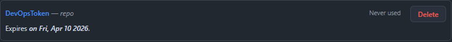
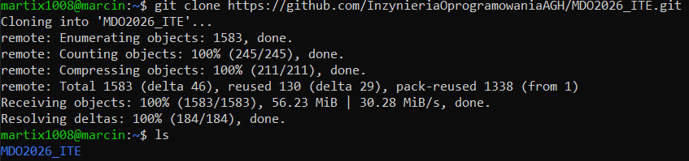
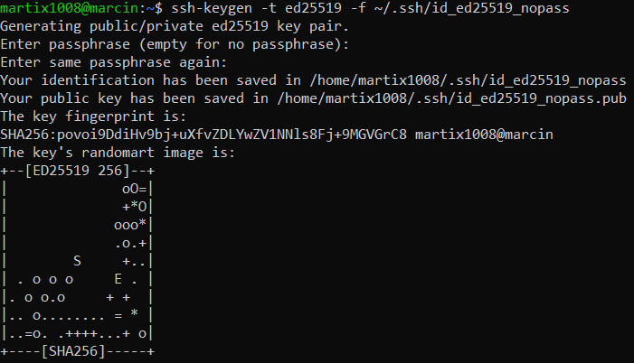
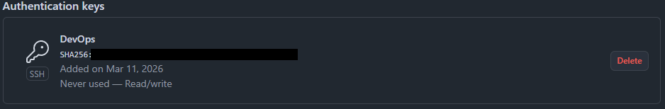
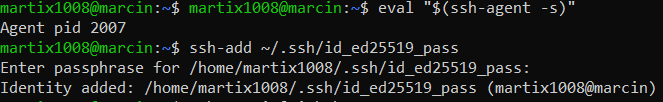
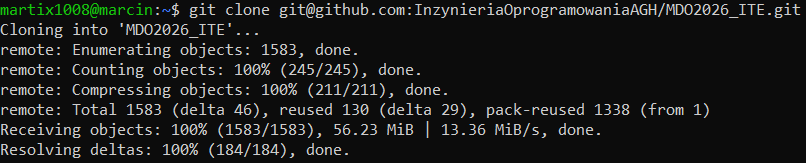
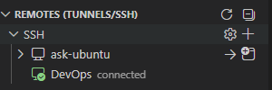
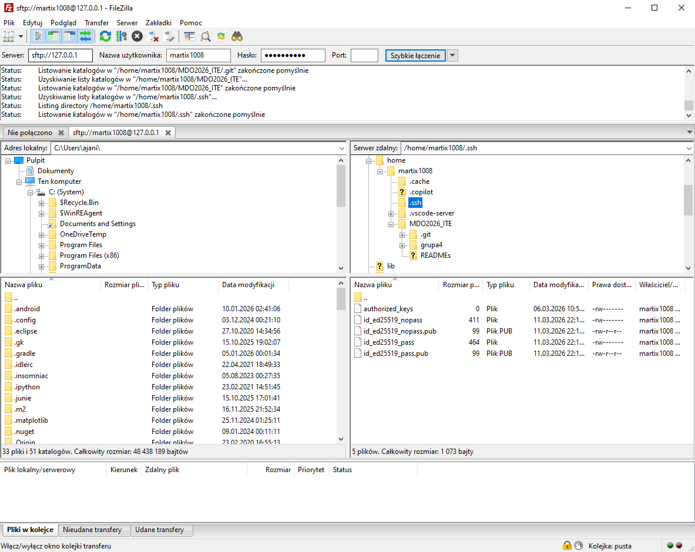
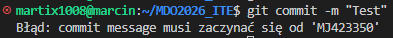

# Sprawozdanie - Lab 1

## 1. Git:

Na maszynie wirtualnej (Ubuntu Server) był już zaistalowany Klient Git oraz obsługa kluczy SSH.

Utworzono personal access token:



Repozytorium sklonowano za pomocą polecenia: 

```
git clone https://github.com/InzynieriaOprogramowaniaAGH/MDO2026_ITE.git
```



## 2. SSH:

Utworzono dwa klucze SSH używając Ed25519:

- Zabezpieczony hasłem `id_ed25519_pass`


- Niezabezpieczony hasłem `id_ed25519_nopass`



Dodano klucz SSH jako metodę dostępu do GitHuba oraz dodano go do agenta SSH:




Sklonowano repozytorium w wykorzystaniem protokołu SSH:



Skonfigurowano uwierzytelnianie dwuskładnikowe na koncie GitHub:

## 2. Narzędzia:

Skonfigurowano dostęp do repozytorium przedmiotowego w edytorze IDE (Visual Studio Code):



Zapewniono natychmiastową wymianę plików ze środowiskiem pracy za pomocą menadżera plików (FileZilla):



## 3. Gałąź:

Utworzono nową gałąź, która była odgałęzieniem od odpowiedniej grupy za pomocą takich poleceń:

```
git checkout main
git checkout grupa2
git checkout -b MJ423350
```

Utworzono nowy katalog o odpowiedniej nazwie

```
mkdir -p grupa2/MJ423350
```

Napisano Git hooka, który weryfikuje, że każdy commit message zaczyna się od odpowiedniego prefix`a oraz dodano go do wcześniej utworzonego katalogu, a także nadano odpowiednie uprawnienia:

```
#!/bin/bash

PREFIX="MJ423350"

MESSAGE=$(head -n 1 "$1")

if [[ "$MESSAGE" != "$PREFIX"* ]]; then
  echo "Błąd: commit message musi zaczynać się od '$PREFIX'"
  exit 1
fi

exit 0
```

```
chmod +x commit-msg
```

